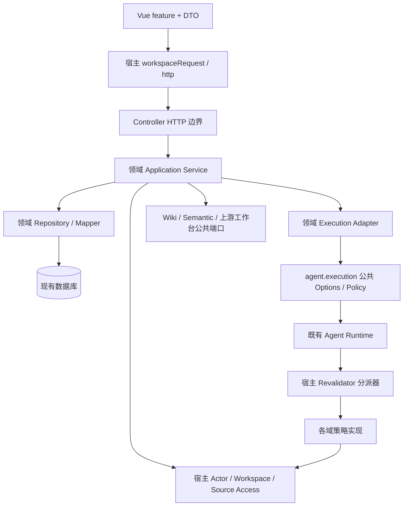

# MateClaw 架构质量整改实施设计

日期：2026-09-29；需求来源：架构质量规范 1.0.0；设计状态：**Proposed，待业务/架构/QA 独立评审**。

本轮交付检查配置与实施设计，不执行 AQ-01 之后的业务重构。当前本地 `dev`、`origin/dev` 都是 `ca0ffbf8b95c2aa8bdb2ba3a1b161b261f6e1f93`；origin/dev 是本地远端跟踪引用，本轮没有 fetch 或验证实时远端。安装结果见 [SETUP_EVIDENCE](SETUP_EVIDENCE.md)。规范中的启动示例不是追加授权，P0 未签收前不得把业务扩展完成计入本设计。

## 1. 需求、范围和完成边界

功能目标：保留普通聊天、本体语义治理、售前、投标的现有能力，通过公共执行契约、统一来源访问、应用服务查询和公共前端请求层修复依赖方向。后续将售前大聚合迁移为独立对象及修订，支持依赖级并发和服务端分页。

不可变化：同身份/Workspace/单 Spring 服务/Vue 壳；Semantic core/application/OWL 的领域隔离；人工批准政策；已发布成果原字节和 handoff 原表示；既有 ID、时间、修订和幂等回执；旧 Flyway 文件；取消与晚到结果拒收。AI 输出始终是候选。

不在本轮新增微服务、消息队列、账户体系、数据库引擎或第二套运行时。不扩展 Delivery 业务、不整理全仓格式、不重命名所有包。技术选型继续使用已有 Java 21/Spring、JDBC/MyBatis、Vue/TypeScript/Axios；检查工具按规范引入开发依赖 Prettier 和 Spotless。

非功能约束及测量方法：

| 维度 | 目标/约束 | 验证方法 |
|---|---|---|
| 隔离与授权 | actor、员工、Workspace、项目绑定、任务固定引用均有效才读取；失败关闭 | AC-06–10，同步/后台/历史/导出矩阵 |
| 一致性 | 相同 operationId 同请求仅生效一次；不同请求冲突；过期 attempt 不回写 | AC-16–22，真实数据库事务与并发测试 |
| 可维护性 | 已清零路径零容忍，底座不引用工作台实现，Controller 无 DAL | 词法 ratchet + 非空字节码 ArchUnit + 人工依赖审查 |
| 数据兼容 | 发布原字节、digest、handoff 原表示完全一致 | AC-23/24/27 的逐条迁移清单与摘要比对 |
| 性能 | 分页不加载全量正文；不因重构增加模型调用 | 固定数据规模记录 SQL 数量/计划、p50/p95、堆内存；数值 SLA 待实测协商 |
| 可用性/恢复 | 模块关闭不拖垮普通聊天；重启任务不得自动重复外发 | 开关组合与故障注入；RTO/RPO 尚未约定，不编造可用率 |
| 运维与成本 | 复用部署单元；远程调用不持有长事务；门禁时长可观察 | 事务追踪、执行日志、CI 时长和资源记录；预算待负责人确认 |
| 证据安全 | 公共 CI 不含生产凭据和客户原文 | 合成 fixture、日志脱敏、独立环境；真实模型/Office 验收另记 |

## 2. 当前代码证据与差距

路径均相对仓库根；行号对应上述 HEAD。检查器初始统计为 2,921 个存量词法命中，不代表同等数量的独立架构缺陷。

| 要求 | 已核对源码 | 实施影响 |
|---|---|---|
| AQ-R01 / AQ-01 | `mateclaw-server/src/main/java/vip/mate/agent/graph/executor/ToolExecutionExecutor.java:283,620,874` 与 `AgentGraphBuilder.java:218,355` 直接引用 PresalesToolPolicy；`agent/execution/ProjectExecutionOptions.java:7`、`ProjectToolPolicy.java:5` 已有公共契约 | 两处核心接入一起消除；不能只删除 executor 的字段 |
| AQ-R01 / AQ-01 | `presales/PresalesEmployeeRuntime.java:47` 走普通 structured stream；`presales/PresalesToolPolicy.java:70,202` 从 conversationId 查运行；`bidding/BiddingEmployeeRuntime.java:73` 已实现 Revalidator | 售前迁到既有项目执行入口；前缀仅保留旧记录兼容查找 |
| AQ-R02 / AQ-02 | `presales/PresalesAccess.java:5,13` 使用 SemanticPrincipalResolver；`bidding/BiddingAccess.java:22,98` 重复身份/成员判定 | 公共主体和 Workspace 服务；不能搬走业务审批政策 |
| AQ-R02 / AQ-02 | `presales/PresalesService.java:986` 要求 admin；`bidding/BiddingAccess.java:64` 允许项目 owner；`PresalesContextProvider.java:34` 和 `PresalesToolPolicy.java:160` 的员工 KB 检查不同 | Context 与工具的权限差异必须先补失败用例，再修复，不能抽取更宽松的实现 |
| AQ-R03 / AQ-03 | `bidding/BiddingController.java:156` 直接 SQL、解析项目 JSON、复核两个来源集合；`BiddingTaskService.java:163` 与 `BiddingRepository.java:155` 已有部分查询 | 抽授权查询服务，保留历史 reviewer 解绑后的访问行为 |
| AQ-R04 / AQ-04 | `mateclaw-ui/src/features/semantic/api/ontologyApi.ts:33` 的 scopedConfig 被售前/投标引用；`:47` 覆盖自定义 transform；`src/api/index.ts:31` 拦截器重写 Workspace | helper 移到宿主并组合 transform，最终固定 header；不能只设置 headers |
| AQ-R04 / AQ-05 | `features/presales/api/presalesApi.ts:4` 有 any 和开放字符串状态；任务服务返回 ObjectNode | 逐步建立 DTO/运行时验证；保留现有 wire shape |
| AQ-R05 / AQ-06 | `db/migration/h2/V211__presales_projects.sql:1` 项目 body_json/总版本；已有 operation/revision/artifact 表；`PresalesService.java:112,429` 内存分页/整体 CAS；`PresalesContextProvider.java:61` 整项目版本失效 | 复用已有回执/成果存储，不重复建同类表；拆对象依赖和分页投影 |

## 3. 目标架构与信任链

图中是调用关系；源码依赖由公共接口反转。宿主装配层注册领域实现，Agent 核心只见接口，不 import 工作台类。领域可消费上游公开事实/发布接口，不跨域写表，不调用内部 Controller 复用服务。

执行时序：认证请求 → 应用服务检查 actor/employee/项目/输入 → 短事务保存 operation、task、attempt 和可信声明 → 提交后执行 → 真正开始及每次工具调用前重验 → 独立短事务检查活动 attempt/依赖并接受候选 → 人工采用/批准/发布再验。缓存和历史读取同样经过当前来源权限入口，日志只记录安全的标识和拒绝类别。

## 4. 各边界的实施设计

### 4.1 AQ-01 公共执行接入

1. 保留 `ProjectExecutionOptions`、`ProjectToolPolicy` 和 `Revalidator`；新增类型只填补现有契约缺口，不重新搭运行平台。
2. 应用服务构造不可变 descriptor：workspaceId、actorId、projectId、taskId、attemptId、inputRefs、skillPin、modelConfigDigest、operationId 与服务端运行类别。重载时与持久任务绑定校验；模型参数、conversationId、浏览器 kind 都不是授权依据。
3. 一个宿主 Revalidator 负责分派，业务实现注册为单独 provider 集合，防止多个 Spring Revalidator bean 的歧义。零匹配/多匹配均报明确错误。若现有契约可承载，不新增冗余注册框架。
4. Options 是 Serializable：仅保存标识与不可变值；不能持久化 Spring service、凭据或线程上下文。动态权限经 revalidator 查询。
5. 售前 runtime 迁到 project execution 入口；AgentGraphBuilder 的 allowlist 与 executor 的即时/排队/审批重放路径共用公共策略。旧运行只读兼容；不能安全恢复时标明终止，由人工重发。
6. 对照新旧策略只比较判定，不双执行工具或重复调用模型。普通聊天无项目声明走原流程，有声明但无策略绝不降级。

复用测试：ToolExecutionExecutorPresalesScopeTest、BiddingRuntimeIsolationTest、PresalesEmployeeRuntimeTest。新增 AC-01–06、AC-20–22；清零后封口 AR-001 对 agent 路径。

### 4.2 AQ-02 主体与来源访问

建议宿主 auth/workspace 边界承载 `ActorResolver` / `WorkspaceAccess`，来源读取由宿主来源服务提供（命名在实现时按现有同类服务收敛）。它们只判断可信主体、成员等级、归属和可读状态。售前 admin 批准与投标 owner 批准留在各自业务政策中，capabilities 与执行 API 调同一业务判定。

受控读取接口接收可信 actor、employee、workspace、项目/任务绑定及 SourceRef，返回经过授权的内容和版本回执。有效范围为各授权条件交集；任何调用方都不能通过 prompt 原文绕开。分别表达 SOURCE_WITHDRAWN、ACCESS_REVOKED、SOURCE_VERSION_CHANGED；对无权限用户不泄漏名称和片段。

先修 ContextProvider 初始注入与工具读取的差异，再逐条覆盖重试、结果接受、快照、缓存、下载/预览/handoff。缓存键包含范围与版本，读取缓存也重验；缺版本/绑定不得使用更宽查询补齐。

矩阵按角色 viewer/member/admin/workspace owner/system admin、项目 owner/非成员/禁用 actor，员工 wiki_disabled/KB-A，项目 KB-A/KB-B 和来源状态展开；每条路径都有允许与拒绝断言。覆盖 AC-06–10、12、19、29。

### 4.3 AQ-03 查询、事务与持久化

`BiddingTaskQueryService.readAuthorized(scope, taskId)` 加载任务身份、项目/历史审核关联，复用 taskDetails 和 repository 的类型化查询，复核当前 reviewer 和任务输入/结果两组引用后才返回 task-detail DTO。历史 `_bidding.targetId` 的判断语义保留；不返回部分可见结果掩盖授权失败。

Controller 仅转换 header/path/body，调用应用服务，保留 HTTP 状态与 R<T> 外形。非法项目内容、员工缺失和解绑均有确定性错误。Repository 承接 SQL/CAS；应用服务拥有事务。普通 CRUD 可用已有 MyBatis，复杂锁/claim 可保留 JDBC，不在这一片切换 ORM。

写入结果和业务更新同事务，模型/文件转换在事务外。查询授权和读取要避免跨范围漂移；必要时在一致读事务内取得引用，返回前再次核对撤权状态。针对并发撤权说明实际隔离保证，不能靠“先查权限”宣称无竞态。

复用 BiddingReviewTest 的 reviewer 重绑不泄漏断言，新增 HTTP 查询两组 refs、404/403/409 与 DTO 快照。通过后封口 AR-002 目标 bidding/controller。

### 4.4 AQ-04/05 前端请求与类型契约

公共 `src/api/workspaceRequest.ts` 接收完整 Axios config；显式调用者 transformRequest 存在时采用调用者函数/数组，否则采用默认转换，最后追加 pinWorkspace。保持调用者序列化语义，不强加 JSON 编码，不手工设置 multipart boundary。全局拦截器运行后仍固定请求创建时 Workspace。

JSON 返回 R<T> 的现有语义，Blob/ArrayBuffer 返回原字节；保持 signal、timeout 和错误处理。页面以 captured workspace/request generation 丢弃过期响应；409 保留编辑草稿；切换前未保存提示维持。三个 feature 同时改 import，ontology 不再承担其他域的公共 helper。

类型化顺序：Ref/ID/status/error → task detail → project/list metadata → Requirement/Clarification/SolutionRevision/Artifact/Handoff。运行时 JSON 使用 unknown 及现有验证方法，不为此未经必要性评估引入 schema 库。未知历史状态映射 `{kind:'unknown', raw}`，不以 `Known|string` 取消枚举约束。旧 API 快照固定字段/空值/枚举，内部类型化不改变外部版本。

复用 ontologyApi.test.ts、presalesWorkbench.test.ts；新增 function/array transform、自定义序列化、multipart、Blob、signal 和过期响应。通过后封口 AR-003，并分路径消除 TS-001。

### 4.5 AQ-06 售前对象拆分和迁移

对象边界：项目 metadata；Requirement/Revision；Clarification/Revision；Solution/SectionRevision；Baseline/Decision；Task/Attempt/Dependency；Artifact/Handoff。这些是设计职责，不是本轮已经创建的表。复用既有 operation/revision/artifact 数据；最终表名和 Flyway 版本须在迁移实施前核对仓库最新占用。

对象 version、attempt、source captureVersion、模板/Skill pin 分别比较。结果接收只校验实际 input dependency，不再因无关联系人修改失效；依赖需求/章节变化则返回 stale。请求 CAS 与 operationId 幂等共存，不能相互替代。

列表将 name/customer/status/owner/stage 与排序投影为可索引字段，count/list 不读取正文；保留现有筛选、排序、空值行为。用小/中/大三档明确数据规模和 SQL plan 选择索引，尚不承诺未测提速。

迁移顺序及放行证据：

1. 黄金样本与全量清单：旧 ID/版本/时间/回执、发布字节、handoff 原表示/digest；异常记录单列，不能补造。
2. 备份并在隔离库恢复，证明可以读取和校验；未通过不能迁移。
3. 三方言追加扩展迁移；幂等回填映射，旧结构维持唯一写入。
4. 影子只读比较，行数/映射/业务意义/字节摘要全部核对；不双写新旧权威。
5. 暂停新写、排空或明确终止运行；事务性切换权威标识，再恢复写入。
6. 旧 API、Bidding 接收及摘要验证；Delivery 消费者只有真正存在时才执行并记录版本。
7. 切换后无新写时可按演练方案退回；已有新写时，没有验证过的反向转换就暂停写入、前向修复，不直接切旧 JSON。

旧 HIGH 不升级 MUST，ANSWERED 不升级 VERIFIED，内部基线不升级客户确认。发布文件不重渲染；依赖序列化次序的 handoff 不重新 canonicalize。

仓库现有 `docs/mateclaw-presales-v1-spec/CODEX_TASKS.md` 的 T04 与 `docs/plans/2026-09-19-presales-delivery-design.md` 可作兼容依据，后者 ADR-05/06/07 保留持久任务、可信身份、重启不重复调用、人工复核约束。未找到正式 Presales V2.0.0 / Delivery V1.0.0 正文；原任务 ID、最终 schema 和黄金样本映射列为 AQ-06 启动输入，不能编造或另造第二套迁移。

## 5. 实施顺序与验收切片

| 切片 | 依赖 | 主要变更 | 完成证据 |
|---|---|---|---|
| AQ-00 | 无 | 当前门禁/formatter/hooks/CI 草案及基线 | 自测、格式/应用工具链真实结果；本地安装和远端强制分别记录 |
| AQ-01a | AQ-00 检查可运行 | 普通/售前/投标执行行为刻画 | 即时、排队、审批重放三路正反例 |
| AQ-01b | 01a | 售前适配公共 Options，宿主分派器，移除核心反向依赖 | AC-01–06/20–22，AR-001 清零，无重复外发 |
| AQ-02 | 01b | 公共主体与来源访问，保持批准政策 | 权限交集端到端矩阵 |
| AQ-03 | AQ-00；可与 02 独立 | 授权 task query + Repository/DTO | AC-11/12，Controller 字节码无 DAL |
| AQ-04 | AQ-00；可独立 | 公共 workspaceRequest + 三域适配 | AC-13–16，真实请求转换回归 |
| AQ-05 | 03/04 | 稳定 DTO/错误/unknown 解码 | 旧消费者快照与类型/运行时校验 |
| AQ-06 | 01/02/05 + 缺失正式规格映射 | 对象/修订/依赖、分页、单写迁移 | AC-17–29，三方言、恢复和逐字节对账 |
| AQ-07 | 01/03 清零；04同步封口 | 安装现有 ArchUnit 模板、policy 零容忍、前端依赖检查 | 编译导入非零类；故意违规失败；不 freeze 新违规 |
| AQ-08 | 00–07 | 全回归、真实 CI/分支保护、独立评审 | 最新合并树、AC-40–44、角色签收齐全 |
| AQ-09 | P0 签收 | 格式/i18n/组件按实际重复职责分离 | AC-30/31，两主题/窄屏/只读/错误态浏览器证据 |
| AQ-10 | 06/09 | 索引/性能/日志/依赖影响图 | 固定环境与数据量的前后指标 |
| AQ-11 | 持续 | 新售前/投标/Delivery 消费已封口公共端口 | 每 PR 带 AQ/AC、基线与真实检查证据 |

AQ-01b 的工程补充采用独立 READ_COMMITTED 短事务锁定项目行后，先核对候选终态与数据库中的 RUNNING 任务除终态字段外完全一致，再按持久快照锁定 actor、Workspace、成员、员工、模型、语义 graph、KB 和原始资料行。撤权先拿到锁时，结果接收在等待后复核新状态；结果先拿到锁时，撤权等结果事务结束。READ_COMMITTED 避免 MySQL 默认可重复读下，锁定读之后的普通复核仍看旧快照。数据库隔离不能消除 MyBatis SESSION 缓存：全部权威行锁成功后，清除当前事务共享 SqlSessionTemplate 的一级缓存，再做原有领域复核。graph 必须先于 KB/raw，与语义修订的父行锁顺序一致；KB 仍先于 raw。语义来源撤回原本就先锁 graph 行；员工 KB 绑定替换现改为事务内先锁员工行；KB 级联删除先锁 KB 再处理原始资料。H2 双事务/latch 覆盖用户、员工、原始资料、graph 修改。普通工具检查仍是短时复核，不持有模型调用期长事务。

AQ-02 第一片让 Context 组装、结果复核和工具读取共用员工 KB 交集；有绑定行但均停用时，项目与通用 Wiki 可见性都不再退回全工作区，按 KB 名称查找也复核员工范围。以上只是工程行为证据，AC-06–08 的领域/QA 正式签收、其他授权路径、生产同构并发验证及 PostgreSQL 验证仍待完成（本机隔离 MySQL 8.0.46 的行锁/缓存切片已通过，见 2026-09-30 工程证据）；不能据此标记整个 AQ-01/02 已验收。

2026-10-01 补充真实 runtime/代理事务切片：H2 与隔离 MySQL 8.0.46 全量 schema 的同一 15 项用例验证真实 PresalesEmployeeRuntime→宿主分派器→领域复核→service 代理路径。结果事务挂起调用者 SERIALIZABLE 事务并使用 READ_COMMITTED；调用者回滚不撤销已接纳结果。执行前及生成后的 actor/员工停用、模型 pin 变化、成员降权、取消/项目漂移拒收；Workspace/成员撤权在结果锁等待期间提交后仍拒收。AgentService 的员工读取替身转调真实 mapper，模型流/会话外发使用替身；该切片未验证 Agent 图执行器、异步协调器、历史/导出和真实模型质量，正式 AC 状态不自动升级。证据见 `evidence/2026-10-01/AQ01_RUNTIME_ACCEPTANCE.md`。

每个切片先刻画旧行为，再改最小职责，最后跑 dev 和适用测试。格式整理与业务修改拆开。共享 POM、权限接口、配置、Flyway 版本由一位整合者管理；并行只用于不争用文件的任务。

## 6. ADR 决策记录

以下全部 **Proposed**，不是实现 Agent 的独立签收。

### ADR-AQ-001：保留模块化单体，以公共契约反转依赖

背景：已有项目执行接口而售前仍依赖隐式入口。决定：复用当前 Runtime/Options/Policy，宿主负责策略分派，工作台提供实现。收益：迁移范围小、部署成本不增加。代价：同进程仍需严格生命周期和注册唯一性校验。排除：拆微服务（当前无规模证据、引入分布式一致性成本）；把业务类挪进 common（隐藏而不消除依赖）。验证：AC-01–06，AR-001 与 ArchUnit。

### ADR-AQ-002：公共授权机制，领域批准政策保留

背景：Context/工具授权不一致，售前/投标批准人规则不同。决定：公共主体、Workspace、来源读取；批准与客户确认留在业务域。收益：权限入口可测试，避免放宽。代价：公共读取需显式上下文，多处调用适配。排除：统一为项目 owner 全权（改变已有授权）；只提 helper（不能解决链路绕过）。验证：AC-06–12/29。

### ADR-AQ-003：先兼容类型边界，再拆售前聚合

背景：旧发布字节/摘要/回执有消费者，不能一次性替换。决定：独立对象版本、影子只读比对、单写切换；旧 wire shape 与历史表示保留。收益：降低迁移失真与并发冲突。代价：迁移期多份读取模型，切换后回退复杂。排除：长期双写（双权威）；新写后直接切旧 JSON（丢数据）；批量重渲染历史文件（摘要漂移）。验证：AC-17–29。

### ADR-AQ-004：增量门禁先部署，清零路径逐步硬化

背景：存量词法命中多，立即全仓零容忍会阻断所有工作。决定：固定 Git 基线按指纹/次数 ratchet，清零后 policy 封口，行为测试与 ArchUnit 补足词法盲区。收益：阻止新增且不洗白存量。代价：SCAN_PASS 不能证明存量正确；动态依赖仍需测试。排除：整体重写 baseline（债务消失假象）、一次性全仓格式化（难审查）。验证：AC-25/32–44，独立控制面审查。

### ADR-AQ-005：请求范围固定与序列化组合在宿主负责

背景：全局拦截器会重写 Workspace，现 helper 覆盖调用者 transform。决定：完整 config 组合并最终 pinWorkspace，JSON/二进制契约分离，页面丢弃过期响应。收益：工作区切换不串数据、上传下载兼容。代价：需转换顺序与多响应类型测试。排除：只改 headers（被拦截器覆盖）；每个 feature 复制 helper（持续漂移）。验证：AC-13–16。

### ADR-AQ-006：结果接收与撤权共用权威行顺序

背景：只锁售前项目行无法阻止身份、员工、模型和来源表在复核后并发变化。决定：结果接收使用独立 READ_COMMITTED 短事务，复用已有权威行的数据库锁；从持久活动任务读取锁定对象，宿主 `ProjectAuthorityFence` 按固定顺序锁行，再执行原有领域复核。新增来源治理状态由 graph 父行协调，员工 KB 绑定写入由员工父行协调。收益：无新表和方言专属触发器，模型调用不持锁。代价：短暂增加写入等待，所有新增的授权写入路径都必须沿用父行锁；大项目来源数量会影响锁数。排除：仅提高隔离级别（并发事务仍可能按相反于提交的顺序串行化）、仅重复读状态（无法封住提交窗口）、新增全局 epoch 表（迁移及所有写入接入成本过高）。验证：H2 双事务/latch 与员工 KB 交集回归；2026-09-30 增补真实 MyBatis 缓存复现与 graph→KB/raw 竞争回归，修复前失败，修复后在 H2/隔离 MySQL 8.0.46 通过。固定锁序为 actor→Workspace→成员→员工→模型→graph→KB→raw；全部锁成功后清除当前事务 MyBatis 一级缓存。新增测试仅验证行锁双顺序及 Workspace/成员撤权的 service 持久化路径，不代表完整 runtime、Spring 代理事务或生产同构验收。详见 `evidence/2026-09-30/AQ02_AUTHORITY_ACCEPTANCE.md`；独立 QA 与正式 AC 签收仍待执行。

## 7. 风险、失败模式与待评审输入

| 风险/失败 | 处理 | 阶段门槛 |
|---|---|---|
| 同一运行被多个策略匹配 | 启动/执行时明确拒绝并安全诊断 | AQ-01 |
| 撤权发生在排队/工具执行/结果接受之间 | 每个检查点复验，活动 attempt CAS 拒收 | AQ-01/02 |
| Context 比工具授权更宽 | 先补暴露差异的负例，再收敛公共来源入口 | AQ-02 |
| 迁移失败或新写后的回退 | 备份恢复演练、隔离对账、暂停写入和前向修复 | AQ-06 |
| 正式 V2/Delivery 规格缺失 | 先做公共边界；schema/原任务映射未齐不启动迁移 | AQ-06 |
| formatter 升级影响历史字节 | 只包含源码，固定版本，升级独立变更 | AQ-00/09 |
| 本地钩子可绕过/CI 初次无可信 runner | 受控 bootstrap 合入后验证故意违规 PR，随后 required check/独立审批 | AQ-08 |
| 同 runner 恶意构建可修改控制文件 | 当前门禁不作为强恶意代码隔离；必要时组织只读控制容器/独立 required workflow | 安全评审 |
| 现有未跟踪材料导致完整提交检查阻断 | 保留用户材料，未来在独立干净工作区组织提交；不 stash/reset/忽略源码凑通过 | 提交前 |

评审需要明确：业务批准规则保持性；缺失正式规格和黄金样本；SLA/数据规模/恢复预算；独立审阅人和仓库管理启用安排。它们不阻碍本轮交付检查及可评审设计，但不能用文档自签替代 P0 完成。

2026-10-02 AQ-02历史/成果切片复用宿主ProjectSourceAccess，当前材料和既有baseline/task来源受当前项目员工KB权限约束，实际raw归属不信任快照kbId。H2真实HTTP47项定向回归通过；无员工旧项目、批准政策和发布字节保持。冻结release独有来源/material解绑/员工重绑定及完整历史交集仍未验收，详见evidence/2026-10-02/AQ02_HISTORY_SOURCE_ACCEPTANCE.md。

2026-10-02 冻结来源第二片：复核所有对象型release快照，包括候选；绑定员工项目保留当前KB绑定交集。命令/回放按当前employee授权响应副本，受限时返回已有summary+sourceAccessRestricted而不改回执；修复绑定后恢复完整响应。48项H2定向回归和限定独立审阅通过，受限UI/多方言/并发/原执行pin仍待验收；见evidence/2026-10-02/AQ02_FROZEN_SOURCE_ACCEPTANCE.md。

2026-10-02 受限响应UI：明确sourceAccessRestricted提示并禁用生成，保留授权绑定修复，清理来源编辑/详情/预览及迟到下载；实际403轮询丢弃旧数据。27项售前组件/状态回归、SIMULATED真实组件浏览器绑定修复通过，浏览器台账INCOMPLETE。GET403后的授权元数据/修复读取契约、真实角色/QA继续待设计验收；见evidence/2026-10-02/AQ02_RESTRICTED_UI_ACCEPTANCE.md。

2026-10-02 AQ-02 安全修复读取：member 专用 repair-context 采用显式元数据白名单、空来源集合与不透明绑定 ID；只允许严格绑定/解绑/agentId-only 替换绕过旧来源复核，新目标授权、CAS、归档、回执保持。UI 在真实403后验证最小契约并清除来源状态。H2定向26项与UI35项通过，独立安全审阅无阻断；SIMULATED浏览器台账INCOMPLETE，正式QA不升级。见 `evidence/2026-10-02/AQ02_REPAIR_CONTEXT_ACCEPTANCE.md`。

### ADR-AQ-007：来源授权策略与领域只读事实端口（Proposed，已实施工程切片）

2026-10-02：PresalesService保留用例事务与旧错误适配，PresalesSourceAuthorization负责材料/历史/冻结发布和digest复核；Wiki/Semantic公共只读服务封装自身repository，不再由售前直接查询外域表。读取事实不授予成员或员工权限，调用者先完成真实主体和范围授权。治理读端口不随semantic功能开关移除，保留关闭模块后的历史撤回拒绝。代价是两个明确读契约与既有异常兼容适配；拒绝捕获快照的提取端口、业务integration中藏SQL、基础权限服务承担内容读取或一次性整聚合迁移。H2原50/新21共71项及独立增量安全审核通过；正式QA/多方言仍待签收。见 `evidence/2026-10-02/AQ02_SOURCE_BOUNDARY_ACCEPTANCE.md`。

### ADR-AQ-008：宿主主体与无缓存 Workspace 基础入口（Proposed）

2026-10-02：ActorResolver/WorkspaceAccessService复用AuthService与原Mapper；售前/投标/语义保留解析、错误和领域批准政策，不借用语义内部身份类，不使用60秒成员缓存或归一化capability等级。投标明确收紧anonymous哨兵和批准第二次actor/workspace失效拒绝，不增加允许角色。H2/MyBatis、真实JWT/HTTP/事务与工具身份85项工程回归通过；测试夹具只增加宿主Bean，原断言保留。代价是明确的host事实接口与业务错误适配；拒绝通用批准政策、缓存授权或一次性全聚合迁移。正式QA/多方言仍待签收。见evidence/2026-10-02/AQ02_PRINCIPAL_BOUNDARY_ACCEPTANCE.md。

### ADR-AQ-009：售前工作台单循环轮询生命周期（Proposed）

2026-10-02：AQ-09 页面拆分先处理已复现的轮询竞态，关联 AQ-04/AC-13 及 AQ-01/AC-21 工程证据。域内组合函数管理单实例/项目串行 GET，读取前后校验循环身份、取消和范围，拒绝旧版本及受限循环内的来源恢复；页面保留严格授权/修复读取和命令策略。保留1秒/600次、按全项目运行任务继续，成功命令或重载替换循环，卸载释放资源。拒绝通用框架/全局store及每个operation重复全项目GET。三个组件红例变绿，新增合同后50项工程回归通过；真实浏览器、服务端重启、其余编辑/预览路径与正式QA未完成。见evidence/2026-10-02/AQ09_POLLING_LIFECYCLE_ACCEPTANCE.md。

### ADR-AQ-010：来源查看选择与命令确认范围（Proposed）

2026-10-02：来源查看交给域内组合函数，选择/关闭/限制/卸载固定结果生命周期及URL释放；页面同步scope generation与editor session隔离旧确认、命令及选项。归档/发布确认固定原项目与版本，旧mutation不关闭新编辑器、写旧错误或解除新busy；较旧version按原冲突流程保留草稿。当前来源修复政策、回执和409保持；拒绝只有ID比较、确认后重取目标或通用请求框架。代价是失效确认需重发、本地拒收不取消已发送服务端动作。真实RouterView/Workspace夹具与77项工程回归及限定独立审核通过，业务环境与正式QA仍待签收。见evidence/2026-10-02/AQ09_VIEW_CONFIRMATION_ACCEPTANCE.md。

### ADR-AQ-011：公共 Workspace 请求完整配置边界（Proposed）

2026-10-02：宿主workspaceRequest选择调用者transform（含空列表）或默认转换，最后固定捕获Workspace并保留config.signal/独立signal、参数、headers/this和响应契约；三域各自处理envelope/errors，不跨借语义私有helper。直接FormData上传，传输层生成boundary；拒绝只设headers、复制helper或全局拦截器改动。四个旧实现红例变绿，七文件26项与实际loopback multipart/binary/取消工程回归通过；独立增量审核无阻断，无新依赖/配置变化。代价是自定义transform的合法序列化由调用者负责，公共捕获范围不替代服务端授权，正式浏览器/真实409并发/QA未完成。AR-003封口另需控制面审查。见evidence/2026-10-02/AQ04_WORKSPACE_REQUEST_ACCEPTANCE.md。

### ADR-AQ-012：编辑业务规则与提交协调分离（Proposed）

2026-10-02：域内纯editorSubmission拥有11类初始化、历史副本/基线响应、校验和精确action/payload，返回typed invalid/project/command；页面保留界面、翻译、授权、scope/session、CAS/receipt及异步执行。拒绝通用表单框架、整页store或mapper内调用API/授予权限。project receipt仍使用原完整data，metadata只维持原wire白名单；受限修复和ANSWERED来源规则保持。原49项刻画前后通过、最终119项与独立工程审核无阻断，页面减少129行但整体结构尚未完成。代价是业务规则与显示模板需合同协同，正式浏览器/角色/QA待签收。见evidence/2026-10-02/AQ09_EDITOR_RULES_ACCEPTANCE.md。

### ADR-AQ-013：方案与成果展示组件发出意图，页面保留执行权（Proposed）

背景：工作台方案/评审表格同时承载覆盖计算、比较和用例调用，父scoped样式在组件拆分后不能隐式视为跨多根继承。采用两个完整职责组件，typed intent连接原用例；比较值仍由页面持有，原状态重置不变。仅共享原展示样式源并以scoped src复用，专有方案CSS归属方案组件。不引入通用事件框架或新应用状态层。

约束/权衡：减少页面466行，但完整用例协调和编辑生命周期仍未拆；组件可用状态只是展示，不扩大批准或来源权限。原98项CSS合同/三组件scoped编译、旧实现53项和迁移后123项回归、模型/语言交互及独立工程审阅证明该边界；浏览器/业务QA与维护人签收保持未完成。最终提交证据见AQ09_OUTPUT_VIEWS_ACCEPTANCE及PR5。

### ADR-AQ-014：编辑会话封装代次，页面保持提交用例（Proposed）

背景：编辑草稿、只读选项、discard与save共用裸generation，工作台无法单独说明选项/确认生命周期。选用本域usePresalesEditorSession封装draft/options/baseline watcher/关闭与卸载，提供captureSession有效性predicate，复用原页面scope。页面保留guard注册、确认文案和create/update/command/CAS/receipt/409，不把predicate升级为授权。

取舍：新增typed组合函数194行、页面减111行，完整用例和编辑模板仍待分离；拒绝把整页移动成god composable或第二套scope框架。同步撤权和employee/material repair保持；disposed拒绝卸载后capture和选项。旧55项与最终142项工程回归/独立审阅证明该边界，真实角色/浏览器/并发/重启和正式签收不由本片替代。证据见AQ09_EDITOR_SESSION_ACCEPTANCE及PR5。

### ADR-AQ-015：字段组件共享原编辑草稿，提交权保留页面（Proposed）

背景：11类编辑字段仍与页面执行协调混合，project/employee重复员工选择模板。选用三个本域typed字段组Assignment/Discovery/Output，required named form model复用原session draft，来源/statement/管理导航仅发意图；页面保留原dialog/el-form、批准/授权、scope/session/CAS/receipt/409。共享原scoped字段CSS，不创建通用表单框架、第二套store或执行权限。

取舍：页面减少430行，字段组104/242/161行，完整用例及项目/任务展示仍待拆。原55项字节保持，旧实现59项刻画、迁移后146项工程回归及98项CSS合同/六组件编译、独立审阅证明该边界；真实两主题/窄屏/角色/并发/重启与正式QA仍NOT_RUN。回退仅恢复字段接入，无数据库操作。证据见AQ09_EDITOR_FIELDS_ACCEPTANCE及PR5。
