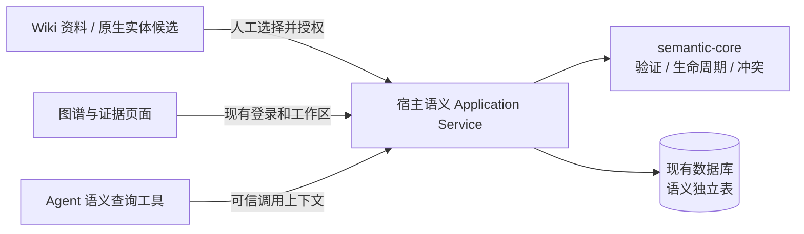

# MateClaw 仓库内企业语义核心：收敛设计

日期：2026-09-05。状态：Proposed。用户已明确仓库和交付方向；本文细化模块边界与验收，不代表代码已实现。

2026-09-07 执行补记：M1/M2 和 M3 工作台、取证工具已实现。本文件保留设计时语境，当前验证范围与缺口以 [M3 验收矩阵](../validation/semantic-core/acceptance-matrix.md) 为准；自动抽取未实现。

知识库、本体、语义图的基数及事实/证据/版本/冲突的字段和生命周期已进一步明确在[领域模型](2026-09-05-semantic-domain-model.md)中；该模型细化本文的概要设计。本期非空图固定本体版本，候选不能覆盖已确认事实。

本体管理维护界面已纳入首期必交付范围，覆盖草稿配置、校验、对比、发布及绑定，详见[本体管理 UI 规格](2026-09-05-ontology-management-ui-spec.md)。

完整执行入口已整理为[总体设计](../superpowers/specs/2026-09-05-enterprise-semantic-core.md)与[11 项实施计划](../superpowers/plans/2026-09-05-enterprise-semantic-core.md)。本文件保留范围和架构收敛过程；详细 API、存储、任务依赖与验收以这两份整合文档为准。

## 1. 已确定的方向

在当前 `/Users/guojiexie/Development/mateclaw` 仓库新增一个独立 Maven 模块，承载企业本体、事实、来源、版本和冲突的核心规则，再由现有 MateClaw Server 装配。

原 `/Users/guojiexie/Development/semantica4j` 仅作为设计参考，不在该工作区继续实现，不导入其整个 Reactor、不依赖未发布实验 records，也不继承它的大型平台任务链。首期以当前 MateClaw 工程和依赖版本为基线。

本次只修订设计文档；未修改 POM、Java、数据库或 UI。

## 2. 交付形态：一个新模块，一处宿主集成

```text
mateclaw/
├── mateclaw-semantic-core/           新增、独立测试的 Java 21 核心
│   └── src/main/java/vip/mate/semantic/core/
│       ├── ontology/               类型、属性、关系定义及本体验证
│       ├── fact/                   实体、事实与生命周期规则
│       ├── evidence/               来源快照引用与证据定位
│       ├── revision/               不可变版本与变更校验
│       └── conflict/               确定性冲突识别与处理规则
├── mateclaw-server/
│   └── src/main/java/vip/mate/semantic/
│       ├── application/            授权后的命令、事务、编排
│       ├── persistence/            现有数据库/MyBatis 适配
│       ├── wiki/                   读取并固化经授权的 Wiki 来源
│       ├── web/                    查询、审核与图数据 API
│       └── tool/                   Agent 高层语义工具
└── mateclaw-ui/src/features/semantic/  本体管理、事实审核、图谱与证据页面
```

上述是责任划分，不提前创建没有行为的目录和类。核心源码只依赖 JDK；测试复用仓库已有工具。Server 单向依赖 core，core 不依赖 Spring、Spring AI、Wiki Entity、MyBatis、HTTP DTO 或数据库驱动。模块继承当前根 POM 并不等于源码依赖 Spring。

首期与 MateClaw 同进程、同部署、复用现有数据源，语义表独立命名，事务也由宿主承担。新增的核心不是动态插件，Agent 工具是集成入口之一。

## 3. 只解决企业本体和事实图谱

| 核心对象/能力 | 首期内容 | 有意限制 |
|---|---|---|
| OntologyRevision | 一份本体的精确版本；实体类型、属性与关系定义；发布后不可变 | 无 Package/Module 导入体系、OWL/Jena、通用规则语言 |
| Entity | 稳定 ID、类型与显示名；引用确定的本体版本 | 不根据同名或拼音自动合并实体 |
| Statement | 有 ID 的主语—谓语—值/实体事实；包含本体版本、状态、有效时间与证据引用 | 仅二元关系及类型化属性，不做 n 元关联和自动推理 |
| Evidence / SourceSnapshotRef | 原始资料 ID、来源内容摘要、快照 ID、原文片段定位；多个证据可支持一条事实 | 不复制整个文档平台；未固化的当前页面不能冒充历史来源 |
| Revision / Change | 本体和事实的历史版本；记录操作者、时间、原因和前置版本 | 无分支合并、全图快照、双时态查询语言 |
| Conflict | 明确规则发现的不相容事实；保存参与版本和人工处理结果 | 不承诺发现所有自然语言矛盾；置信度最高者不自动胜出 |

治理状态和事实内容分开：Proposal 是待审候选；只有经授权确认的事实可作为默认可信查询结果。推断/假设不能因生成成功就成为已确认事实。修改已确认事实产生新版本，旧版本保留；撤回也保留历史。

首期本体只支持必需的类型与关系约束：属性值类型、关系起点/终点类型，以及单值/多值。实体类型继承、推理、公理和本体跨包复用后置。对约束违反明确拒绝，不默默生成新属性或新关系类型。

示例本体：设备、部件、故障、处置措施；关系为“包含部件”“发生故障”“采用处置”。这是验收数据，不将制造业名称硬编码进核心。

## 4. 事实、来源、版本和冲突如何配合

假设同一台设备在同一有效时间内有两份记录：A 说额定电压是 380V，B 说额定电压是 400V。

1. 本体规定“额定电压”为单值属性，并定义数值和单位比较策略。若首期未实现单位换算，使用显式一致单位的数据集，不假装不同单位可直接比较。
2. 两份来源各形成不可变快照与独立证据，候选事实不能覆盖已有事实。
3. 相同范围、实体和单值属性，值不同且有效时间重叠时，产生冲突候选。多值属性的多个值不因不同而自动冲突。
4. 审核人可拒绝错误候选，或明确修订原事实并关联处理记录；不能让两个冲突值都无提示地成为默认权威结果。
5. 查询返回事实、所用本体/事实版本、证据和冲突状态。时间不重叠的合法变化不视为冲突。

首期只覆盖上述确定性冲突及本体类型约束。模糊同义实体、自然语言反义、复杂业务因果都留给后续能力。

多来源支持与撤回必须区分：撤回一份来源只撤销对应支持关系，不能顺带抹掉其他仍有效的证据；若已无有效支持，按明确规则将事实退出默认可信查询，并保留历史原因。数据清除另走受控流程，不能把逻辑撤回当物理清除。

## 5. 图谱不要求先引入图数据库

首期使用现有关系数据库保存实体、事实、证据、版本与冲突记录。实体为节点，实体引用型 Statement 为有向边，属性型 Statement 为节点事实，查询返回有界图视图。

这样既构建真实的知识图谱，又无需单独维护 Neo4j/向量/RDF 投影。先实现实体查找、事实列表和一至两跳邻域，限制深度、节点数和查询耗时。避免先设计通用 GraphStore 插件体系；出现实际容量或查询瓶颈后再评估独立图存储。

首期正式事实与历史修订在同一数据库事务内提交，不引入跨库双写与分布式 Outbox。来源导入有持久化任务和幂等键；若以后接入独立图投影，再为该真实异步边界引入 Outbox。

## 6. 与 MateClaw 的具体接法



- 复用 Wiki 上传、解析、chunk 和来源定位。现有 `WikiEntityRelationEntity` 已有三元组、证据、置信度和来源 chunk；可以映射成候选，但自由文本 predicate 必须匹配已发布本体才能进入正式事实。
- 原生 Wiki 图继续保留。语义图查询使用独立 API/小型视图，不把语义事实回写到原生图表形成双主。
- 首期先人工录入或导入明确的结构化候选，完成可信图谱闭环；已有抽取能力能复用时只输出 Proposal，不新增一套模型编排系统。
- 所有语义资源显式绑定工作区；首期每张语义图绑定一个 KB，减少跨库授权复杂度。Core 接收不可伪造性由宿主保证的输入，负责 Scope 一致性；Server 校验真实用户/Agent、工作区成员资格和 KB 资源权限。
- Scope 是资源归属，不是权限证明。命令/查询中的 actor 与 Scope 分开，不能从全局 ThreadLocal 猜测，也不允许无身份调用落到默认工作区。
- 先复用现有角色：可读用户只读、具备相应写权限者提议、经明确审核权限映射的用户确认。首期不建设全公司 IAM；身份、授权和资源关系仍要做服务端负测。
- 构建期注册一个高层查询工具即可；写入仅可提议。ChatOrigin/ToolContext 转换留在 Server，核心不暴露任意 SQL/Cypher。
- 现有 enterprise UI profile 继续只负责外观；语义功能开关和访问权限独立。引用、邻居、统计和缓存不得泄漏失去权限的来源。

## 7. 关键决策（本地 ADR 摘要，Proposed）

| 决策 | 原因和代价 | 备选取舍 |
|---|---|---|
| LOCAL-SEM-01：同仓一个无框架核心模块，Server 装配 | 满足用户“小、收敛、能集成”；共享发布和进程资源 | 独立服务增加运维；完整 Semantica4j 移植范围过大；动态插件缺少所需宿主集成契约 |
| LOCAL-SEM-02：先关系存储直接提供图视图 | 复用数据库及事务，无独立投影一致性问题；复杂深路径查询能力有限 | Neo4j 保留为有实际需求后的选项，不作为图谱成立前提 |
| LOCAL-SEM-03：本体约束下的可寻址事实 | 来源、版本和冲突能关联到具体事实；比无 ID 边多少量治理数据 | 直接扩字段到原生 Wiki 关系表易与上游耦合，也难保护历史语义 |
| LOCAL-SEM-04：显式候选、审核、修订与撤回 | 构建可信企业事实；需要审核操作和版本校验 | LLM 直接确认、按置信度自动覆盖均不满足可追溯要求 |
| LOCAL-SEM-05：首期单 KB 图及确定性冲突 | 限制权限与语义复杂度；暂时不能跨知识库统一图 | 跨库图和通用推理后置，未来需重新审查来源权限与实体对齐 |

这些决定只适用于当前 MateClaw 新模块，不修改另一个仓库的 Accepted ADR。

## 8. 小步实施与验收

| 本地阶段 | 工作 | 验收 |
|---|---|---|
| S1 核心 | 一个 Maven 模块；最小本体、实体/事实、证据、修订、冲突规则与公开调用契约 | 真实规则测试：类型/关系不符拒绝、跨 Scope 引用拒绝、旧版本不可变、单值冲突、多值不误报、时间不重叠不误报、中文来源定位 |
| S2 存储与宿主 | Server 事务/授权适配、独立语义表、幂等导入与查询 API | 数据库重启后回读；重复导入不重复；CAS 并发冲突；跨工作区/KB 拒绝；来源授权撤销和撤回行为 |
| S3 可用闭环 | 本体列表与配置编辑、草稿校验/版本对比/发布/绑定；一个 KB 样本、人工审核、图谱/证据视图、一个 Agent 查询工具 | 通过真实管理界面维护并发布本体，刷新回读；版本更新不暗改已绑定图；真实 Wiki 资料生成候选，审核后查询得到图及准确原文证据；Agent 不越权、不直接确认事实 |

S1 不是最终用户可用交付；S1–S3 完成并验证才是本轮“小型企业知识图谱”的完整目标。本体管理界面为必交付，不以仅有核心/API/只读图谱代替；界面集成在现有应用，保持单一工作台，不扩成独立平台或通用企业治理系统。

预计上游挂接点：根 POM 注册一个 module、server POM 增加一个依赖、现有装配/迁移配置必要的少量挂接、UI 路由和菜单入口。实现时按真实代码确定，不提前承诺绝对零冲突。核心和集成分提交，沿用 Lore commit 格式。

验证复用现有 JUnit/ArchUnit、MyBatis、Flyway 和前端测试体系，不新增生产依赖。后端运行对应模块测试和宿主集成测试；UI 有改动时跑类型检查、相关测试和构建，并补认证浏览器操作证据。H2/MySQL/Kingbase 按实际支持目标分别记录门禁，未运行的数据库不能声明兼容已验证。

## 9. 风险、回滚与待确定项

- 同进程意味着重型抽取可能占用宿主资源：查询有预算、导入有批量上限，后台任务遵循现有宿主机制；首期不改 Agent 主循环。
- 现有来源字段可能变化：固化可授权访问的来源快照和摘要；从当前内容重新计算 hash 不能伪造历史版本。
- 审核可能并发：持久化层以 expectedRevision/CAS 和事务保证原子性；单靠核心校验不足以避免竞态。
- 原生 Wiki 授权不会自动保护新 API：页面、工具、导入、证据读取和图邻域统一经过宿主应用服务。
- 核心不能“所有东西都是字符串/Map”：身份、事实值、状态和版本采用明确类型，但不复刻完整 Semantica4j 类型体系。
- 通过后端开关停用语义入口和新增任务；保留已有数据和修订。增量数据库迁移不依赖破坏性反向迁移。切换 classic UI 不等于关闭语义后端。
- 业务首场景、数据规模和生产数据库尚未确定；制造业设备例子仅作可替换验收样本。具体性能阈值由真实样本确定，不以虚构并发量扩大架构。

## 10. 本次核查依据

- 根 [pom.xml](../../pom.xml)：已有 Java 21 Maven Reactor 与统一依赖管理。
- [WikiEntityRelationEntity.java](../../mateclaw-server/src/main/java/vip/mate/wiki/model/WikiEntityRelationEntity.java)：原生事实关系和证据字段。
- [WikiRawMaterialEntity.java](../../mateclaw-server/src/main/java/vip/mate/wiki/model/WikiRawMaterialEntity.java)：来源内容、抽取文本及 contentHash。
- [PluginContext.java](../../mateclaw-plugin-api/src/main/java/vip/mate/plugin/api/PluginContext.java)：现有工具等插件注册边界。
- [server POM](../../mateclaw-server/pom.xml)：现有数据库、MyBatis、Flyway 及测试依赖。
- [前次评估](2026-09-05-semantica4j-enterprise-integration-assessment.md)：只保留代码事实作为参考，共享服务建议已被本次用户范围调整替代。
