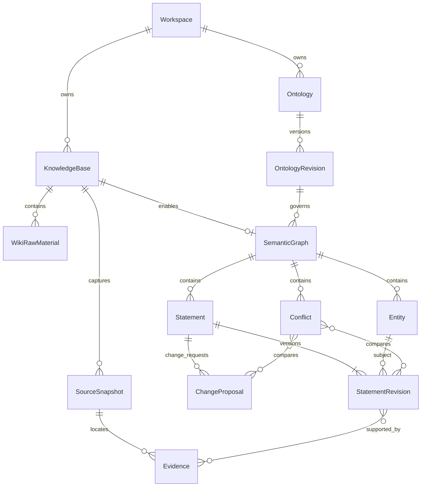

# 企业本体、知识库与事实图谱领域模型

日期：2026-09-05。状态：Proposed，建模规格，尚未实现。范围遵循[仓库内核心设计](2026-09-05-mateclaw-semantic-core-design.md)：一个新核心模块，现有 Server 装配，同库同进程。

用户已要求本体管理维护界面；[本体管理 UI 规格](2026-09-05-ontology-management-ui-spec.md)定义创建、配置、草稿校验、发布、版本对比与绑定流程，属于首期交付。

## 1. 先固定三种不同对象

- 知识库回答“资料在哪里、哪些人可访问”，复用 MateClaw Wiki。
- 本体回答“有哪些类型、属性、关系，以及哪些事实是合规的”，由新核心定义规则。
- 语义图回答“哪些具体对象之间有哪些有依据的事实”，由新核心治理，Server 存储与查询。

文档上传到知识库不意味着文档中的句子已成为事实；本体发布也不会自动产生设备、客户、合同等实例。图谱不等于图数据库或可视化画布。

## 2. 关系与基数



补充约束（图中未画属性型/关系型对象分支）：

1. 一个知识库可不开启语义图；开启后首期恰好一张图。图属于该 KB 的工作区，不能由用户另填一个工作区。
2. 一张图恰好绑定一个已发布本体版本，不绑定 `latest`。本体可被同一工作区多个 KB 复用；这些 KB 的实体和事实仍隔离。
3. 一个本体版本可有多个实体类型、属性定义与关系定义；它们都是版本内容，不是独立发布平台。
4. 一个实体恰好属于一张图，首期恰好一个实体类型。关系两端必须属于同一图。
5. 每条事实修订有一个主体；对象要么是类型化字面值，要么是一个实体，不能两者都有或两者都无。
6. 候选可以缺证据但不可确认；确认时至少一个有效且经校验证据。一个证据可支持多个事实修订，一条事实可有多个证据。
7. 每个冲突至少包含两个带类型的成员引用：具体事实修订或不可变变更候选。不能只保存主体 ID 或可变的“当前事实”，也不能为尚未批准的候选虚构正式修订号。

## 3. 归属和身份

资源范围：`GraphScope(workspaceId, kbId, graphId)`。本体属于 `workspaceId`；跨工作区共享本体首期不开放。Scope 不包含当前用户，也不是授权凭证。

宿主从认证会话或可信 Agent 调用上下文得到 Actor，验证工作区成员、KB 权限及图的真实归属，再构造明确的命令上下文。核心检查引用和 Scope 一致性；权限判断不能仅依赖模型参数或浏览器 Header。

ID 为不透明稳定标识，Java 使用明确值类型；对外 JSON ID 一律字符串，避免现有大整数 ID 在浏览器中丢精度。名称、标签、工作区路径均不能充当身份。

本体中的 `typeKey`、`propertyKey`、`relationKey` 使用稳定业务键，显示标签可为中文。精确引用为 `(ontologyRevisionId, key)`；各类 key 有类型区分。删除或改变一个 key 的含义属于新版本变化，不能靠改显示名称偷换语义。

## 4. 本体模型：少量规则，明确约束

| 对象 | 最小字段 | 规则 |
|---|---|---|
| Ontology | ontologyId, workspaceId, name, description | 领域定义的稳定身份，不存企业实例 |
| OntologyRevision | revisionId, ontologyId, version, status, entityTypes, properties, relations, createdBy/At, publishedBy/At | version 为本体内递增整数；已发布内容不可变 |
| EntityType | typeKey, label, description | 首期不做类型继承、多类型或自动归类 |
| PropertyDefinition | propertyKey, ownerTypeKey, label, valueType, multiplicity, optional fixedUnit | SINGLE 或 MULTI；值类型为 TEXT/DECIMAL/BOOLEAN/DATE/INSTANT；固定单位可选 |
| RelationDefinition | relationKey, sourceTypeKey, targetTypeKey, label, multiplicity | 从主体出发的 SINGLE 或 MULTI；首期无逆关系、对称/传递推理 |

首期不做必填属性和最小基数：资料常不完整，缺失属性表示未知，不能因未提及就推断“不存在”。SINGLE 约束表示同一有效时间至多一个不同值/目标，不限制历史版本数量，也不限制同值的多份证据。

数值用十进制值比较，`380` 与 `380.0` 等价。单位要求与属性定义一致；未实现换算的单位直接拒绝或保持候选待处理，不能自动认为 `0.38 kV` 与 `380 V` 不同或相同。TEXT 首期按明确的精确文本规则比较，不用模糊相似度证明事实相同。

本体示例：

```text
Ontology: 设备维护
Revision: 1（已发布）

EntityType: Equipment（设备）、Component（部件）、RepairEvent（维修事件）
Property: ratedVoltage，owner=Equipment，DECIMAL，unit=V，SINGLE
Property: modelCode，owner=Equipment，TEXT，SINGLE
Relation: hasComponent，Equipment -> Component，MULTI
Relation: maintainedEquipment，RepairEvent -> Equipment，SINGLE
```

需要表达“谁在什么时间对设备执行了什么维修”时，可把维修事件作为实体连接设备、人员和措施；首期不引入另一套 n 元关系模型。

## 5. 本体版本与图的绑定

生命周期：`DRAFT → PUBLISHED`；发布前校验定义引用、重复键、值类型、数量约束以及工作区归属。已发布版本可停止供新图选择，但被现有图引用的内容必须保留。

为支持管理界面，活动草稿补充 baseRevisionId、draftVersion、updatedBy/At；首期每个本体最多一个活动草稿，以 expectedDraftVersion 防止并发覆盖。draftVersion 与发布 version 分开，发布记录持久化变更说明、基准版本和操作者。校验报告绑定草稿版本，发布时重新执行权威校验；从历史版本恢复配置也通过新草稿和新发布完成。

发布 v2 不改变使用 v1 的图。首期不实现非空图的原地本体升级：空图可显式换绑；非空图需要未来专门的迁移和验证流程。实体重分类、关系改名/改义也不偷偷发生。

这一限制使“本体有版本”可真实落地，同时不假称已实现全图迁移。本体复用是规则复用，不是跨 KB 自动合并事实。

## 6. 实体与事实

| 对象 | 最小字段 | 含义 |
|---|---|---|
| SemanticGraph | graphId, workspaceId, kbId, ontologyRevisionId, status, mutationVersion | 集合边界及写入并发控制；mutationVersion 不是业务事实版本 |
| Entity | entityId, graphId, entityTypeRef, displayName, optional externalRef, status | 稳定对象；displayName 是展示信息，业务属性均进入 Statement |
| Statement | statementId, graphId, currentRevision | 一项陈述的身份及当前修订指针 |
| StatementRevision | statementId, revision, previousRevision, ontologyRevisionId, subjectId, predicateRef, value, validTime, reviewStatus, evidenceRefs, actor, recordedAt, reason | 完整不可变快照，承载一条具体陈述及其治理状态 |
| ChangeProposal | proposalId, graphId, targetStatementId, expectedRevision, immutablePayload, status, createdBy/At, optional resultingRevisionRef | 针对已有事实的修改候选，具有自己的身份；状态为 PENDING/APPROVED/REJECTED/STALE |

`value` 是互斥类型：`LiteralValue` 或 `EntityReference`，不能使用任意 Map 代替。关系型事实引用 RelationDefinition，属性型事实引用 PropertyDefinition；核心校验主体类型、对象类型、值类型和所有引用范围。

多个来源对同一已识别实体、相同谓语和值、相同有效时间提供支持时，可向同一陈述添加证据并产生新修订。不同值的竞争说法创建独立候选 Statement，不能用同一“属性槽”的 upsert 覆盖旧值。幂等重试与内容合并是两回事：同幂等键同内容返回原结果，同键异内容拒绝。

实体重复首期只根据显式 ID 或经过确认的外部身份映射解决。同名、向量相似度、原生 Wiki normalizedKey 都不能直接成为语义实体自动合并依据。人工补录也需要可追溯的人工记录作为证据。

## 7. 事实审核、修订与时间

审核状态采用 `PROPOSED / ACCEPTED / REJECTED / RETRACTED`；状态改变同样产生新修订，不改写旧快照。

- PROPOSED → ACCEPTED：证据、类型、范围、冲突检查通过，审核人具有确认权限。
- PROPOSED → REJECTED：记录原因，保留候选和证据。
- ACCEPTED → RETRACTED：明确撤回依据，保留历史。
- ACCEPTED 的业务内容修改：先建立引用目标及 expectedRevision 的变更候选；批准后原子生成新修订。审批期间旧正式版本仍有效。
- REJECTED/RETRACTED 不通过修改状态复活；重新提出候选并关联前序记录。引擎不支持由模型直接确认正式事实。

新增陈述的候选采用 PROPOSED StatementRevision；已有正式事实的修改采用独立 ChangeProposal。两者可共享 `StatementContent` 值对象，但不共享身份或修订号。ChangeProposal 的 immutablePayload 保存拟修改后的完整内容；纠正该内容须另提一个新 proposalId。候选状态变化有审核记录，批准时生成正式修订并写回 resultingRevisionRef。

尚未批准的修改不能替换 Statement.currentRevision。同一事实可有两个基于 r2 的候选，各自拥有 proposalId；其中一个批准生成 r3 后，另一个因 expectedRevision 过期而变为 STALE，不能顺势覆盖 r3。确认前重新检查最新数据及变更完成后的图约束；修订替换自身旧版本时，不把自身旧版本当作另一条竞争的当前事实。

`recordedAt` 是 UTC 系统记录时间。`validTime` 是业务有效时间，采用 `[fromInclusive, toExclusive)`；无界端点显式表示。另设 UNKNOWN 表示来源没有足够时间信息，不能把它自动解释成永远有效，也不能因时间未知而宣布两个值不冲突。

初期没有通用双时态查询引擎。未知有效时间且存在竞争单值事实时，标记 `TEMPORAL_UNCERTAINTY`，确认前由审核者补足时间或处理竞争说法。

查询未指定业务时点时，可列出满足其他可信条件的 UNKNOWN 事实并明确标注时间未知；指定时点的严格查询不得把 UNKNOWN 算作该时点已成立的事实，可单列为时间待核实信息。

## 8. 来源、快照与证据

| 对象 | 最小字段 | 规则 |
|---|---|---|
| SourceRef | sourceKind, sourceId, workspaceId, kbId | 来源的稳定身份；首期 WIKI_RAW 或 MANUAL_RECORD |
| SourceSnapshot | snapshotId, sourceRef, captureVersion, capturedAt, textDigest, immutableTextRef, optional binaryDigest | 固定采集内容；重新处理产生新快照，不更新旧内容 |
| Evidence | evidenceId, snapshotId, span, exactQuote, optional page/section/chunkRef, extractionMetadata | 证据定位以不可变快照为准；chunkRef 是导航辅助 |

Snapshot 的内容与摘要不可变。单独的来源治理记录按 SourceRef 保存 ACTIVE/WITHDRAWN 及操作者、时间、原因；来源级撤回对该来源全部采集版本生效。若仅发现某次解析错误，另记录精确 snapshotId 的支持排除，不撤回同来源其他正确版本。两种治理操作均保留审计，首期不自动恢复撤回或排除的支持。

摘要校验必须针对实际保存的字节/文本，不能盲信语义未确认的 Wiki hash。原始 PDF 等二进制与解析文本的摘要分别记录，不能混用。

`span` 固定为快照文本的 Unicode code point 半开区间；验证区间、边界及截取结果与 exactQuote 一致。MateClaw 现有偏移先核对坐标语义再转换，不能直接复制。中文、补充平面字符、换行均进入测试；原文不先做简繁或空白归一化。

为什么必须有快照：现有 WikiChunkEntity 的 content/offset 是可更新字段，WikiChunkService 在内容摘要相同但位置改变时仍会更新旧 chunk 偏移。`chunkId + offset` 不是历史不变性保证。

资料撤回与查询人失去权限的区别：

- 来源撤回：使该 SourceRef 所有快照对应的支持证据失效；其他来源仍有有效证据的事实可继续参与可信查询。零有效证据的事实退出默认可信结果，显示 SUPPORT_LOST，但历史修订不被覆盖。
- 个人撤权：只改变该用户可见结果，不改全局事实状态；当前引用、历史快照、邻域和导出都重新授权。
- 源内容更新：已有历史快照仍指向旧内容，显式展示来源版本；更新本身不能被解释为旧事实一定错误，也不能自动用最新文本替换证据。

`supportStatus=SUPPORTED/SUPPORT_LOST` 是派生状态，不是第五种审核状态。默认可信结果必须同时满足：当前修订 ACCEPTED、业务有效时间符合查询条件、存在有效支持，以及查询人可访问支撑该结果的证据和资源。无法确认来源权限时拒绝披露；治理支持状态不能代替个人访问控制。

单值约束检查所有当前 ACCEPTED 事实，包括 SUPPORT_LOST 的事实。证据失效不会自动释放其约束位置，确认竞争新值前须显式撤回或修订旧事实；否则支持恢复可能制造双重确认。服务端可检查不可向调用者披露的竞争数据，但不能在错误详情中泄漏隐藏事实或来源。

## 9. 冲突模型与处理

`Conflict` 最小字段：conflictId, graphId, kind, memberRefs（至少两个）, ruleRef, status, detectedAt, resolution, resolvedBy/At。成员引用是强类型联合：`StatementRevisionRef(statementId, revision)` 或 `ChangeProposalRef(proposalId)`；后者只能引用不可变候选内容，批准后保留原引用及其生成的正式修订关联。

首期 kind：`SINGLE_VALUE_DISAGREEMENT`、`TEMPORAL_UNCERTAINTY`。类型/Scope/值格式违反是验证错误，不包装为可投票通过的事实冲突。

确定性冲突条件：同图、同主体、同单值谓语、不同规范值/目标，且有效时间重叠。MULTI 的不同值不冲突；明确不重叠的时间区间不冲突。缺失信息不等于负事实。

OPEN → RESOLVED 的动作是可审计的事务：拒绝候选、批准修订并撤销竞争的当前版本、或补足有效时间再重验。不得只把 Conflict 标记为已解决，却留下两项违反单值约束的正式事实。参与修订已变化时重新评估，不对过期版本作决定。

候选与已确认事实冲突时：保持旧事实，候选进入待处理；不会因为模型提交另一种说法就自动删除旧事实。读接口分别返回满足第 8 节可信条件的 ACCEPTED 事实和用户有权看到的 pendingDisputes，不把候选混进正式图。首次导入的两个互斥候选在处理前都不成为正式事实。

首期正式事实写入可通过图记录锁或等价 CAS 在小图范围串行校验和提交，避免两个并发确认各自通过检查；不提前建设独立分布式锁服务。

## 10. 三种版本各管什么

| 标识 | 示例 | 改变的原因 |
|---|---|---|
| 本体版本 | equipment-ontology / v1 | 类型或约束定义变化 |
| 来源采集版本 | manual-001 / capture-2 | 再次固定来源内容；不等于文档发布版号 |
| 事实修订 | statement-101 / revision-3 | 事实内容、审核状态、有效时间或证据集合变化 |

三者独立，事实修订同时精确引用本体版本与证据快照。不能用文档更新时间充当事实修订，也不能用图 mutationVersion 充当本体版本。

## 11. 一组完整例子

```text
Workspace: 工厂 A
KnowledgeBase: 设备运维资料
SemanticGraph: 设备事实图，绑定本体 v1
Entity: P-101，类型 Equipment

来源快照 S1：设备手册，“P-101 额定电压为 380V”
证据 E1：S1 固定区间及原文
事实 F1/r1：P-101 --ratedVoltage--> DECIMAL(380,V)，PROPOSED
事实 F1/r2：相同值和证据，ACCEPTED，记录审核者

来源快照 S2：另一份记录，“P-101 额定电压为 400V”
候选 F2/r1：P-101 --ratedVoltage--> DECIMAL(400,V)，PROPOSED
冲突 C1：比较 F1/r2 与 F2/r1，SINGLE_VALUE_DISAGREEMENT
```

假定两条声明的有效时间明确重叠。界面显示“已确认 380V；存在待处理 400V 候选”，并分别展示来源。审核者若认定第二条错误，拒绝 F2 并记录 C1 处理结果；若是后续改造，则录入真实生效时间，修订原事实有效区间并确认新时期事实。

这组例子不用引入额外 ontology package、图数据库或推理引擎，也能验证企业图谱最关键的治理行为。

## 12. 宿主映射与存储边界

| 现有 MateClaw | 新模型的接法 |
|---|---|
| WikiKnowledgeBaseEntity | 直接引用 KB ID 和工作区归属，不创建第二套知识库 |
| WikiRawMaterialEntity / WikiChunkEntity | 读取经授权内容并固化 SourceSnapshot；chunk 提供辅助定位 |
| WikiPage / Citation | 保留现有整理与引用功能；首期优先追到 raw，不能把整理页当未经说明的原始证据 |
| WikiEntityEntity | 候选实例来源；其 person/organization 等自由分类需映射到本体类型 |
| WikiEntityRelationEntity | 候选关系来源；自由 predicate 和 confidence 不等于本体定义及确认状态 |
| Workspace roles / Agent ToolContext | 宿主构造可信 Actor 和 Scope，执行统一资源授权 |

关系存储建议分组：ontology + ontology_revision（版本内定义可作为整体文档存储）；graph + entity；statement + statement_revision + change_proposal；source_governance + source_snapshot + evidence + revision_evidence（快照排除另有可审计记录）；conflict + conflict_member。审核记录关联具体命令、修订与既有审计设施。表分组是逻辑映射建议，尚未创建 DDL；不要把每个值对象都建成一个模块或一张表。

业务事实只能从 Statement 读取，禁止在 Entity.propertyJson、原生 Wiki 关系表和 Statement 里同时维护三份可写的同一事实。默认图响应使用第 8 节可信条件筛选关系型事实和属性型事实；实体为节点，关系为边，属性附在节点上，每条边带 statementId/revision 以便追证。原 Wiki 删除不得通过数据库级联物理抹掉语义历史；来源删除按治理和访问规则处理，实际敏感数据清除需明确移除快照内容并保留必要的最小记录。

## 13. 确认流程与验收

1. 定义并发布一个小本体。
2. 给已有 KB 启用语义图并绑定精确版本。
3. 固化来源，形成实体候选、事实候选与证据；未识别类型或关系进入待处理，不自动改本体。
4. 确认实体映射，校验候选并处理冲突。
5. 服务端在同一事务内重新校验权限、expectedRevision、图约束并写入事实修订、证据关联与审核记录。
6. 提供有权限过滤的实体、事实、邻域及证据查询，Agent 只调用高层接口。

模型验收反例：跨 KB 关系拒绝；候选不能出现在正式图；两个并发单值冲突确认不能都成功；380 和 380.0 不误报；多值关系不误报；未知时间不假定无冲突；来源更新不改变旧引用；撤回一个证据不误撤其他有效支持；个人撤权不删除全局事实；非空图不能暗中换本体；中文与 emoji 的证据区间可准确回读。

## 14. 本地源码依据和变更状态

- [WikiKnowledgeBaseEntity](../../mateclaw-server/src/main/java/vip/mate/wiki/model/WikiKnowledgeBaseEntity.java)：已有 KB、工作区和 Agent 关联。
- [WikiEntityEntity](../../mateclaw-server/src/main/java/vip/mate/wiki/model/WikiEntityEntity.java)：现有实体类别、名称、别名及去重键。
- [WikiChunkEntity](../../mateclaw-server/src/main/java/vip/mate/wiki/model/WikiChunkEntity.java) 和 [WikiChunkService](../../mateclaw-server/src/main/java/vip/mate/wiki/service/WikiChunkService.java)：内容、offset 和重处理行为。
- [术语表](../../CONTEXT.md)；[领域边界 ADR](../adr/0001-semantic-knowledge-ontology-fact-boundaries.md)。

本次仅建立模型文档和词汇，未修改业务代码、数据库或原 Semantica4j 工作区。基数、状态和反例为设计约束，尚无实现测试结果。
