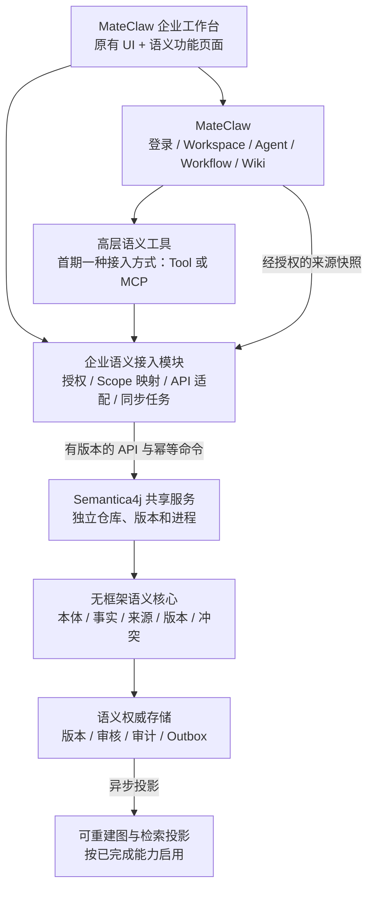

# MateClaw 企业扩展与 Semantica4j 融合评估

日期：2026-09-05。状态：Superseded（架构建议已被后续范围调整替代）；不是实施完成记录。

用户已明确改为在当前 MateClaw 仓库内建设小型独立语义核心，不继续推进外部 Semantica4j 工作区，也不以独立服务作为首期形态。当前建议见 [本地语义核心设计](2026-09-05-mateclaw-semantic-core-design.md)。下文保留为前次评估记录；其中共享服务方案和外部 TASK-150 前置要求不再适用于本地新模块。

## 1. 结论与范围

可以融入。建议将 MateClaw 作为统一工作台和 Agent 执行平台，Semantica4j 作为独立演进的语义引擎，通过薄接入模块与高层工具连接。生产形态优先采用一个共享语义服务，而不是把 Semantica4j 全部源码搬进 fork，或把整个服务封装成动态插件。

“基于 MateClaw 框架”体现在沿用登录、工作区、Agent、Workflow、Wiki、工具调用和统一 UI；它不要求所有领域逻辑都进入 MateClaw 的 JVM。

用户所述 `~/Development/semantic4j`，本机对应项目实际为 `/Users/guojiexie/Development/semantica4j`。

本次只核查代码、Git 状态和既有规划，新增此评估。没有修改业务代码、调整任务卡、改变 remote、合并、推送或启动服务；没有重跑测试，运行可用性和性能未验证。

## 2. 当前事实与完成度

| 范围 | 本次核实 | 含义 |
|---|---|---|
| MateClaw Git | `HEAD=04dde691`，分支 `codex/enterprise-ui`；origin 为 chrisopal/mateclaw，upstream 为 mateaix/mateclaw，upstream push 为 DISABLED | 双远端已配置；无需重新 fork |
| 上游差异 | 相对本地 `upstream/dev` 为落后 0、领先 2；21 个差异文件，主要为企业 UI 和文档 | 这是本地 remote-tracking ref 对比，本次未 fetch，不能据此断言远端最新状态 |
| UI | 已有 enterprise profile、CSS 适配、登录布局，默认 classic | 视觉扩展已实施；企业功能授权必须另设能力开关，不能绑定 UI profile |
| MateClaw 插件 | TOOL、PROVIDER、CHANNEL、MEMORY、SEARCH；工具通过 Spring AI ToolCallback 注册 | 可扩展 Agent 能力；现有 SDK 未提供完整 UI、菜单、数据库迁移、领域事务扩展协议 |
| 原生 Wiki 图谱 | 已有 KB 实体列表、全图、邻域图、实体提及及证据/置信度 | 不应把“新增图谱”理解为原生完全没有图；重点是增加治理语义 |
| MCP 身份 | 有按调用注入的身份类型与 RS256 短期签名断言；当前签名不包含 tenant/workspace/agent | 可复用身份设施，但不能据此假定跨服务 Scope 授权已完成 |
| Semantica4j | `HEAD=12bfd0a`；存在未提交模型和本体实验实现；client/server/kernel/integration-mateclaw/Neo4j adapter 生产目录仍为 ModuleMarker | 具备设计基础和部分内部实现，尚没有本次可确认的完整可接入服务 |
| 集成规划 | `TASK-150` 已计划 Java Client/MCP/MateClaw 适配，依赖 TASK-120/140 | 集成方向原本就在规划中，不能将 READY（依赖满足后）当成已完成 |
| 技术基线 | 两者均 Java 21；MateClaw POM Spring Boot 3.5.16，Semantica4j POM 4.1.1 | 不宜直接导入对方 Server/Starter/BOM 到宿主；这是声明的版本差异，尚未执行依赖兼容测试 |

Semantica4j Accepted ADR-013 已明确“Core 可嵌入，生产默认共享 Server”。ADR-028 又要求首个公开版本前重置未稳定的 Ontology 契约。因此融合方案应沿用这些决定，先冻结契约再形成正式消费者。

具体偏差示例：当前未提交的 `OntologyPackage` 内嵌 `List<OntologyModule>`，而 ADR-024 要求 Manifest 引用精确 Module Snapshot；`OntologyElementContext` 仍使用 `SemanticScope`，而 ADR-022 要求资源 Scope 与请求 Actor 分离。这些待收敛模型不能直接作为 MateClaw 的稳定依赖。

## 3. 需求与边界

功能目标：保留成熟工作台；新增企业本体、可寻址事实、证据追踪、冲突与版本治理；让 Agent 按权限查询并提交变更建议；支持今后接入企业业务系统。

非功能目标：低冲突升级、Scope 隔离、可重放同步、可观测失败、原文追溯、独立回滚。用户规模、知识量、并发和运维预算尚未给定，不据此引入多服务拆分、消息中间件集群或性能承诺。

| 能力 | 处理方式 | 归属 |
|---|---|---|
| 登录、工作区、Agent、Workflow、聊天、Wiki 原文和页面 | 保留并复用 | MateClaw |
| 主题、布局、导航扩展、语义业务页面 | 现有主题适配 + 独立功能目录 | MateClaw fork |
| 当前 Wiki 实体图 | 保留；可作为候选事实来源，不自动视为已审核正式事实 | MateClaw |
| 身份到 Scope 映射、资源授权、引用定位、同步任务和平台审计关联 | 新增薄接入模块 | MateClaw 企业扩展 |
| Ontology、Statement、Provenance、Revision、TruthStatus、Conflict | 在稳定契约基础上建设 | Semantica4j |
| ERP/CRM/MES 订单、客户、设备等权威状态 | 保持在来源系统；语义层保存带版本和来源的表达 | 业务系统 |
| 独立语义管理控制台 | 保留面向本体管理员的定位；一期不搬入整套 React Console | Semantica4j |

来源权限不能在导入时丢失。跨文档关系、聚合统计、路径、中间节点、缓存与导出都必须符合查询人的可见范围，而不只检查最终引用。

## 4. 建议架构（待实施）

薄接入模块建议名 `mateclaw-enterprise-semantic`，属于构建期 Maven 模块，是否装配由后端功能开关控制。名称和位置是建议，当前没有创建模块。它不依赖 Semantica4j 的 Server 或内部 Mapper。

Semantica4j 的 `semantica4j-client` 负责通用客户端；现有 `semantica4j-integration-mateclaw` 负责可复用的平台适配。平台内部 ChatOrigin、Wiki Service 和路由装配等强耦合代码留在 fork 的薄模块。两边不要分别实现一套相同的 Scope/协议转换。

初次交付优先一个构建期接入模块注册高层 ToolCallback，并承接页面 API 和来源授权，减少第二条授权路径。当 scoped MCP 契约与服务端具备同等安全门禁时，可以让 MCP 工具委托同一个接入层；无需同时实现两套传输方式。

前端可采用 `src/features/semantic/` 下的 routes、api、views、components；在现有路由与菜单保留少量显式挂接点。复用 Vue 和已有主题，不引入微前端框架，不复制整套前端。UI 风格与 `semantic.read/propose/review` 等业务能力分开配置。

## 5. ADR 摘要

以下为本评估提出的本地决策，均为 Proposed；不替代 Semantica4j 既有 Accepted ADR。

### MC-SEM-01：独立语义服务，宿主薄接入

- 背景：持续跟随 MateClaw 上游，语义引擎需要独立演进，双方 Spring 主版本不同。
- 决策：生产采用共享 Semantica4j Server + 明确 API；Core 嵌入保留给单机或确定性测试场景。
- 收益：隔离依赖、数据库迁移与故障，支持后续其他业务客户端。
- 代价：增加一个部署单元，需要网络超时、服务认证、版本兼容与监控。
- 备选：直接嵌入纯 Core 的部署成本更低，但当前 Core 仍未完成，也不能免除持久化和治理建设；完整 Server 塞入动态插件会引入类加载和生命周期耦合。

### MC-SEM-02：按职责选择扩展方式

- 背景：插件 SDK 是能力注册接口，不是任意企业应用安装框架。
- 决策：Agent 动作使用高层工具；页面与权限挂接使用功能模块；长任务和语义存储由语义服务承担。
- 收益：不改 Agent 主循环，不把领域服务限制在插件生命周期内。
- 代价：fork 仍有少量显式挂接点，升级时需检查。
- 备选：全部做 JAR 插件虽然部署入口统一，但 SDK 没有相应 UI/事务/授权契约；当前 SEARCH 面向 web_search，MEMORY 仅容许一个外部 provider，不应拿它们替代企业事实查询与治理。

### MC-SEM-03：语义事实与文档、业务事实分权威源

- 背景：Wiki 已有实体抽取和图展示；业务系统也有自己的主数据。
- 决策：Wiki 保留文档权威；Semantica4j 管理语义表达和治理版本；业务权威状态留在原系统。LLM 和原生抽取结果只产生 Proposal。
- 收益：保留上游成果，事实、推断、假设、冲突可区分，支持撤回与追溯。
- 代价：维护来源 ID、内容摘要、版本和映射关系。
- 备选：让两套图自由双向写入同一事实会形成双主，拒绝；关系图展示可演示，但不能代替 Statement 和审核治理。

### MC-SEM-04：可信身份与资源 Scope 分开

- 背景：现有 MCP 签名身份不包含完整资源范围，Agent 参数和浏览器 Workspace Header 都不是授权证明。
- 决策：接入层依据已认证身份与实际资源归属，生成明确 Tenant/Workspace/KB 映射；语义服务验证调用者及委托范围，再进行资源授权。首期缺少 tenant 模型时使用显式安装级 tenant 映射，不把 workspace 直接等同于 tenant。
- 收益：同一查询在 UI、Agent、任务中遵循可追踪的隔离边界。
- 代价：要定义服务身份、用户身份与 Agent 权限的交集，撤权时还要失效缓存和投影访问。
- 备选：共享管理员 API Key + 用户传入 scope，拒绝。现有签名身份可作为基础；workspace/KB 权限必须另行可信绑定或实时校验。未知调用者不得回落到默认工作区。

### MC-SEM-05：异步、幂等、可重建同步

- 背景：Wiki 有进程内事件和 whats-new 查询，但前者不是持久化消息日志，后者有限条数且不代表完整变更与删除流。
- 决策：首期人工选定来源，生成经授权的不可变快照并建立可持久化任务；持续同步阶段增加事务性 Outbox 或具备游标、删除语义及全量对账的变更接口。消费端以来源身份、revision/eventId 去重，拒绝旧版本覆盖新版本。
- 收益：失败可重试，图投影可重建，主聊天流程不等待重型抽取。
- 代价：增加任务、游标、重试与对账管理。
- 备选：同步双写 Wiki 数据库与 Neo4j，拒绝；单纯监听 Spring Event 后发 HTTP 不能作为无丢失同步保证。

## 6. 首个业务闭环与实施顺序

建议场景：设备故障知识助手。资料中描述“设备—部件—故障—原因—处置”，回答能回到原文，并明确哪些关系经过人工确认。首轮限制一个知识库、一个受控本体和一批可审核资料，不同时实现完整 GraphRAG、因果推理和全套企业权限中心。

目标链路：选定 Wiki 资料 → 固定来源版本/摘要 → 生成候选 Statement → 人工审核 → 提交语义版本 → 图与检索投影 → Agent 查询 → 展示证据、来源和同步状态。

| 阶段 | 内容 | 退出门禁 |
|---|---|---|
| A：契约收敛 | 对齐 Semantica4j 已接受 ADR 与未提交模型；确认 TASK-010/020/070 及本体任务的前置状态；制定来源、Scope、查询结果与 Proposal 契约 | 内部模型、Wire、Fixture、任务卡一致；不把未发布实验模型变成外部兼容承诺 |
| B：最小语义运行时 | 按已有任务依赖完成必要的事实、版本、持久化、授权和有界查询 | 真数据库写入、重启读取、跨 Scope 拒绝、幂等/CAS、引用回溯通过 |
| C：单条融合闭环 | MateClaw 薄模块、人工触发同步、一个查询 Tool、一个证据页面 | 从 Wiki 到存储再到真实 Agent/页面的端到端证据；失败有状态且可重试 |
| D：规模化增强 | 可靠增量、撤回/清除、混合检索、治理页面、企业身份与更多业务来源 | 重放、撤权、删除传播、数据对账、性能和升级回归通过 |

当前 TASK-150 依赖 TASK-120/140，不能在未满足时直接宣称可开始。如果要先交付更窄的单 KB 试点，应先正式拆分任务并记录最小依赖，不绕过 Scope、持久化和发布治理门禁。本评估未改动其任务顺序。

`codex/TASK_INDEX.md` 还规定 TASK-140 前 MCP 仅做接口探索、不提交正式实现。上文阶段 C 是目标能力，不是当前已获得实施资格的任务。

## 7. 非功能验收与失败处理

- 隔离：跨 tenant/workspace/KB、伪造 scope、匿名/IM 身份冒充用户、无身份定时任务全部有拒绝或明确受限行为测试。来源撤权后不能从图邻居、计数、缓存或引用泄漏内容。
- 一致性：记录 source revision、semantic revision、projection revision；投影落后必须显式显示，不能声称读到了刚发布版本。CAS 冲突与重试不能重复提交。
- 故障：语义服务不可用时语义功能返回明确不可用状态，已有普通 Wiki/聊天入口继续服务；只有用户允许的普通问答降级才回退，并说明本次未使用语义检索。
- 资源预算：请求明确 deadline、路径深度、返回数和 token 预算；禁止普通 Agent 使用任意 Cypher/SPARQL。具体阈值由样本数据压测确定，本次不伪造 SLO。
- 恢复：权威记录、来源映射、任务游标要备份；图/向量投影需验证重建。生产试点前根据业务明确 RPO/RTO，并做恢复演练。
- 运维：首期增加一个语义服务，存储按既有任务逐步启用；不要提前把 Neo4j、向量库、Jena、消息集群全部装齐。监控查询耗时、投影滞后、积压、失败率和模型成本。
- 验证层次：静态/构建、领域测试、真实存储和权限负测、认证浏览器、真实工具调用分别记录；Mock、ModuleMarker 或绿色 Maven Reactor 均不能替代运行闭环。

## 8. 双远端维护与回滚

沿用 upstream 官方只读、origin 企业 fork。当前 `dev` 跟踪 origin/dev，企业 UI 在 `codex/enterprise-ui`。企业功能基于已确认的企业集成基线建独立功能分支；本次不重命名或移动现有分支。

每次上游升级在隔离分支完成：fetch 并固定 upstream SHA → 审查差异 → 合并验证 → UI 双 profile 与关键业务流程回归 → 插件/身份/API 契约测试 → 再集成到企业交付分支。UI、语义接入、核心授权修复分开提交；通用平台改进可单独回馈上游。

新增语义能力通过后端功能开关和相应 capability 回滚；停止同步并保留任务位置。服务与插件版本锁定、API 有兼容策略；数据库采用可兼容的增量迁移，代码回滚不等同于反向执行破坏性数据库迁移。classic/enterprise 是构建期选择，切换视觉模式不能代替语义功能回滚。

## 9. 关键源码与规划证据

- MateClaw UI 入口：[main.ts](../../mateclaw-ui/src/main.ts)，第 14、24 行；[profile.ts](../../mateclaw-ui/src/styles/enterprise/profile.ts)，第 1–20 行。
- 插件公开能力：[PluginContext.java](../../mateclaw-plugin-api/src/main/java/vip/mate/plugin/api/PluginContext.java)，第 24–75 行；插件实例化：[PluginManager.java](../../mateclaw-server/src/main/java/vip/mate/plugin/PluginManager.java)，第 195–224 行。
- 原生实体图：[WikiEntityGraphService.java](../../mateclaw-server/src/main/java/vip/mate/wiki/service/WikiEntityGraphService.java)，第 42–150 行。
- 工具调用上下文：[ToolExecutionExecutor.java](../../mateclaw-server/src/main/java/vip/mate/agent/graph/executor/ToolExecutionExecutor.java)，第 1055–1080 行；身份断言：[McpIdentityForwardService.java](../../mateclaw-server/src/main/java/vip/mate/tool/mcp/runtime/McpIdentityForwardService.java)，第 181–200 行。
- Wiki 变更查询：[KbOpenApiController.java](../../mateclaw-server/src/main/java/vip/mate/kbopen/controller/KbOpenApiController.java)，第 249–278 行；进程内事件：[WikiFactPageUpdatedEvent.java](../../mateclaw-server/src/main/java/vip/mate/wiki/event/WikiFactPageUpdatedEvent.java)。
- Semantica4j 集成占位：[README](../../../semantica4j/semantica4j-integration-mateclaw/README.md)，第 3–8 行；集成任务：[TASK-150](../../../semantica4j/codex/task-cards/TASK-150-sdk-mcp-integrations.md)。
- 服务边界：[ADR-013](../../../semantica4j/docs/adr/ADR-013-library-and-service.md)；本体权威与投影：[ADR-024](../../../semantica4j/docs/adr/ADR-024-ontology-package-manifest-module-snapshots.md)；未发布契约收敛：[ADR-028](../../../semantica4j/docs/adr/ADR-028-pre-01-ontology-contract-reset.md)。

上述链接及行号对应本次本地工作树快照，未提交的语义模型不是可发布基线。是否进入实施，以评审后的任务卡与明确范围为准。
