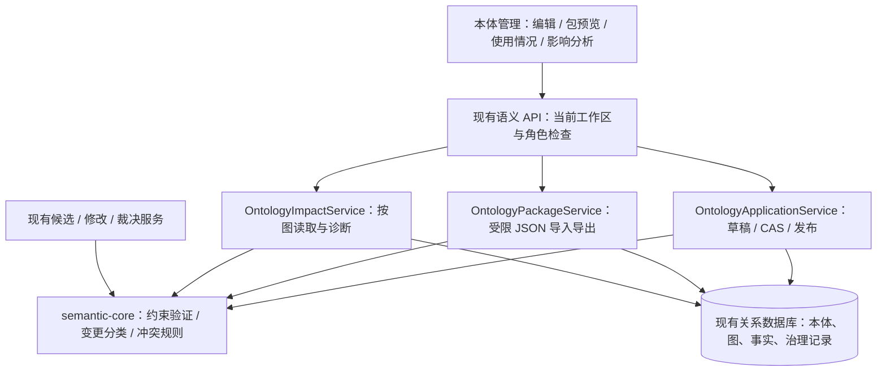

# M4 本体建模、复用与变更影响设计

状态：**Accepted / M4 已实施并完成本地验收**（2026-09-08，用户授权“开始执行”）。开发基线 `fe638a97`；实现、测试与未验证边界见 [M4 验收](../validation/ontology-m4/acceptance.md)。M5/M6 仍是建议路线，尚未实施。

## 1. 阶段目标与路线选择

建议 M4 先使本体成为可复用、可表达有限业务约束、能说明变更影响的企业模型。业务人员需要回答三个问题：“这类事实允许怎样表达”“能否从已有模板开始”“改了本体会影响哪些知识库和事实”。

| 路线 | 直接收益 | 代价与风险 | 建议 |
|---|---|---|---|
| 本体约束 + 模板复用 + 影响分析 | 改善建模质量，减少重复录入，为抽取和迁移建立稳定契约 | 不直接提高文档抽取自动化率 | **M4 推荐** |
| 本体驱动文档抽取 | 减少人工生成候选 | 需要模型配置、精确引用验证、实体消歧、成本/重试治理；不能以模型置信度替代事实审核 | M5；如果业务更急需减少录入，可调整优先级 |
| 非空图本体版本升级 | 已有图可使用新本体 | 涉及历史解释、修订、冲突、写入冻结和失败恢复，风险最大 | M6，单独设计后实施 |

当前工作假设：优先增强本体本身，沿用质量根因场景；保持单仓库独立 core + 宿主集成，保留成熟 UI，无新服务、新数据库或新依赖。M4 范围已获执行授权；后续阶段排序仍是建议，不是排期承诺。

## 2. 已实现基线与真实缺口

| 能力 | 当前实现 | M4 增量 |
|---|---|---|
| 类型、属性、关系 | key/中文标签/说明；属性数据类型、SINGLE/MULTI、固定单位；关系起止类型 | 别名、术语弃用提示；TEXT 枚举、DECIMAL 闭区间约束 |
| 本体治理 | 单活动草稿、CAS 保存、校验、版本差异、管理员发布、版本停止新绑定 | 保留流程，增加语义变更分类和使用情况入口 |
| 知识库绑定 | 一个 KB 一张语义图，绑定精确发布修订；非空图不能直接换绑 | 显示每张图的绑定版本与变更影响，**不执行迁移** |
| 可信事实 | 审核、冲突、固定证据、来源撤回、当前权限和历史追溯 | 新版本约束复用同一核心验证器，旧绑定继续使用旧定义 |
| 复用 | 可在本工作区复用已发布本体，尚无可移植模板包 | 发布版本导出 JSON；导入预览后创建新本体草稿 |
| Agent | 只读 semantic_search，带可信事实、标签、版本与证据 | M4 不新增可写工具；为后续抽取保留明确类型/标签契约 |

源码依据：`OntologyDtos`、`OntologyApplicationService`、`OntologyWireMapper`、core `OntologyValidator`、`GraphApplicationService`、`StatementApplicationService`、`SemanticQueryService` 和现有 `OntologyEditor/Versions`。当前本体上限为 100 类型、500 个属性与关系合计；图上限 1000 实体、10000 事实身份，M4 不扩大这些容量。

## 3. 明确范围

**M4 必须交付**：

1. 业务术语别名和弃用提示，稳定 key 不被中文改名影响。
2. TEXT 枚举、DECIMAL 最小/最大值；草稿、候选和修改提案共用规则。
3. 自包含 JSON 本体包：导出已发布版本，预览后导入为新草稿。
4. 变更分类、绑定使用情况、按图的只读影响分析。
5. 既有管理界面上的完整编辑、预览、定位、发布和影响说明。
6. 质量根因升级场景及旧版本、权限、并发和恢复验收。

**不纳入 M4**：继承、多父类型、跨本体动态 import、OWL/RDF 推理、实体自动合并、条件表达式/任意脚本、自动单位转换、必填事实完整性规则、自动抽取、自动发布、非空图换绑。必填属性不能用单条事实验证器草率实现：它需要明确“实体录入完成”的业务时点，另行建模。

## 4. 领域与版本契约

四种版本继续区分：本体业务版本（v1/v2）、定义格式版本（definitionFormatVersion）、事实修订（r1/r2）、图 mutationVersion。本体包还有自己的 packageFormatVersion，它只表示文件封装格式。

| 对象/字段 | 定义 | 规则 |
|---|---|---|
| TermRef | `{kind: TYPE/PROPERTY/RELATION, key}`，位于特定 OntologyRevision 内 | key 稳定；不同 kind 不能混为一个谓词。更换 key 在差异中表示删除 + 新增，不自动识别重命名 |
| aliases | 类型、属性、关系的显示/识别提示列表 | 默认空；最多 10 个，每个 128 code point；trim、去空、去完全重复；同一 kind 中重复别名或与另一 key/label 相同给出歧义警告，不能作为合并依据 |
| deprecated | 该术语不推荐继续使用 | 默认 false；仅提示，不使旧事实失效，不阻止解释历史，也不自动撤回事实。与“整个本体版本停止新绑定”分开 |
| TextConstraints | `allowedValues?: string[]` | 仅 TEXT；缺省表示不限制；提供时 1–100 个非空唯一值，每项最长 128 code point。候选值按原文精确匹配，不自动 trim、忽略大小写或替换同义词 |
| DecimalConstraints | `minimum?: string, maximum?: string` | 仅 DECIMAL，普通十进制字符串，闭区间；边界最多 38 位有效数字、12 位小数，拒绝指数形式/NaN/Infinity，minimum ≤ maximum；用 BigDecimal 比较而非 double |
| OntologyPackage | 已发布定义及必要名称/说明的可移植副本 | 不含实体、事实、证据、权限、工作区/数据库 ID、脚本或远端引用；来源名称/业务版本只作描述，不能冒充发布者签名 |
| ImpactReport | 草稿或发布修订对一个现有图的只读诊断 | 报告不是迁移批准，也不是新事实；不修改绑定和历史 |

示例：保留 `QualityIssue`、`rootCause` 的 key，给“孔径超差”类型相关术语补别名；新增 `investigationStatus`（TEXT，枚举“待复核/已确认”），给 `deviation` 增加适合该定义的 DECIMAL 范围。生产阈值是业务方配置，系统不内置 `0.05 mm` 等工艺结论。

约束表达结构建议：属性新增 `constraints: {allowedValues?, minimum?, maximum?}`，校验器按 valueType 严格拒绝无关字段组合；类型、属性、关系新增 aliases/deprecated。不使用字符串表达式语言。

别名用于本体编辑器定位及 semantic_search 的术语检索，返回仍是匹配的可信事实和规范名称；别名重复时允许多结果，不自动选择某个实体或把候选确认为同一对象。类型别名不是实体别名，不能把全部某类型实体合并。

### 4.1 旧格式兼容

- 已存定义无格式字段视为 format 1；新写入 format 2。通过 `OntologyWireMapper` 及一个明确的格式读取入口转换到 core 值对象，不在 Controller/UI 各自猜默认值。
- 旧发布 JSON 不重写、不重新计算原有命令结果。读旧修订时默认无新约束、无别名、未弃用，仍以其自身定义验证旧绑定图。
- format 1 草稿可继续读取；新 UI 保存升级草稿需显式带 format 2 和 expectedDraftVersion。format 2 草稿拒绝缺少格式声明的旧客户端整包覆盖，避免静默丢字段。
- 未知未来格式拒绝解析/导入，不降级忽略；区分“缺少旧字段”和“错误类型/无关字段”。
- 旧发布/重放命令 hash 和序列化是回归门禁：新增 DTO 字段不得破坏已记录的同操作重放。若需要适配，采用版本化命令 payload，严格核验资源与原请求，不能放宽幂等检查。
- 新规则在 `StatementValidator` 验证类型后执行；候选提交、修改提案、审核/裁决以及影响分析都调用同一个约束实现。新来源不能绕过本体规则。
- 新增 WARNING 前必须修正宿主的 `violations.isEmpty()` 有效性判断及保存/发布拒绝逻辑：仅 ERROR 阻断，WARNING 原样显示。core 已区分严重度，不能让合法别名警告意外阻止发布。

## 5. 架构与模块职责



core 只接收不可变定义、事实和诊断输入；不读取 DB、HTTP、Wiki 或模型。Server 完成当前授权、限制输入、读图、事务和记录。UI 不自行认定事实有效、变化兼容或导入成功。

技术选择沿用 Java 21、现有 Spring/JDBC/MyBatis/Flyway 与 Vue/Element Plus，不增加图数据库、队列、动态规则引擎或包注册中心。当前问题是规则和治理契约，现有有界数据集可先按图同步诊断；如果实测超时，再依据数据量决定异步作业，而不是先造调度平台。

### 5.1 持久化与发布顺序

- 新约束仍在不可变 `definition_json` 中，不为每个规则建立 EAV 表；格式字段在 JSON 中保存，读取由服务端统一处理。
- 包导入的 operationId/payloadHash、结果、新建本体和草稿、来源摘要必须同事务持久化，复用现有命令/本体治理存储；实现前确认字段容量和操作种类。不能把只支持 RevisionView 的旧 operation DTO 强行当作导入结果。
- M4 不持久化大量影响报告，不建“兼容性缓存”；导出的报告是一次诊断快照。后续迁移执行若需要冻结报告，应另建可审计的升级计划，而非复用 UI 临时 JSON。
- 当前最高迁移为 V196。若命令/来源摘要需要新增列或表，实施时重新扫描占用并追加 H2/MySQL/Kingbase 三套迁移，禁止预占固定编号或改写旧迁移。
- 先部署支持双格式的后端，再启用新 UI 写 format 2；旧版后端不保证能读新定义，不能把直接回滚旧 JAR 当成已支持恢复。功能关闭只关闭新入口；已写 format 2 的读取/验证能力必须保留。

## 6. 模板包：复用模型，不复制事实

```json
{
  "packageFormatVersion": 1,
  "name": "质量问题与根因调查",
  "description": "批次、设备、质量问题及经复核的根因关系",
  "source": {"ontologyName": "质量分析", "version": 2},
  "definition": {
    "definitionFormatVersion": 2,
    "types": [],
    "properties": [],
    "relations": []
  }
}
```

上面仅展示包结构，空 types 不能通过实际本体验证。提供一个能通过校验的质量分析示例包作为 fixture，不能夹带示例事实作为已审核结论。

导入采用 **预览 → 解决校验问题 → 创建新草稿 → 校验发布**，M4 仅支持创建新本体，不合并/覆盖已有本体。版本复用优先直接绑定现有已发布版本；只有需要独立演化才复制模板。

- UTF-8 JSON，建议上限 1 MiB；沿用 100 类型/500 谓词限制，限制嵌套深度，拒绝重复 JSON key、未知字段及外部引用；不支持 zip、URL 下载和远端包依赖。
- 包 digest 对服务端解析、校验并规范化后的完整有效包计算；字段排序、数组顺序与数值字符串规范须固定。digest 用于一致性/重放，不证明来源可信或签名有效。
- preview 不创建本体、不发布。返回 digest、字段错误/警告、目标名称和数量。import 重传同一包、expectedDigest、operationId；服务端重新解析并比对，不能信任浏览器的“已校验”标记。
- 导入时重新检查当前工作区和 member 权限；同 operationId + 同请求返回相同新草稿；异请求 409。跨工作区不能重放另一个工作区的导入结果。
- 名称相同只提示可能重复，内部 ID 新建；禁止猜测合并。来源摘要来自受限字段，错误日志不得保存整个上传内容或凭据。

## 7. 变更与影响：分清兼容、符合和迁移

| 变更 | 定义级分类 | 图数据诊断 |
|---|---|---|
| 标签/说明/别名/弃用提示变化 | ANNOTATION | 不改事实身份；显示业务提示 |
| 新增类型/属性/关系，枚举扩展或范围放宽 | ADDITIVE_OR_WIDENING | 未新增必填语义；通常不使既有事实违规，但不代表图已升级 |
| 枚举减少、范围缩小、MULTI→SINGLE | POTENTIALLY_BREAKING | 检查值与当前单值槽位/业务时间冲突 |
| 删除 key、改变 valueType、固定单位、归属/起止类型 | BREAKING | 列出受影响实体/事实/提案，不自动转换或重映射 |

报告返回两个独立判断：`definitionChangeClass` 与 `dataConformance=CONFORMS/VIOLATIONS/INCOMPLETE`。禁止返回 `safeToUpgrade=true`。一个“碰巧没有违规数据”的删除操作仍是破坏性定义变化；有违规数据也不阻止发布独立新版本，只阻止把报告误解成可以直接换绑。

### 7.1 数据范围与一致性

1. 使用情况分页列出当前有权访问且 KB 仍有效的绑定图；不得通过合计泄露不可见图的名称、数量或事实。
2. 每次仅分析一张图。目标为本体的某个已发布修订或**已保存且明确 expectedDraftVersion 的草稿**。未保存 UI 内容必须先保存。
3. 比较该图**实际绑定修订**和目标定义，不假设所有图都绑定草稿的 baseRevisionId。支持同一本体多个旧版本分别诊断；M4 不做跨本体映射。
4. 检查全部实体、current ACCEPTED 事实（包括 SUPPORT_LOST，避免忽略仍占据单值槽位的当前确认修订）、PROPOSED 候选及 PENDING 修改提案。历史修订只统计，不用新规则重新定性或重写；完整历史迁移风险明确不在本报告结论内。
5. 单条结构/值约束和单值冲突分开检查，后者沿用核心的有效时间与 UNKNOWN 语义。候选/提案违规列为待处理项，不能仅扫描 trusted 结果。
6. 记录源/目标 revisionId、目标 draftVersion、definitionDigest、graph mutationVersion、scannedAt、扫描数、截断标记。读取前后核对版本及当前 KB/授权，变化则返回 409，不能以部分读取得到“全通过”。实现需测试所有影响诊断输入的写路径都会递增图版本。
7. 建议最多返回 200 条诊断明细，仍需完成全部有界扫描以提供准确总数；`detailsTruncated=true` 不等于检查不完整。超时/上限使全量检查未完成时必须 INCOMPLETE，不能给出 0 违规结论。

诊断总数按去重后的实体/事实/提案引用统计，不承诺枚举全部冲突组合数量。单值检查按主体与谓词分组，并利用时间顺序处理；不得为了渲染全部两两冲突而物化平方级结果。真实性规则沿用 core，性能优化也要经过 UNKNOWN/半开区间回归。

发布只创建新修订，保留旧图绑定；影响分析不强制成为发布事务的图全局锁。发布页展示分析时间与过期状态，CAS 仍以草稿版本为准。发布后新空图可绑定 v2，旧非空图继续 v1；**界面不出现“应用升级”按钮**。

## 8. API 建议契约

以下均是拟新增契约，前缀 `/api/v1/semantic`，保留现有响应 envelope、字符串 ID 和数字计数。

| API | 权限 | 输入/输出要点 |
|---|---|---|
| PUT `/ontologies/{id}/draft`（扩展） | member | expectedDraftVersion、format 2 definition；保留 CAS |
| POST `/ontologies/{id}/draft/validate`（扩展） | member | 错误带 code/path/termRef/severity，区分 ERROR/WARNING |
| GET `/ontologies/{id}/revisions/{revisionId}/package` | viewer | 仅当前工作区可读的已发布定义；返回可下载文件与 digest |
| POST `/ontology-packages/preview` | member | body 为包；只校验，返回 digest/数量/诊断 |
| POST `/ontology-packages/import` | member | package + expectedDigest + operationId + 目标名称；创建新草稿 |
| GET `/ontology-package-imports/{operationId}` | member | 仅创建者或 admin，仍验当前工作区；结果回读用于网络超时恢复 |
| GET `/ontologies/{id}/usage` | viewer | 可见绑定图分页，revision/version，enabled；服务端当前资源检查 |
| POST `/ontologies/{id}/impact` | admin | graphId + targetRevisionId 或 expectedDraftVersion（二选一）；返回完整性/版本/诊断 |

既有 diff API 保留，并新增分类字段；旧字段不改义。400 无效请求格式/范围；已有本体定义诊断保持 422 INVALID_DEFINITION，不随新接口改义；403 当前角色不足；404 跨工作区、资源不可见或已失效；409 CAS/digest/operation 冲突；413 包过大；504 分析超时。禁用语义功能时不开放新入口。

## 9. 管理界面与客户体验

保留现有列表、编辑器、版本页和知识库绑定面板。使用现有样式变量与 Element Plus；classic/enterprise、浅/深主题保持一致授权和功能。

| 页面 | 布局与操作 | 反馈与失败恢复 |
|---|---|---|
| 本体列表 | 主操作“新建本体”，次操作“导入模板”；导出放在已发布版本菜单 | 明确“导入为草稿”，不暗示立即替换已有模型 |
| 编辑器 | 现有类型/属性/关系列表旁展示选中项；常用字段优先，别名/约束按类型展开 | 错误可点击定位到行/字段；不让业务人员写 JSON。切换 valueType 清楚提示将移除不兼容约束 |
| 发布预览 | 变更类别、术语名称、风险解释、可见绑定版本；可按图分析 | 明确“发布新版本不会更新现有知识库”；草稿改变使分析过期，失败保留输入 |
| 版本详情 | 类型与约束只读，保留 diff；增加导出和使用情况 | “不推荐使用术语”和“停止此版本新绑定”分别显示 |
| 影响分析 | 图/当前版本/目标版本、总数/违规/待处理、可定位事实或提案 | 缺少权限不展示对象；超时显示未完成；显示仅 200 条时标明总数和明细截断 |
| 导入向导 | 选文件 → 本地读文件/服务端预览 → 设置名称 → 创建草稿 | 返回 draftId 后跳转编辑；超时可按 operationId 回读，按钮不重复创建 |

窄屏采用单列详情和可横向滚动的列表；不把小按钮塞满一行。所有状态有文字而非仅颜色；键盘可进入约束配置、错误定位和包预览。加载/空态/无权限/过期/失败均须有明确下一步，工作区切换取消旧请求且清空旧结果。未保存保护沿用现有规则。

## 10. 非功能要求与失败模式

以下为**待测目标和设计预算，不是当前实测性能**：

- 不增加常驻基础设施和模型调用成本；M4 不调用 LLM。沿用上限，不为假设中的百万图规模实现分布式扫描。
- 基准：100 类型、500 谓词、单图 1000 实体/10000 事实身份，并覆盖密集单值槽位、时间 UNKNOWN、多提案反例；绑定列表单页最多 100。
- 在记录 CPU/内存、数据库、索引和数据分布的固定验收环境，普通元数据请求 p95 目标 ≤500ms，包预览/单图分析目标 ≤3s，硬超时 5s。不达标则先测查询/算法并减少重复读取，不将超时吞成成功。
- 浏览器 390/1280/1920 宽度，浅/深主题，两种 profile；慢网和取消请求不覆盖新工作区数据。
- 每项写入与命令结果/必要审计原子提交；DB 故障不留下半个导入。恢复目标是已提交命令可回读，不新增未经宿主运维承诺的可用性 SLA。

| 失败 | 行为 |
|---|---|
| 两人保存/发布同一草稿 | CAS 409，保留用户编辑供对照，禁止静默覆盖 |
| 上传超限/格式未知/重复 JSON key | 预览拒绝，无写入；返回具体字段错误 |
| 上传内容在预览后改变 | digest 409，重新预览 |
| 导入成功但响应丢失 | operationId 回读同一草稿，不重复创建 |
| 分析时事实、提案或草稿变化 | 409，明确“数据已变化，请重新分析” |
| 扫描超时或容量不能完整读取 | INCOMPLETE/504；不允许显示“无影响” |
| KB 删除、转移、撤权 | 当前请求拒绝/过滤；不返回缓存报告中的敏感对象 |
| 新版格式已写入后回滚旧服务 | 禁止宣称透明兼容；保留双格式读取服务或按演练过的整库快照恢复 |

## 11. 验收故事与阶段后续

质量分析本体 v1 已有可信超差事实 `0.08 mm`。从 v1 建 v2 草稿，业务方将允许范围调整为 `[-0.05,0.05]`，新增调查状态枚举，修改中文标签但保留 key。

1. v2 草稿校验通过不代表旧图数据符合。按图分析列出 `0.08 mm` 违反目标范围，分类为潜在破坏性变化；历史证据不变。
2. 发布 v2 后，v1 图仍能按 v1 接收/查询原合法事实；新建空图绑定 v2，提交 `0.08` 被拒绝，`0.03` 可以成为有证据的待审核候选；非法枚举被拒绝。
3. 导出 v2 模板，在另一个授权工作区预览、创建新草稿并发布；新 ID、零事实、零证据，原工作区无变化。
4. 试图直接给旧非空图换绑 v2，仍返回 409。任何影响报告都不绕过这个约束。
5. 补充范围放宽、单位改变、移除类型、MULTI→SINGLE、修改提案、证据失效、跨工作区和并发版本变化测试。

后续 **M5**：从固定 SourceSnapshot 按精确 OntologyRevision 生成候选，验证 exactQuote 与 code point、让人工消歧实体、经过现有审核与冲突链才成为可信事实；先一类质量调查文档，不做全平台抽取。

后续 **M6**：在 M4 影响分析基础上设计非空图升级，需冻结目标定义/源图版本、转换方案、冲突处理、历史解释及失败恢复；不得仅 UPDATE graph.ontology_revision_id。具体模型和任务不在本轮承诺中。

下一步建议批准 M4 后从契约与兼容性门禁开始。决策依据见 [ADR-0002](../adr/0002-ontology-m4-governed-model-evolution.md)，任务及验收见 [M4 实施计划](../plans/2026-09-08-ontology-m4-plan.md)。
