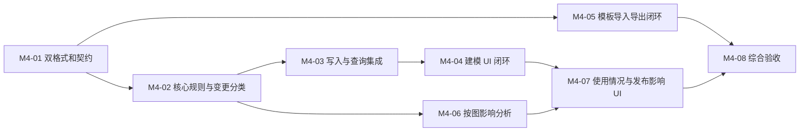

# M4 本体增强实施计划

状态：**M4-01～08 已实施并完成本地验收**（2026-09-08）。实际执行数、修复、运行证据和限制见 [验收记录](../validation/ontology-m4/acceptance.md)。代码基线 `fe638a97`，设计见 [M4 设计](../architecture/2026-09-08-ontology-m4-design.md)，重大决策见 [ADR-0002](../adr/0002-ontology-m4-governed-model-evolution.md)。任务完成必须有可回读证据，不能以复选框或构建成功代替行为验收。

## 顺序和交付界限



优先完成 M4-01～04 的可发布小闭环，再做模板复用与影响分析。模块接口和字段冻结后 M4-05/06 可独立推进，但共享 DTO/mapper 的改动需指定单一负责人，避免两个任务同时改同一协议。没有团队规模或期限输入，因此不把人日估算当作排期承诺。

## M4-01：冻结协议并建立旧版本兼容门禁

- **修改**：`mateclaw-server/src/main/java/vip/mate/semantic/web/OntologyDtos.java`、`ontology/OntologyWireMapper.java`、`ontology/OntologyApplicationService.java`；按需要新增 `ontology/OntologyDefinitionCodec.java`。
- **工作**：定义 format 1/2、aliases/deprecated/constraints、错误码和严格 JSON 规则。扫描所有 `Definition.class`/definition_json 读取点，统一经过 codec；列出旧构造器、operation hash 及发布结果的兼容策略。
- **先建立的反例**：旧版真实 definition_json 与已发布命令 fixture，旧版 GET/diff/publish 重放；未知 format 拒绝；旧客户端覆盖 format 2 草稿拒绝，数据不变。
- **验收**：旧发布 JSON 字节不被迁移或查询修改；旧图行为与基线一致，新草稿能保存读取新字段。复现旧客户端/新后端及新 UI/旧后端拒绝策略。
- **停止线**：不能证明幂等历史和序列化兼容时，不开始 format 2 正式写入。

## M4-02：core 确定性规则与差异分类

- **修改**：`mateclaw-semantic-core/src/main/java/vip/mate/semantic/core/ontology/{EntityTypeDefinition,PropertyDefinition,RelationDefinition,OntologyValidator}.java`、`core/fact/StatementValidator.java`。
- **新增候选路径**：`core/ontology/PropertyConstraints.java`、`core/ontology/OntologyChangeClassifier.java`；复用 `core/conflict/ConflictDetector`，不创建平行冲突规则。
- **工作**：TEXT allowedValues、DECIMAL minimum/maximum、别名诊断、弃用提示；确定性分类 metadata、新增/放宽、潜在破坏、破坏性变更。
- **测试**：上下界包含、负值、小数精度、不适用字段、重复枚举/别名、空约束、非法格式；label 变化身份不变；MULTI→SINGLE/单位/起止类型/key 删除的分类；不将 alias 当作实体等价。
- **验收**：core 不依赖 Spring、Jackson、DB、Wiki；同一输入结果可重复，保留现有 25 个核心回归。

## M4-03：宿主写入与搜索统一消费新规则

- **修改**：`semantic/statement/{SemanticDomainMapper,StatementApplicationService,StatementReviewService}.java`、`semantic/graph/GraphApplicationService.java`、`semantic/query/SemanticQueryService.java` 与实际定义读取点。
- **工作**：所有路径按图绑定修订验证，format 1 保持原规则；新字段经过草稿保存/验证/发布完整往返。别名只用于术语检索，结果仍返回规范名称和可信事实。
- **现有适配点**：`OntologyApplicationService.validate` 目前按 violations 是否为空判断 valid，发布通过 wire.reject；新增 WARNING 后统一改为仅 ERROR 阻断，并证明有警告可以保存/发布。
- **测试**：v1 图继续接受原合法值；v2 图拒绝越界/非法枚举；propose/change/review/resolve 都不能绕过；别名歧义多结果与 Agent/KB 权限保持；旧命令 replay 仍合法。
- **验收**：新规则没有让旧图的根因或证据静默失效；发布 v2 不改变任何现有图绑定。

## M4-04：本体编辑器可操作闭环

- **修改**：`mateclaw-ui/src/features/semantic/api/types.ts`、`ontology/OntologyEditor.vue`、`ontology/useOntologyDraft.ts`、`ontology/components/{EntityTypeEditor,PropertyEditor,RelationEditor,ValidationPanel,PublishDialog}.vue` 与中英文词条。
- **工作**：别名/弃用、枚举列表、范围输入、按值类型显示字段、诊断定位。保留现有键盘操作、未保存保护、CAS 冲突和错误输入。
- **测试**：切换类型处理不兼容约束；缺省字段的旧修订只读展示；警告不等于发布失败；工作区切换清除请求结果；服务端失败不丢表单。
- **验收**：无需手写 JSON 即可创建 v2 草稿、验证和发布；390/1280/1920、深浅主题和两个 profile 通过。

## M4-05：模板包导入导出完整纵向功能

- **新增**：Server `semantic/ontology/OntologyPackageService.java`、`semantic/web/{OntologyPackageController,OntologyPackageDtos}.java`；UI `ontology/components/OntologyPackageDialog.vue`、API 对应函数；`docs/examples/semantic/quality-ontology-package.json`。
- **复用**：现有本体/草稿、命令记录、治理记录。若字段不足才追加迁移；最高 V196 仅是规划基线，实施前重新分配新版本。
- **工作**：导出发布修订；预览不写入；规范化 digest；导入重新校验，事务创建新本体/草稿、operation 结果与来源摘要；可回读恢复。
- **测试**：合法 round trip、中文/Unicode、format 1/2、未知字段/重复 JSON key/超限；同 operation 幂等、不同 payload 409、断网后回读；故障注入完整回滚；跨工作区/撤权；无事实、证据、权限复制。
- **验收**：页面完成导入 → 编辑 → 发布；新 ID/零业务实例，原本体没有变化。示例包可直接通过真实服务端预览。

## M4-06：绑定使用情况和按图影响诊断 API

- **新增**：`semantic/ontology/OntologyImpactService.java`、`semantic/web/{OntologyImpactController,OntologyImpactDtos}.java`；仅在现有 mapper 无法表达查询时增加专用只读 mapper。
- **工作**：可见使用情况分页；目标已保存草稿或发布修订；从图实际绑定修订比较；检查实体、current ACCEPTED（含 SUPPORT_LOST）、PROPOSED 和 PENDING 提案；版本前后校验、统计与明细限制。
- **一致性前置**：审计所有影响数据的写路径是否递增 graph mutationVersion；不满足则补齐并测试，不把当前图版本当万能快照。
- **测试**：范围缩小/放宽、删除类型、单位变化、时间重叠/UNKNOWN、密集 SINGLE 槽位、多提案；不同图绑定不同旧版本；并发修改返回 409；200 条明细截断与全量统计区分；超时 INCOMPLETE/504。
- **验收**：无写入、无自动换绑；无违规只表示被扫描 current 数据符合目标规则，不能承诺迁移历史；当前资源权限与基线一致。

## M4-07：版本使用情况与发布影响界面

- **修改/新增**：`ontology/OntologyVersions.vue`、`ontology/components/PublishDialog.vue`、`ontology/components/OntologyImpactPanel.vue`、`graph/KnowledgeBindingPanel.vue`。
- **工作**：显示术语变更类别、绑定版本、按图分析、诊断定位；过期/超时/明细截断解释；管理员诊断，普通用户仅见允许的使用情况。
- **测试**：分析失败不能显示绿灯；未保存先保存；草稿修改使旧报告过期；发布后旧图仍 v1；非空图没有“应用升级”；没有权限的对象不在合计和跳转 URL 泄漏。
- **验收**：业务人员能区分“发布新版本”“停止新绑定”“旧数据不符合新规则”，并能打开有权限的事实/提案核对；保留现有工作台路径。

## M4-08：质量场景、运行和兼容性验收

- **新增测试**：core `OntologyConstraintTest`/`OntologyChangeClassifierTest`；Server `SemanticOntologyM4IntegrationTest`、`SemanticOntologyPackageIntegrationTest`、`SemanticOntologyImpactIntegrationTest`；UI 对应 component/API/route 测试。类名为计划名称，实施时遵循实际目录约定。
- **端到端**：按设计第 11 节的 v1 `0.08 mm` → v2 收紧范围 → 影响诊断 → 独立发布 → 新图拒绝非法值 → 模板跨授权工作区复用。另覆盖现有质量根因裁决/撤回场景仍成立。
- **数据库**：真实 H2/MySQL 场景与现有迁移链（M4 无新增迁移，结构保持 V196），旧迁移 checksum 不变；新增 SQL 必须有 Kingbase 实机验证才声称支持该数据库。无可用环境则明确留为发布限制。
- **恢复**：导入已提交但响应丢失、DB 故障、服务重启、关闭新功能入口后仍读 format 2；演练支持双格式服务的回退方案。
- **性能**：记录硬件与分布，按上限跑最坏槽位/提案输入；确认全量扫描/截断语义，不能用只含少量数据的 p95 代表容量边界。
- **产物**：`docs/validation/ontology-m4/acceptance.md`、API/DB 回读、各 profile 截图、迁移与测试摘要、未验证项。只保存合成数据，不保存凭据和认证浏览器状态。

## 验证命令原则

所有命令必须在实际开发 worktree 执行，先核对 `pwd`、branch 和 HEAD。指定用例的 Maven 可以因“无用例”而绿色结束，因此必须核对 Surefire 的实际执行数和 skip 数。

```bash
# 在开发 worktree 根目录，选择本机实际 Java 21
JAVA_HOME=$(/usr/libexec/java_home -v 21) mvn -pl mateclaw-semantic-core -am test
JAVA_HOME=$(/usr/libexec/java_home -v 21) mvn -pl mateclaw-server -am \
  -Dmaven.compiler.proc=full -Dtest='Semantic*Test' \
  -Dsurefire.failIfNoSpecifiedTests=false test
# MySQL 单独按现有 opt-in 环境运行；必须 0 skipped，凭据不进入命令日志
# UI 从 mateclaw-ui 执行：语义测试、目标文件 ESLint、双 profile build
```

## 提交、上线与阶段门禁

- 建议按上述纵向功能形成可回退提交；提交遵循仓库 Lore 协议，列出真实测试和未验证内容。
- 不修改 V196 及以前迁移，不引入依赖，不从旧项目批量复制未使用模块。
- M4 发布前，格式兼容、权限、约束共用、导入原子性及影响分析不写入是必须门禁；性能/数据库限制必须写入验收，不能用自动延期掩盖。
- 设计确认后才开始开发。M4 验收不自动授权 M5/M6，也不自动推送或部署。
