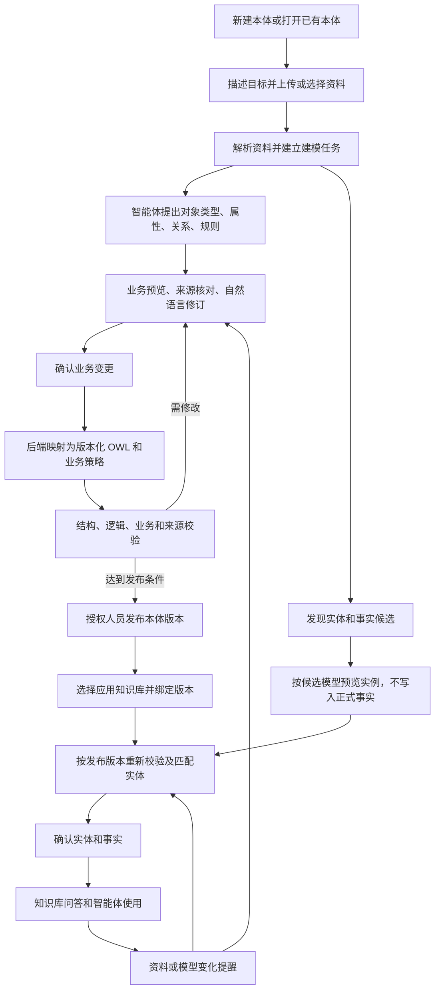
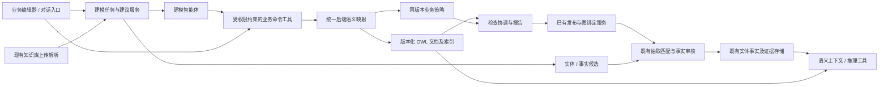

# 本体管理与智能建模功能设计

状态：设计提案，待业务评审；不代表已实现。

日期：2026-09-10。实现基线：`19fa7558`。用户所述 MetaCloud 知识库，在本设计中指当前 MateClaw 已有知识库系统，不另建资料库。

## 1. 产品目标与范围

让用户通过上传资料、选择已有知识库文档和自然语言交流，建立可理解、可验证、可维护的本体业务模型，并管理模型下的具体实体。系统负责将确认的业务语义转换为 OWL，打通知识库的资料、实例事实和智能体使用过程。

核心成功标准：用户不需要编写 OWL、填写 IRI、提供摘要或字符位置，也能完成一次“资料进入—模型生成—模型修订—校验发布—知识库绑定—实体确认—智能体使用—后续更新”的闭环。

本轮设计涵盖：

- 本体业务模型的建立、修改、验证、发布、版本管理和停用。
- 具体实体及其属性、关系、来源、有效时间和修订生命周期。
- 资料上传、解析、引用及资料变化后的影响处理。
- 基于自然语言的智能体建模、修改、解释和校验协助。
- 与现有知识库、语义图、事实审核及智能体上下文能力衔接。

不扩展为通用数据库 ETL 平台、业务流程执行引擎或独立图数据库产品。专家仍可通过高级入口导入/导出 OWL；它不是普通建模的前置条件。

## 2. 统一业务语言

| 用户看到的名称 | 示例 | 系统含义 |
|---|---|---|
| 本体 / 业务模型 | 设备运维模型 | 可复用的对象类型、属性、关系与规则及其版本 |
| 业务对象类型 | 设备、传感器、产线 | 对事物类别的定义，不是某个具体设备 |
| 属性 | 设备编号、温度、安装日期 | 对象记录的信息及内容类型 |
| 关系 | 设备安装传感器、设备位于产线 | 不同对象之间的关联定义 |
| 业务规则 | 设备编号必填；温度单位为摄氏度 | 模型语义规则或完整记录检查规则，内部区分执行方式 |
| 业务实体 | 设备 EQ-001、传感器 TS-009 | 某一知识库语义图中的具体对象 |
| 实体记录 / 事实 | EQ-001 安装 TS-009 | 有来源和状态的具体属性或关系断言 |
| 参考资料 | 设备规范第 3 节 | 支持某项定义或实体记录的证据 |
| 待确认内容 | “每台设备最多几个传感器？” | 未获充分依据的模型问题，不自动转成确定规则 |

界面禁止用“公理、TBox/ABox、IRI、定义域、值域、摘要、码点”等作为普通用户必填字段。可在高级详情中保留这些信息以供审计和维护。

“规则检查”必须区分语义和数据完整性。例如“每台设备必须填写编号”属于完整记录检查，不能直接把 OWL 的关系数量限制当作缺失字段校验。

## 3. 主业务流程



模型和实体可以由一次任务共同提出，但不能捆绑成一次无条件发布。模型先稳定，实体再按明确版本入库；已经有模型的知识库可以直接进入实体抽取与审核。

### 步骤 1：发起建模

入口一：本体管理 → 新建 → “从资料建立”或“自然语言建立”。

入口二：知识库选择文档 → “建立或完善业务模型”。

入口三：与领域本体建模师对话 → 创建建模任务并链接到同一个本体工作区。

三个入口共用任务和草稿服务，不各自维护独立建模状态。恢复任务时打开原草稿，不能重新生成同名本体。

用户输入：模型名称、用途、所属领域、需要回答的问题，以及选定资料。自然语言输入可以是：“根据这些设备规范，建立设备、部件与故障的模型，并整理文档里出现的具体设备。”

无文档也允许建模。此时依据记为用户提供或专家确认，不伪造文档引用；需要文档支持的推断保持待确认。

### 步骤 2：选择资料与解析

上传文件复用现有知识库文件和解析服务；用户选择保存到哪个可访问知识库，不能在本体模块保存第二份独立原件。已有文档通过标题搜索和批量选择加入任务，选择资料不会自动改变该知识库的本体绑定。

每个文件独立显示：等待解析、解析中、可用于建模、解析失败。解析能力以现有管线支持的格式为准；扫描件需要已有 OCR 能力或明确提示无法读取，不将空内容视为成功。

任务固定本次使用的资料版本及解析文本。长文档分页/分块处理，多文档保留各自来源；不能因工具的文档数量或字符上限静默漏读。部分失败时可重试单个文件，用户决定是否以其余资料继续。

### 步骤 3：生成业务建模建议

智能体输出结构化建议，而不是要求用户提交或审阅 OWL 文本：

- 业务对象类型及名称、别名、说明、上位类别。
- 属性名称、所属类型、内容类型、单位及可确认的取值规则。
- 关系名称、起点和终点类型。
- 明确的规则以及该规则适用的业务场景。
- 文档中出现的具体实体及有依据的属性、关系记录。
- 支持上述内容的资料摘录和待确认问题。

模型可建议同义词合并，但不能仅凭名称相似就合并两个类型或实体。不同文档冲突时同时呈现原文、适用范围和日期，交由用户选择或保留区别。

### 步骤 4：业务预览与自然语言修订

默认展示图与业务表格，用户可以直接编辑，也可说：

- “把机器统一叫设备。”
- “设备和传感器分开，设备可以安装多个传感器。”
- “增加设备编号，完整记录时必须填写。”
- “这里描述的是一台设备，不是所有设备的规则。”

每次对话修改产生可比较的变更建议：新增、修改、合并、移除及其影响。用户可确认单项或确认本次全部变更；在明确授权的本轮自动应用模式下，可应用低风险变更，但合并实体、删除已使用定义和版本迁移仍须显示影响并显式确认。

智能体必须针对当前草稿版本工作。会话历史不是状态权威，重新进入或失败恢复均以服务端任务、草稿和变更记录为准。

### 步骤 5：确认并转换

用户确认业务变更后，服务端分配稳定内部标识，解析对象引用，调用统一映射服务生成 OWL；业务完整性规则写入同版本业务策略。保存为草稿并返回业务投影及变更结果。

重命名不改变对象类型/属性/关系的内部标识；同一 operationId 的相同请求只执行一次。整个变更批次要么保存成功，要么保留之前的草稿，不能只保存声明而丢失关系或规则。

对暂不支持的复杂语义明确列为“待建模/需专家处理”。不得静默简化、丢弃或用近似 OWL 表达后声称完成。

### 步骤 6：最后校验

用户点击“检查模型”，获取一个以业务问题组织的检查中心：

| 检查 | 实际责任 | 展示结果 |
|---|---|---|
| 模型结构 | 后端确定性解析、引用及 OWL 规范检查 | 哪个对象或关系定义不完整、引用不存在 |
| 逻辑一致性 | 后端有界推理服务，对当前草稿及固定导入执行 | 不一致或不可能成立的类别；不支持/超时单列 |
| 业务约束 | 后端策略校验与完整对象样例检查 | 缺少编号、单位不一致、取值不合法等 |
| 来源与冲突 | 来源摘要、访问状态、引用及冲突记录检查 | 资料变化、依据缺失、不同资料说法冲突 |
| 领域覆盖 | 智能体按用户目标提出问题与试答，用户确认 | 哪些目标问题已支持、哪些仍需补充 |

智能体负责把错误翻译为业务说明、定位和建议修复；不能替代确定性检查器给自己判定通过。领域覆盖是辅助评审，不能宣称形式化证明了业务正确性。

每项状态为未执行、执行中、通过、未通过、执行失败或不适用。报告绑定草稿版本、内容摘要、导入摘要、策略版本和证据快照；有相关变更即失效。模型缺少实体样例时，不把“未检查实例”显示为实例通过。

默认发布门禁：结构错误、已证实逻辑矛盾、非法策略、不受支持但被要求执行的关键规则阻止发布。超时/失败不得视为通过。来源缺失或业务问题可按显式发布策略允许带理由发布，但必须由有权限的人员确认并保存原因；首次版本采用严格模式，例外机制不是自动绕过检查。

### 步骤 7：发布本体与选择应用范围

展示本次变化、检查结果、未决事项及影响范围，授权人员填写说明并发布不可变版本。发布前服务端再次核对草稿版本和检查凭据，避免检查后修改或多人并发导致错误放行。

发布后选择将模型应用到哪些知识库。新知识库可以绑定指定版本；已有其他模型或已有事实的知识库显示现状和迁移方案，禁止静默替换。

### 步骤 8：实体确认与入库

实体候选在发布版本下重新校验，匹配已有实体，并展示“新建实体 / 补充已有实体 / 无法确定”。可用业务编号作匹配依据；只凭同名不得自动归并。

用户确认实体及事实时，复用现有事实提议与审核服务。模型阶段的案例和候选不会提前出现在正式问答中。实体指向所属知识库语义图及固定模型版本；跨知识库可建议关联，但不自动合并各自事实和权限。

实体详情包含：业务编号与名称、类型、属性、关联实体、记录来源、有效时间和修订历史。未知时间明确标注，不能默认永久有效；相互冲突的记录保留各自依据并进入待处理。

### 步骤 9：使用与持续维护

智能体基于知识库绑定版本读取模型和已确认、仍有依据支持的事实，回答时给出引用；模型定义、文档原文、已确认事实与推理结论需要明确区分。

新增或修改资料后，系统列出受影响定义与实体记录，允许发起增量建模任务。由用户确认后形成新草稿或实体修订，不直接改写已发布版本。新版本发布后，各知识库分别决定是否升级。

## 4. 生命周期与权限

以下是用户状态设计，可由既有 revisionState、任务、提议和审核状态组合实现，不要求将全部字段复制为第二套状态机。

| 管理对象 | 生命周期 | 关键约束 |
|---|---|---|
| 建模任务 | 待资料 → 解析中 → 分析中 → 待确认 → 已应用；另有失败、取消 | 保存进度；重试单步；取消不删除已上传资料和已确认草稿 |
| 本体版本 | 草稿 → 待检查 → 待发布 → 已发布 → 停止新增使用/归档 | 修改已发布内容创建新草稿；停用不破坏已有绑定与历史回读 |
| 模型变更建议 | 待确认 → 已接受/已拒绝/已过期 | 绑定基准版本；过期建议需重新评估，不能覆盖新内容 |
| 实体及事实 | 候选 → 待审核 → 已确认 → 已修订/已撤回 | 修订追加历史；有冲突或失去支持时不冒充当前可靠事实 |
| 版本应用 | 未绑定 → 已绑定 → 待升级 → 迁移中 → 已升级/已回滚 | 有事实的图通过显式迁移；回滚前再次检查条件 |

读者查看已授权模型和实体；编辑者建模、修订与发起检查；发布/审核权限沿用现有权限能力；管理员管理绑定和迁移。智能体继承当前用户和员工的有效权限，不因能调用工具而获得发布授权。

归档优先于硬删除。被版本、事实、证据或审计引用的内容保留可追溯记录；正式删除遵循现有资源保留和权限策略。

## 5. 页面信息架构

保留现有本体管理路由和企业 UI，扩展为一个有连续状态的工作区。

| 页面/区域 | 内容及主要操作 |
|---|---|
| 本体列表 | 名称、用途、最新版本、草稿状态、应用知识库；新建、继续建模 |
| 新建引导 | 建模目标、上传/选择资料、是否同时整理具体实体、开始分析 |
| 业务模型 | 对象类型目录、关系图、选中项业务详情；增改定义、查看依据 |
| 业务实体 | 候选/待审核/已确认；匹配、新建、修订、查看事实与来源 |
| 资料与应用 | 资料列表及解析/变化状态；应用知识库及版本绑定。分组展示，避免混成一张表 |
| 检查发布 | 分项检查、问题定位、修复建议、发布说明；版本历史从更多进入 |
| 建模助手 | 按需打开的侧边会话；显示建议与可确认变更，不长驻挤占画布 |

顶部只保留当前状态对应的主操作，例如“确认变更”“检查模型”“发布版本”。上传和管理资料放在相应区域；OWL 文件交换、系统标识和高级维护进入更多菜单。

用真实状态提醒下一步，不用长篇解释或永久步骤条迫使用户重复已有流程。错误旁放修复入口，依据在选中内容附近按需展开。

桌面端适应可用宽度；窄屏目录、内容纵向排列，详情/助手使用抽屉。所有主操作、选择器、弹窗和失焦回显要有实际浏览器回归。

## 6. 服务与数据架构



### 6.1 权威边界

- 业务对象结构是命令和展示协议，不是独立于 OWL 的第二套可随意写入的本体主库。
- 确认前保存建议；确认后由后端统一生成 OWL 草稿及策略。业务视图由保存结果生成，界面修改也走相同命令。
- OWL 描述支持的类型、属性、关系和语义；业务完整性策略与之同版本存储。工作流状态、权限和全部证据元数据不强塞进 OWL。
- 具体实体和事实继续以现有图/事实/证据服务为权威，按需投影为 OWL 实例断言用于推理或导出，不维护第二份可独立编辑的实例 OWL 主库。
- 标准 OWL 导出与完整项目包分开：前者用于语义交换；后者携带业务策略、映射版本和必要元数据。仅导出 OWL 时明确提示不包含哪些管理信息；实体导出还需明确图、时间与事实状态范围。

### 6.2 最小新增持久化内容

| 内容 | 必要字段/用途 |
|---|---|
| 建模任务 | workspace、目标本体/草稿、用户目标、所选资料版本、任务状态、模型配置版本、重试及取消信息 |
| 变更建议 | 基准草稿版本、业务操作列表、临时引用、证据引用、未决问题、接受/拒绝记录 |
| 检查运行 | 精确输入摘要、检查器版本、各项状态、问题及业务定位、发布门禁结果 |

资料原件、解析任务、OWL 版本、来源快照、实体、事实、审核、命令幂等、迁移记录优先复用既有表与服务。以上为逻辑设计，实施前做字段复用检查，不预设新增三套重复数据库。

### 6.3 智能体业务协议

自然语言由智能体理解；工具参数应是类型明确的业务操作，例如：

```json
{
  "baseDraftVersion": 3,
  "changes": [
    {"action": "addObjectType", "temporaryId": "equipment", "name": "设备"},
    {"action": "addAttribute", "owner": "equipment", "name": "设备编号", "valueType": "text", "requiredForCompleteRecord": true}
  ],
  "evidenceRefs": ["selected-document:passage-3"],
  "questions": []
}
```

此例是目标协议示意，不是当前 API。服务端验证临时引用、资料权限及操作白名单后映射为现有业务命令并分配稳定标识。证据引用由服务器解析为真实文档版本与摘录位置，模型不得自报可绕过校验的权限或摘要。

建议能力：发现/读取资料、恢复任务、读取当前业务模型、提交变更建议、应用已确认建议、运行检查、解释问题、准备发布。优先扩展既有 OntologyAuthoringTool；不并行建设一个绕过应用服务的新 Agent 本体系统。

创建任务、本体与应用建议均具备请求幂等；重复回复、工具超时重试不能产生重复本体或实体。智能体没有自动发布和自动迁移权限。

## 7. 失败模式与非功能要求

| 场景 | 设计处理 |
|---|---|
| 多文件中一份解析失败 | 标记该文件失败；保留其余结果；由用户确认是否继续 |
| 文档内容冲突或不足 | 生成待确认问题和来源对比，不自行猜测成确定规则 |
| 模型返回格式错误、限流、超时 | 验证输出、有限重试、保留阶段结果；任务状态可恢复，不后台无上限重试 |
| 草稿被其他人修改 | 拒绝过期建议应用，重新计算差异；不覆盖更新内容 |
| 保存成功但响应丢失 | 通过同一操作标识查回结果或重放，禁止盲目新建 |
| 资料在分析后改变 | 应用和发布前复核资料版本；标记来源过期并要求处理 |
| 推理超时或不支持 | 明确未知/失败状态；不当作一致；检查发布策略是否允许例外 |
| 实体同名、跨资料重复 | 候选匹配加用户确认；保留匹配依据和可撤回修订 |
| 知识库正在使用旧版本 | 保持旧版本稳定；新版本通过显式升级和迁移 |
| 任务期间权限撤销 | 每次资料读取和写入重新鉴权；已缓存内容不继续泄露给失去权限的会话 |

运行要求：任务异步可查询、取消和恢复；源文档不作为工具指令执行；日志记录任务、版本和错误码，避免输出原始敏感文档。记录模型调用用量、步骤耗时和失败原因，设置可配置的并发、资料大小、推理预算和单任务费用上限。

性能目标在实施时按实际文档和实体规模测定，不能以本地小样本宣称生产容量达标。发布前必须完成目标数据库备份恢复、任务中断恢复、权限隔离与代表性大文档测试。复用当前部署结构，不为假设规模拆微服务或引入新图数据库。

## 8. 与当前代码的衔接

| 当前能力 | 处理方式 | 本次需补齐 |
|---|---|---|
| 业务模型编辑与后端映射 | 保留并扩展 | 批量临时引用、业务策略、完整建议确认协议 |
| OntologyAuthoringTool / 建模师 | 保留 | 从完整 OWL 写入转向业务操作；任务及建议恢复 |
| 知识库上传解析 | 复用 | 选择资料与建模任务关联、长文档处理和清晰解析状态 |
| 本体草稿/版本/来源 | 保留 | 检查凭据、业务来源覆盖、增量更新导引 |
| 结构检查、推理、完整对象检查 | 复用实现 | 增加面向精确草稿的统一协调及业务化结果 |
| 图绑定、抽取、事实审核 | 保留 | 发布后应用导引、候选实例重新校验与实体匹配 |
| 迁移/回滚服务 | 保留 | 在本体生命周期中暴露实际影响和升级入口 |
| 原始 OWL 输入 | 降为专家入口 | 不再是普通用户或智能体常规建模的必需输入 |

## 9. 交付阶段与验收

### 第一阶段：自然语言/文档建模闭环

交付任务、资料选择/上传、智能体业务建议、确认应用、后端转换、统一检查、人工发布。必须能恢复任务，保留引用与未决问题；不以孤立的生成按钮或工具接口作为完成标准。

### 第二阶段：知识库实体闭环

交付模型应用、实体与事实候选、匹配、完整性校验、审核入库、智能体带证据使用。第一阶段发现的实体候选在这里正式落地；已有知识库实例使用既有服务并验证兼容。

### 第三阶段：变更生命周期闭环

交付资料变化检测到增量建模的入口、版本差异与影响、知识库升级迁移、实体修订、停用归档、失败恢复和质量基准。

三个阶段共同构成完整目标；第一阶段完成不能宣称整套功能已齐备。

### 核心验收场景

1. 上传设备规范与设备清单，用户只用自然语言完成模型和具体实体的建立；无需 OWL 文件。
2. 文档中的“EQ-001 安装两个传感器”进入该设备的候选事实，不自动变成所有设备的数量规则。
3. 用户说“设备编号必填”，系统将其作为完整对象检查策略；缺少编号的完整记录被定位，部分事实不被错误拒绝。
4. 用户修改类型名称后，既有属性、关系和实例引用不因重命名断裂。
5. 两份资料对同一规则冲突时必须显示问题与原文，不能自动标为已验证。
6. 结构合法但逻辑冲突的模型、超时的检查、检查后被改动的草稿不能被当作全部通过。
7. 保存响应丢失后恢复，不重复创建本体、定义或实体。
8. 发布版本绑定知识库，审核后的事实用于问答，返回准确版本和可访问依据；未确认候选不混入答案。
9. 文档变化后出现影响提醒，用户生成新版并选择知识库升级；旧版和历史证据仍可回读。
10. OWL 导出再导入保持支持语义；业务策略与来源等不能由标准 OWL 完整携带的信息通过项目包明确管理，不伪称完全无损。
11. 多人编辑、权限撤销、任务取消与重启不越权、不丢失已确认内容。
12. 真实模型对话、浏览器操作、后台持久化回读共同验证，不能只靠 mock、接口 200 或截图验收。

## 10. 关键架构决策（提案）

### ADR-01：业务操作作为主要建模入口

背景：用户希望自然语言/文档建模，而现有建模 Tool 仍提交完整 OWL。

决策：智能体与 UI 共用结构化业务建议及命令，后端统一映射；OWL 作为底层语义和交换格式。

权衡：增加命令覆盖和映射维护成本，但减少模型输出语法错误并可统一权限、校验、来源和幂等。

替代方案：让模型继续直接生成完整 OWL，再替换界面术语。拒绝原因：没有解决日常修改、用户理解和受控保存问题。

### ADR-02：模型与实例分别确认，共享工作区

背景：一份文档可能同时包含通用定义和具体记录。

决策：共同发现、分开存储及审批；实例确认时固定模型版本，草稿案例不进入正式事实。

权衡：需要候选阶段和二次版本校验，但避免实例被误当作通用规则，或模型变更使事实失去解释基础。

替代方案：将所有内容直接合并成一个可写 OWL 文件。拒绝原因：混淆知识库隔离、事实状态、证据和生命周期。

### ADR-03：OWL 语义与业务完整性策略分层

背景：开放世界逻辑与业务记录必填、单位、枚举检查目的不同。

决策：分别执行，统一显示，绑定同一本体版本；标准 OWL 导出与完整项目包明确区分。

权衡：增加结果协调和交换说明，但不牺牲业务规则语义。

### ADR-04：复用现有知识库与语义服务

背景：当前已有文档、图绑定、事实审核、推理、迁移和权限体系。

决策：补任务、建议与检查协调，不复制资源库、事实库或权限系统；保留授权人员发布边界。

权衡：需适配既有服务边界，但部署和数据迁移成本更低，不引入双主状态。

以上决策供本次功能设计评审；未据此实施代码或调整生产配置。
