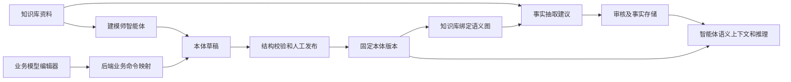

# 本体能力闭环审查

基线：`19fa7558`，2026-09-10。方法：当前源码、调用链、测试实现核查；引用上一轮浏览器验收，不把工具集成测试当作真实大模型对话验收。本轮未修改产品代码，也未重跑全量测试。

## 结论

主要架构模块已具备：本体版本、OWL 文档存储、业务编辑、知识库精确版本绑定、资料证据、事实抽取与审核、智能体建模工具、语义查询和有界推理。但尚未形成以业务用户为中心、统一校验并有真实模型质量证据的完整闭环。

注意：建模师目前直接提供完整 OWL 文档，尚未经过新的业务命令接口；草稿发布校验与运行时推理仍是分离路径。

## 能力盘点

| 能力 | 当前证据 | 边界与缺口 |
|---|---|---|
| 建模 | 业务对象、关系、属性、分类/名称编辑，五种直接关系限制；后端映射；OWL 导入导出 | 非任意复杂 OWL 的可视化编辑器；嵌套/带注释表达式保留高级维护 |
| 管理 | 草稿、发布历史、版本冲突检测、重复请求恢复、版本可用性、影响分析、迁移审批/执行/回滚服务 | 发布前统一质量清单、业务签核证据仍需整合 |
| 存储 | 关系库保存 OWL 文本、语法、摘要、固定导入、业务策略；公理索引；图/实体/事实/证据分开存储 | 不需要因此另建一套本体权威库；生产备份恢复和规模容量需单独验收 |
| 资料→模型 | 精确摘录、摘要、资料快照、规则绑定和资料变化复核 | 来源覆盖率、未获证据支持的模型内容需要业务化检查 |
| 知识库→版本 | 一个知识库绑定一张语义图，图固定到已发布版本；非空图禁止直接换绑，走迁移 | 绑定不等于资料自动变成事实，也不等于数据库字段 ETL 映射 |
| 资料→事实 | 有模型调用、抽取任务、建议编辑与提交、实体映射、事实审核链 | 默认 extraction 开关为 false；当前本地启动也明确关闭。不能称为开箱即用自动抽取 |
| 智能体建模 | 建模师预置、资料发现/读取、创建/保存草稿、验证、准备人工发布、回读工具 | 工具仍要求完整 OWL JSON；没有新业务命令的 Tool 适配；资料发现有数量和正文大小上限 |
| 智能体使用 | accepted/supported 事实查询、固定版本上下文、证据读取、有界 OWL 推理 | 工具执行成功不证明领域模型正确或推理解释充分 |
| 检验 | OWL 2 DL 结构检查；独立图推理；独立完整对象校验；业务策略层有必填/单位/枚举等基础 | 草稿 validate 返回 reasoning=NOT_RUN；前端“检查一致性”描述强于实际保障；未统一为发布质量门禁 |

## 优先补齐

### P0：明确校验含义并整合发布门禁

结构合法、逻辑一致、完整对象合格、业务需求覆盖是四种不同结论。当前 `OntologyApplicationService.validate` 返回 `OWL 2 DL` 和 `NOT_RUN`，发布也仅调用 `wire.violations`。不能据此宣称逻辑一致性通过。

建议分项展示结构检查、可选有界逻辑推理、业务规则检查、来源复核；结果绑定精确草稿版本/文档摘要，未执行、超时、不支持必须分别显示。上线策略应明确哪些检查阻止发布，哪些允许带理由豁免。业务专家确认不由模型自动替代。

验收：结构合法但逻辑不一致、推理超时、资料过期、检查后再次修改草稿，均不得继续显示全部检查通过。

### P1：智能体统一使用业务命令

新增 Tool 适配复用 `editModelDraft`，不另写映射逻辑；更新 ontology-builder 技能，让通常的增改对象/关系/属性/规则走结构化业务命令，复杂导入走文档接口。创建整个本体的工具还需强化响应丢失后的确定性恢复，现有创建工具仅提示先列表查询再重试。

验收：真实对话从资料建模、修订已有对象、恢复一次不确定响应、校验并交接人工发布；只产生预期草稿，不重复创建，不越权发布。

### P1：业务约束编辑闭环

业务策略引擎已有基础，默认业务表单没有相应必填、枚举、单位等配置入口；数量规则目前仍是 OWL 关系限制，不能当作表单完整性校验。先为已有策略提供业务表单和完整对象检查反馈，再根据实际需求扩展规则，避免将所有约束硬塞进 OWL。

验收：同一规则对部分事实提议和完整对象提交有明确不同语义；缺失值、单位、枚举错误能定位到业务字段。

### P1：接通知识库绑定与抽取体验

把选择已发布模型、绑定知识库、模型配置与开关检查、试抽取、实体匹配、人工审核、智能体问答串成导引。复用既有图绑定和抽取组件；不要把现有 Wiki 图与语义事实改成双主存储。

验收：一套实际领域资料产生可审核事实，审核后问答使用正确版本及原文证据；资料变化后过期依据可被发现，版本升级通过迁移而非隐式换绑。

### P2：质量基准与运行保障

建立领域问题/预期答案、正确和错误实例、来源遗漏、同义词与实体歧义测试集；测真实模型的命中率、误建模率、修订次数和成本。另验收生产数据库恢复、权限隔离、任务重试/取消、推理超时、大模型限流及大文档性能。本轮没有新的生产规模或真实模型长链路证据。

## 建议决策记录（待评审）

- ADR-A：继续以 OWL 文档及固定版本为本体权威，业务命令作为编辑入口。拒绝独立业务 schema 与 OWL 双向双主：同步冲突和维护成本高。代价是复杂 OWL 暂不能完全业务化编辑。
- ADR-B：OWL 逻辑与业务完整性策略分层验证。拒绝以基数替代必填校验：开放世界语义不同。代价是需要统一呈现多种检查结果。
- ADR-C：保留人工发布边界。模型可创建、修订、验证和准备发布，授权人员承担业务确认。代价是多一步审核，但已有版本和权限体系可复用。

## 当前源码定位

- `mateclaw-server/src/main/java/vip/mate/semantic/ontology/OntologyApplicationService.java`：编辑映射、校验、发布。
- `mateclaw-server/src/main/java/vip/mate/semantic/ontology/OntologyRevisionRow.java`：持久化文档元数据。
- `mateclaw-server/src/main/java/vip/mate/semantic/authoring/OntologyAuthoringTool.java`：实际 Tool 能力、完整文档写入和人工发布边界。
- `mateclaw-server/src/main/java/vip/mate/semantic/graph/GraphApplicationService.java`、`graph/migration/GraphMigrationService.java`：绑定与迁移。
- `mateclaw-server/src/main/java/vip/mate/semantic/extraction/ExtractionConfiguration.java`、`MateClawModelAdapter.java`：开关和模型调用。
- `mateclaw-server/src/main/java/vip/mate/semantic/object/CompleteObjectValidationService.java`、`mateclaw-semantic-core/src/main/java/vip/mate/semantic/core/policy/BusinessPolicySet.java`：完整对象和业务策略。
- `mateclaw-server/src/test/java/vip/mate/semantic/OntologyAuthoringIntegrationTest.java`：直接调用 Tool 的集成测试，不是实际模型对话质量测试。
