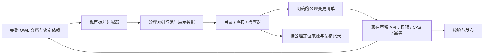

# MateClaw 本体工作台增强方案

日期：2026-09-10。状态：E1a/E1b、E3a 简单编辑及 E2 两批标准投影与复杂表达式已实施并完成本地验收；E3 复杂编辑与 E4 待实施。详见 [E1 验收记录](../validation/semantic-ontology-e1/acceptance.md)。下文现状分析仍以实施前基线为准。

代码基线：`codex/enterprise-semantic-core`，`d45d4abb64b46f248550e713ff77633f7c362bd6`（2026-09-10 09:22 +0800）。实际工作区：`/Users/guojiexie/Development/mateclaw/.worktrees/semantic-m1`。核查时相关业务代码无未提交差异；工作树存在既有未跟踪的验证输出，未覆盖。

本方案延续 `2026-09-09-ontology-workbench-design.md`，以当前 OWL 文档权威和已实现工作台为基础。它不覆盖原 OWL 能力矩阵、CTX、VAL、M7/M8 尚未完成的验收，也不将历史验收记录视为当前全量通过。

## 1. 目标和采用结论

让领域专家能够浏览、理解、修改和复核本体：从图上的“设备、测头、测量任务”定位到正式定义、公理与来源，修改简单定义后可靠地保存草稿、校验和发布；复杂定义拥有明确的查看与编辑路径。

参考 Microsoft Ontology Playground 的目录、画布、检查器、模板体验；沿用 MateClaw Vue 3 / Element Plus 工作台。OWL 文档、固定 imports、业务 policy、来源绑定和版本治理保持现有权威。图仅为可重建展示数据，不可据图形节点列表重建整份本体。

| 路线 | 收益与代价 | 选择 |
|---|---|---|
| 原位增强现有 Vue 工作台 | 复用权限、草稿状态、公理接口和企业主题；需要实现交互适配 | 推荐 |
| 内嵌独立 Playground | 公共样例演示快；生产编辑需要跨应用状态同步和模型转换 | 仅独立演示可选，不作为生产编辑方案 |
| 整体移植 Playground | 自带 React/Zustand 交互；与现有 Vue 及完整 OWL 表达不一致 | 不采用 |

上游核查提交：`1f8113ba6f84270a8093584e40c556143a078c39`。其内部 Ontology 为 entityTypes / relationships；序列化使用自定义 cardinality，按名称生成 base IRI。不得引入其内部模型和 serializer 作为我们的标准交换权威。复制代码应保留 MIT 许可和来源记录；行业示例须核查具体资产来源。

## 2. 最新代码已具备什么

以下路径均相对本工作区，描述的是当前源码能力，并非本轮端到端验收结论。

| 能力 | 当前实现 | 本轮增强切入点 |
|---|---|---|
| OWL 权威文档 | core `OntologyDocument`、`OntologyDocumentPort`；`mateclaw-semantic-owl/OwlDocumentAdapter`；server `OntologyWireMapper` | 复用文档、摘要、锁定依赖及标准适配器 |
| 工作台布局 | `OntologyModelWorkbench.vue` 已有搜索目录、Dagre + SVG 结构图、检查器、缩放、schema/individuals 切换 | 增强画布；不重建页面壳 |
| 图形投影 | `ontologyProjection.ts` 支持声明、标签、命名类继承、domain/range、简单 some/all 限制，保留 `unprojectedAxiomIds` | 当前支持集继续可用；复杂构造分阶段增加 |
| 普通编辑 | `ontologyForm.ts` 新增 Class/ObjectProperty/DataProperty；`OntologyLabelEditor.vue` 可替换已有标签并处理语言 | 扩展已有定义的编辑；复用标签逻辑 |
| 高级编辑 | `OntologyEditor.vue` 有完整文本、公理表、ADD/REMOVE、双格式导出 | 保留完整编辑路径和未保存保护 |
| 可靠写入 | `useOntologyDraft.ts`；`PATCH /semantic/ontologies/{id}/draft/axioms`；server 事务、CAS 和 operationId 回执 | 新交互共用这一条写入链 |
| 发布和版本 | 草稿校验、发布、不可变修订、差异、影响分析接口 | 增加可视化理解；不新增发布权威 |
| 定义来源 | `OntologySourcePanel.vue`、axiomSources、sourceReviews、来源快照对比/决定接口 | 所选公理联动来源及复核状态 |
| 模板导入基础 | `OntologyPackageDialog.vue`；package preview / import / receipt | 模板目录只补元数据与选择体验 |

当前 `AxiomDescriptor` 只有 axiomId、axiomType、rendering、signatureIris、annotations、logical，没有类型化操作数。前端自带一个有界 Functional Syntax 展示解析器。不能将它扩展成另一套 OWL 解释器；signature 中共同出现的术语也不能被直接连成关系。

前端 package.json 已直接声明 cytoscape、cytoscape-cose-bilkent 和 dagre，锁文件已有解析版本。当前本体工作台实际使用 Dagre + SVG；“依赖已声明”不代表已完成 Cytoscape 接入。首期复用现有依赖，不新增 React、Zustand、图形编辑插件或标准库。

## 3. 保留、增强、退役范围

- 保留：OWL 文档权威、IRI、锁定 imports、policy、正式事实及证据、版本、权限、CAS、幂等、M7 来源复核、M8 图升级；成熟的目录/画布/检查器布局与企业主题。
- 增强：交互画布、明确的投影覆盖说明、现有定义编辑、公理及来源定位、版本差异图、受控模板导入。
- 局部替换：通过验收后，用独立画布组件替换工作台内 SVG 渲染；第二阶段以标准适配器产生的展示结构替换本体 UI 内的字符串解析职责。
- 不扩展：新图数据库、整套微前端、通用 OWL AST 框架、协同光标、分支合并、公开分享、自动发布、任意本体推理性能承诺。
- 不清理业务数据，不重启服务或覆盖其他任务的未跟踪文件。增强实施不依赖整库迁移。

## 4. 数据流与边界



ADR-E1（提议）：展示投影从权威文档派生，禁止整图反序列化为完整本体。理由：任何视图都可能省略复杂表达式、注释或 imports；简单编辑必须保留这些内容。

ADR-E2（提议）：保留前端现有组件边界，画布接受 nodes / edges / selection，发出选择、定位和编辑意图；不得直接请求保存 API。布局、缩放、折叠是展示状态，不改变 draftVersion 和 documentDigest。

ADR-E3（提议）：复杂表达式的识别由现有 OWL 适配层完成，core 仅暴露所需的 JDK 值对象。展示契约为有限的表达结构，不复制 OWLAPI 全部类型，也不传递 OWLAPI 对象到 HTTP/UI。

## 5. E1：画布和定义检查增强（首个交付单元）

保留现有三栏与高级入口，新增独立 `OntologyGraphCanvas.vue`。

- 平移、滚轮/触控缩放、适应画布、定位所选定义、节点拖动；沿用图形库已有能力，不引入额外插件。
- 概念层级优先使用现有 Dagre 计算位置并交给 Cytoscape preset；概念关系探索可选已有 cose-bilkent。切换布局保持选择；常规选择不重新计算整图。
- 目录搜索和画布可见范围分开：默认高亮并定位结果、保留必要邻域；用户主动选择“仅看匹配项”时提示隐藏数量，避免搜索导致关系端点突然消失。
- 一跳邻域、按定义种类筛选、按继承/定义域/值域/量词限制筛选；选择节点和连线都能定位相关公理。
- 为画布提供同等可操作的目录/关系列表，保留键盘选择、读屏标签和窄屏详情抽屉。不得在替换 SVG 后丢失现有键盘操作。
- 本期沿用当前投影支持集；未投影/部分展示的内容继续有入口，文案描述“图示覆盖”，不得将当前 `unprojectedAxiomIds` 简单换算为“语义不支持比例”。
- 图旁展示定义来源/待复核数量时按当前授权数据获取，来源未知不当作没有来源。节点对应多项公理时先列公理，由用户定位具体来源。
- 视图状态首期仅驻留当前会话，以 workspaceId、ontologyId、draft/revision 和 typed IRI 区分。组件卸载释放图对象、事件和观察器；切换工作区清理旧数据。

验收：草稿和只读版本都可浏览；拖动/缩放不写服务端、不改变文档摘要；搜索和过滤不虚构关系；本体个体不冒充 ACCEPTED 业务事实；多工作台实例相互独立；宽屏/窄屏、键盘、组件销毁和工作区切换通过。

## 6. E2：可追溯的复杂定义展示

在 E1 后扩展。只读投影由 `OntologyDocumentPort` 增加一个有界读取能力，`OwlDocumentAdapter` 用标准对象访问产生结果。server 沿用已有授权和文档装载边界。

提议增加专用只读接口（以下不是现有接口）：

```text
GET /semantic/ontologies/{id}/draft/projection
    ?expectedDraftVersion=...&view=...&focus=...&limit=...
GET /semantic/ontologies/{id}/revisions/{revisionId}/projection
    ?view=...&focus=...&limit=...
```

使用独立接口避免把全量展示对象塞入每个草稿保存响应，也避免普通页面为了画图调用含事实及推理的 semantic_context。首期不增加数据库表；任何缓存都不能绕过每次授权。

建议响应内容：

| 字段组 | 语义 |
|---|---|
| snapshot | 草稿/修订标识、draftVersion（适用时）、documentDigest、importLockDigest、展示 schema 版本 |
| nodes / edges | typed IRI 或匿名表达式节点、结构边；每项携带公理引用，复杂边允许多个引用 |
| axiomRefs | 当前文档/固定导入的来源标识、artifactId、axiomId、root/imported 标记；禁止仅用局部名称寻址 |
| expressions | 命名对象、交/并/补、量词、限定基数、逆属性等按需表达结构；节点标识包含来源公理与表达式路径 |
| coverage | 每个公理 FULL / PARTIAL / NOT_RENDERED 及原因；总量、返回量、截断状态、依赖覆盖范围 |

第一批新增命名等价类/互斥类、逆属性和属性特征、多语言标签。第二批增加匿名交并补、嵌套量词和限定基数，用表达式节点及详情树呈现。属性链采用有序步骤/超边，不伪装成普通二元事实关系。其余构造继续显示公理全文与定位。

重要语义：domain/range 是类型语义；多个 domain 不能随意画成“任选之一”；allValuesFrom 不推出关系存在；最大基数/函数属性不等于业务 SINGLE；类与个体 punning 按种类分开。直接公理与推导结果不得使用相同无标识边；本期不新增推理执行。

imports 默认折叠、明确标注来源，只能从固定依赖闭包读取；不允许在主本体画布直接编辑导入定义。缺依赖、越权、超限、未覆盖表达式分别呈现，不能显示成空本体或完整成功。

验收：同名不同 IRI、多类型 punning、多 domain、注释与语言、复杂限制、有序属性链、固定 imports 及其缺失反例；每个显示元素可追溯真实公理；截断可见；草稿版本变化时拒绝/刷新旧投影；不重复构建标准解析器。

## 7. E3：现有定义的可视化编辑

简单编辑先复用现有 `termEdits`、`replaceLabel`、`draft.edit` 和公理接口。修改以原子 REMOVE + ADD 表达，不改写整个文档，不按图形节点顺序生成新 IRI。

- 将已有标签编辑接入选中定义详情，支持显示语言选择与后备语言；名称变化不改 IRI。描述编辑通过相应注释公理完成。
- 编辑命名父类、对象属性的单个命名 domain/range、常用数据属性声明；多 domain/range 必须列为多项独立公理，不能当作一个下拉值覆盖。
- 添加简单规则时明确区分存在限制、全称限制与基数；domain/range 不是必填开关，BusinessPolicySet 也不由 OWL 控件自动改写。
- 涉及嵌套注释、不被表单支持的表达式或来源更新的修改必须保留未编辑部分；无法做到保真时提供定位后的高级编辑入口。
- 删除先列目标公理、其他引用和来源绑定影响；本期只删除明确选择的公理，不提供“删除概念并自动清理所有事实”。后续批量 IRI 重命名另立影响分析范围。
- 任何公理替换导致 axiomId 变化时重新读取索引；旧来源绑定不得无证据地移植到新语义。UI 提示新增定义需核对依据；复用当前来源绑定/复核机制。

写入状态必须在 `useOntologyDraft.edit` 边界统一检查 dirty、busy、publicationPending；当前页面已有禁用条件，新入口不能只依赖按钮禁用。全文未保存时引导先保存或放弃，再进行表单修改。

网络超时保留原 operationId 和原请求体，以同一个操作查询回执或重试；回执确定前阻止新的相关写入。现有前端 operation() 的结果类型为 Revision，若用于公理编辑须按实际 command kind 补充 Draft 回执类型，不能强转复用。CAS 冲突保留用户输入，展示最新版本并要求重新核对变更，不盲目重放。

首期不做跨保存/发布的通用撤销栈。表单提交前可重置；已保存后的撤销属于新的公理变更，未来需同时处理来源、并发与幂等，不能复制 Playground 的本地历史栈。

验收：修改后 API/数据库/刷新回读一致；复杂无关公理、注释、IRI、imports、policy 保持；并发草稿冲突、重复操作、响应丢失、校验报告失效、权限变更和发布中状态均受控；只读版本没有写入口且服务端仍拒绝越权请求。

## 8. E4：版本差异、模板和业务理解

### 版本差异图

复用现有 diff/impact/usage 接口。增加、删除、变化以颜色加文字/线型共同标记，既可从图定位到两版公理，也可从影响结果定位受影响定义。

当前公理 ID 生成包含 revisionId，不能直接用两个版本的 axiomId 做差异匹配。优先复用服务端已有 diff；展示对齐采用种类 + IRI，公理按规范化内容对比。IRI 重命名默认显示删除/新增，不猜测同一概念；语义等价判定不列为本期承诺。

### 模板目录

先提供两个受控模板：测量质量、库存术语。模板是标准 OntologyPackage v2 工件，不是第二套 JSON 本体。

新增目录元数据：模板 ID/版本、标题、领域、摘要、包摘要、来源与许可、依赖清单、可用范围。复用 preview → expectedDigest → import → draft → validate → publish，首期模板导入创建新本体草稿；向已有草稿合并后置。

区分复用标准词汇 IRI 与创建本地副本。模板中原有术语 IRI 默认保留，禁止根据显示名称批量重写；需要独立命名空间的本地模板必须在导入前给出明确映射与预览。imports 保持固定，不自动拉取公网依赖。

模板中的个体断言属于本体内容；不自动写入业务图或成为 ACCEPTED 事实。关系 attributes、ont:cardinality 等 Playground 扩展只有明确转换规则才能引入，无法转换时报告，不假装成为标准业务约束。

### 业务理解和 AI

优先提供确定性的规则解释、来源引文和术语说明。如后续接入现有 SemanticContextService/Tool，仅对已发布本体和授权图使用其既有读取范围；不能为了草稿解释开放普通业务 Agent 的建模写权限。模型生成内容进入建议，正式公理与推导结果、解释文本分别标注。

验收：两版 IRI 保持及差异定位；模板摘要不符拒绝、重复导入回执、跨工作区拒绝、来源许可可追溯、导入只生成草稿；质量模板允许超差测量值作为事实，合格判定与实测值分离；库存模板不扩展库存事务功能。

## 9. 文件级实施拆分

所有“新增”均为提议，本轮没有创建这些生产文件。

| 任务 | 主要文件 / 模块 | 依赖与退出条件 |
|---|---|---|
| E1a 画布 | 修改 `mateclaw-ui/src/features/semantic/ontology/components/OntologyModelWorkbench.vue`；新增同目录 `OntologyGraphCanvas.vue`；复用 `ontologyProjection.ts` | 可单独交付；当前投影输入与外层 apply 边界不变；图浏览与无障碍验收 |
| E1b 检查器联动 | 修改 `OntologyEditor.vue`、`OntologyVersions.vue`、`components/OntologySourcePanel.vue`；必要时拆出 `OntologyInspector.vue` | 复用选中 axiomId 和现有来源 API；授权与工作区切换验收 |
| E2 标准投影 | core `OntologyDocumentPort` 及新增有限展示值对象；owl `OwlDocumentAdapter`；server `OntologyController`、`OntologyDtos`、`OntologyApplicationService`/独立只读服务；UI `api/types.ts`、`ontologyApi.ts`、`ontologyProjection.ts` | 标准库类型不得穿透；API 与适配器契约先稳定；退役旧字符串展示解析的生产消费 |
| E3 编辑 | `ontologyForm.ts`、`labelEditing.ts`、`useOntologyDraft.ts`、`OntologyLabelEditor.vue`；新增 `OntologyDefinitionForm.vue`；必要时扩展回执前端类型 | 简单编辑可在 E1 后；复杂表达式编辑依赖 E2；事务保真与并发回读验收 |
| E4a 差异 | `OntologyVersions.vue`、`components/OntologyImpactPanel.vue`、新增 `OntologyDiffView.vue`；复用 diff/impact API | 两版展示投影与公理定位；不重复实现迁移 |
| E4b 模板 | `OntologyList.vue`、`components/OntologyPackageDialog.vue`、新增 `OntologyTemplatePicker.vue` 与受控模板数据 | 复用 package 服务；首期无新数据库表、无公网目录服务 |

建议顺序：E1a → E1b → E3 简单编辑 → E2 → E3 复杂规则 → E4a / E4b。E2 可在 E1 稳定后单独推进；第一轮实施以 E1a + E1b 为范围，交付后再进入编辑与后端契约增强。

## 10. 验收、性能与回退

1. 行为测试：在现有 projection、form、workbench、draft、labelEditing 用例上补充真正变化的行为；不通过删除旧语义反例获得绿色结果。
2. 前端检查：目标用例后执行 typecheck、构建及范围内只读 ESLint。仓库 lint 脚本含 `--fix`，实施验收优先 `pnpm exec eslint <changed paths>`，避免顺带改写无关文件；检查 precision 脚本的当前可用性。
3. 后端/持久化：E2/E3/E4 按实际改动执行 core/owl/server 测试；涉及写入必须有 H2/MySQL API、持久化与刷新/重启读回。Kingbase 无实库时标为未验证。
4. 浏览器：真实登录操作目录、节点、边、筛选、语言、详情、公理定位、来源回跳、保存、刷新和只读版本；覆盖工作区切换、窄屏和键盘。截图仅辅助，不代替操作和回读。
5. 语义夹具：命名结构、完整复杂 OWL、多语言、punning、带注释公理、imports、业务 policy、来源绑定、测量质量及库存。记录输入/输出及摘要，验证未编辑内容保真。
6. 建议在固定验收机用 50/200/500 个节点及相应边数分档测量布局、选择响应、内存和重复开关页面。暂定 E1 产品目标：200 节点/400 边完成绘制不超过 2 秒，选择检查器不超过 200ms；这是待实测的验收目标，不是已验证性能。500 节点档用于确定邻域/显示上限，超限明确提示，不强行渲染无界图。
7. 后续只读 projection 的大小、深度、imports 数量限制先复用现有文档上限并在任务卡冻结；返回截断信息而不是声称显示全部。选中元素/版本切换请求取消并校验响应快照，防止旧数据覆盖新页面。

E1 以独立提交交付，回退只恢复原 SVG 画布，不改数据库或 OWL 文档。E2 的只读接口与写入分离，遇到投影错误显示原公理列表/高级文档并明确提示；简单编辑不依赖失败的复杂投影。各阶段不得回退到旧 types/properties/relations 权威模型。

## 11. 本轮验证和限制

本轮完成当前提交、生产文件与既有测试的定向核对，方案只新增本文件。运行 `pnpm exec vitest run src/features/semantic/ontology/__tests__/ontologyProjection.test.ts src/features/semantic/ontology/__tests__/ontologyForm.test.ts src/features/semantic/ontology/__tests__/ontologyModelWorkbench.test.ts`，结果为 3 个测试文件、11 项测试全部通过（2026-09-10）。这只证明相关现有基线；没有为方案运行全量后端或浏览器测试，没有安装依赖、修改业务代码、清理数据、提交、推送或部署。

证据入口：`docs/validation/semantic-owl-execution/current-acceptance.md`。该记录仍列有 OWL 矩阵、正式模型对照及环境验证缺口；工作台增强不能替代这些验收。

上游参考：[README](https://github.com/microsoft/Ontology-Playground/tree/1f8113ba6f84270a8093584e40c556143a078c39)、[模型](https://github.com/microsoft/Ontology-Playground/blob/1f8113ba6f84270a8093584e40c556143a078c39/src/data/ontology.ts)、[serializer](https://github.com/microsoft/Ontology-Playground/blob/1f8113ba6f84270a8093584e40c556143a078c39/src/lib/rdf/serializer.ts)。
