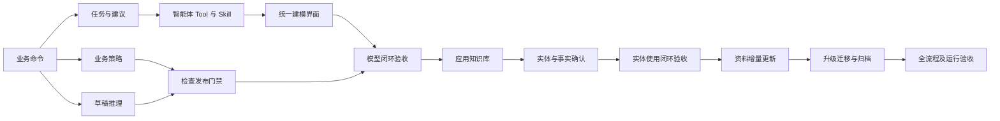

# 本体全生命周期：现状对比与实施计划

状态：B1（T01、T02）、B2（T03、T04）已实施并通过各自声明范围内验证；B3 的 T05、T06 已完成，T07 与 B4—B5 尚未实施。详见 [T06 交付记录](2026-09-11-ontology-t06-delivery.md)、[T05 交付记录](2026-09-11-ontology-t05-delivery.md)、[B1 交付记录](2026-09-10-ontology-b1-delivery.md)、[B2 交付记录](2026-09-11-ontology-b2-delivery.md)。

基线：`19fa7558`，2026-09-10。依据：[完整功能设计](2026-09-10-ontology-business-lifecycle-design.md)、[能力审查](2026-09-10-ontology-capability-audit.md)及当前实现。实施前重新检查 HEAD、工作区改动及数据库迁移版本，不能把此基线当作永久不变。

## 1. 执行结论

不重建 OWL 存储、知识库、语义图、事实审核和推理引擎。新增建模任务/建议和检查协调，扩展已有业务命令与智能体工具，完成统一用户流程。

优先交付“上传/选择文档或自然语言 → 智能体提出业务模型 → 用户确认 → 后端生成 OWL → 检查发布”。随后打通具体实体的审核入库、知识库使用与持续更新。简单工具适配或新页面上线不算整条链路完成。

本计划中的“已有”指源码存在；不等于已在当前运行环境打开开关、完成真实模型测试或达到生产容量目标。上一轮 106 项前端测试、22 项相关后端测试及 UI 验收只能证明其声明范围。

## 2. 逐项对比

| 设计项 | 现有实现与定位 | 判断 | 下一步 |
|---|---|---|---|
| 对象、属性、关系业务编辑 | `OntologyEditor`、`BusinessModelForm`、`OntologyModelWorkbench` | 可复用 | 增加建议确认、批量引用与业务策略入口 |
| 后端生成 OWL | `OntologyApplicationService.editModelDraft`、`OntologyWireMapper.modelEdits` | 部分完成 | 支持一批建议中新建类型之间的临时引用；稳定业务投影和逐项结果 |
| OWL 版本与存储 | `OntologyRevisionRow`、`OwlRevisionDocumentMapper`、`OntologyAxiomIndex` | 可复用 | 不建第二套业务模型主库；补建议/检查的版本引用 |
| OWL 及模型包交换 | `OntologyPackageService`、`OntologyPackageDialog` | 可复用 | 核对现有包已含文档/导入/策略；只扩展确有必要的任务/证据导出，不重写包协议 |
| 上传、解析资料 | 现有 Wiki 原始资料服务 | 可复用 | 将解析状态和固定资料版本接入建模任务 |
| 无文档自然语言建模 | 建模师能对话并创建文档草稿 | 部分完成 | 用户陈述作为独立依据类型，提供业务建议确认，不要求 OWL |
| 从资料智能建模 | `OntologyAuthoringTool`、`OntologyBuilderProvisioning` | 部分完成 | 工具仍要求完整 OWL JSON；改为业务命令和可恢复任务 |
| 智能体技能 | `resources/skills/ontology-builder/SKILL.md` 明确完整文档为写入契约 | 必须扩展 | 与新 Tool 一起升级；保留旧专家导入路径，不能只改提示词 |
| 资料发现与长文档 | sources 工具最多 20 KB、每 KB 50 资料；read_source 有正文长度限制 | 部分完成 | 分页、选定资料清单、分块读取、明确覆盖；禁止静默截断 |
| 建模任务、版本化建议、接受/拒绝 | 本体 authoring 当前主要是直接读写工具；既有 ExtractionTask 针对图内事实抽取 | 新增协调能力 | 复用通用运行和幂等能力；不要直接把事实抽取任务冒充本体建模任务 |
| 模型来源引用 | `OntologySourceReviewService`、`OntologySourcePanel` | 可复用 | 将建议的证据关联到最终保存内容；服务器解析摘录位置 |
| 草稿结构检查 | `OntologyApplicationService.validate` → `wire.violations` | 已有，但含义有限 | 当前返回 NOT_RUN 推理状态；先修正文案和状态，不宣称逻辑一致 |
| 草稿逻辑检查 | `SemanticReasoningService` 现以 graphId 固定已发布版本 | 新增草稿适配 | 复用推理 worker，不能为了校验未发布模型临时创建正式图或先发布 |
| 业务完整性规则 | `BusinessPolicySet`、`CompleteObjectValidationService` | 后端基础已有 | 补规则编辑、草稿样例校验和业务定位；保持部分事实/完整对象语义区别 |
| 统一检查与发布门禁 | 当前发布仅重新调用结构检查 | 新增协调能力 | 精确输入指纹、持久检查报告、服务端门禁和失效判断 |
| 知识库绑定 | `GraphApplicationService`、`KnowledgeBindingPanel` | 可复用 | 接到发布后应用导引，保留非空图禁止直接换绑规则 |
| 文档实体与事实抽取 | ExtractionCoordinator、`MateClawModelAdapter`、ExtractionWizard、建议提交 | 可复用并扩展 | 前置模型配置/开关检查；接入模型版本及实体候选工作区；当前抽取默认关闭 |
| 实体匹配、事实审核 | 现有抽取映射、提议、审核和来源服务 | 部分完成 | 整理统一实体生命周期界面，验证同名、合并、修订和时间冲突 |
| 智能体使用模型与事实 | SemanticContextTool、SemanticTool、SemanticReasoningTool | 可复用 | 验收真实问答只使用授权、正确版本和合格事实，保留依据 |
| 资料变化与版本升级 | 来源变化复核、OntologyImpactService、GraphMigrationService / Panel | 可复用并串联 | 从变化提醒发起增量建议；升级前展示影响，不直接改已发布模型 |
| 归档、停用 | 已有版本新绑定可用性及图启停 | 部分完成 | 补面向本体整体生命周期的归档语义与 UI；保留引用历史 |
| 真实模型与运维验收 | 已有直接 Tool 集成测试和各模块测试 | 仍需补证据 | 实际模型对话、跨模块回读、失败恢复、目标数据库和容量验收 |

## 3. 保留、扩展与收拢范围

**保留**：现有 Vue/Element Plus 工作台、OWL 文档权威、固定版本绑定、权限服务、命令幂等、资料原件和快照、事实审核及迁移服务。

**扩展**：业务命令协议、建模师 Tool/Skill、草稿检查适配、业务策略编辑、知识库应用与实体确认导引。

**新增**：最小的建模任务/变更建议持久状态，以及检查运行和结果协调。是否新增表、复用字段须在对应任务中依据现有 schema 确认。

**收拢**：完整 OWL 文本写入保留为专家导入/维护能力，不再是普通智能建模的必经路径。旧 API 不立即删除；新旧写入均受服务端同一权限、并发与发布门禁约束。

不新增微服务、消息中间件或图数据库依赖；遇到具体容量证据再决策。

## 4. 实施批次与依赖

| 批次 | 任务 | 可验收结果 | 前置 |
|---|---|---|---|
| B1：业务协议和可恢复建模基础 | T01、T02 | 业务建议可保存、确认、回读；后端统一映射，重试不重复 | 当前基线 |
| B2：自然语言与资料建模入口 | T03、T04 | 真实对话/资料生成建议，用户确认后进入业务草稿 | B1 |
| B3：校验发布闭环 | T05、T06、T07 | 分层检查及服务端发布门禁；完成里程碑 M1 | B1；M1 还需 B2 |
| B4：知识库实体闭环 | T08、T09 | 模型应用、实体审核、带证据问答；完成 M2 | M1 |
| B5：变更治理与交付验收 | T10、T11、T12 | 资料更新、版本升级、实体修订、归档及运行验收；完成 M3 | M2 |

依赖关系：

T05 和 T06 在 T01 协议稳定后可以独立推进；涉及同一服务或迁移文件的改动由单一实施者负责集成，不能并发覆盖。估时在 B1 完成契约和 schema 核对后给出，本计划不承诺缺乏依据的天数。

## 5. 任务卡

### T01：统一业务建模命令

涉及：`semantic/web/OntologyDtos`、`ontology/OntologyApplicationService`、`OntologyWireMapper`、UI `businessModel.ts`、对应测试。

- 明确首版命令覆盖：对象类型、名称/说明、分类、属性类型/所属对象、关系两端、五种直接语义规则；不支持项显式返回。
- 新增批次临时引用解析，使同一建议能“新建设备、新建传感器、新建二者关系”，无须模型先生成 IRI。
- 输出业务内容稳定 ID、逐项应用结果及与最终定义的关联，供来源绑定使用。
- 复用版本比较、原子保存、幂等；重命名不换 ID；只读导入及复杂表达式保护不退化。
- 对证据定位设计服务器验证接口：临时依据引用映射到真实版本和摘录，多次出现的摘录不能默认选第一处而丢失语境。

验收：一次提交创建关联模型；重复请求只执行一次；错误引用整批失败；过期草稿拒绝；只改名称不破坏引用；复杂规则不会被简单命令覆盖。

### T02：建模任务与变更建议

涉及：`semantic/authoring/` 扩展、现有命令记录/事务设施、资料权限服务；必要的多数据库迁移及测试。

- 建模任务记录用户目标、目标草稿、选定资料版本、运行阶段和当前建议。
- 建议记录基准版本、业务操作、证据、待确认问题、接受/拒绝/过期状态。
- 创建任务/本体/应用建议均可幂等恢复；避免目前 create_draft 只靠列表查询防重复的不足。
- 建模失败不删除原始文档或已确认草稿；取消阻止后续自动应用，但保留可查看历史。
- 初期实例样例仅是隔离候选，不能写入正式事实；与事实抽取任务的职责明确分开。
- 建议应用与来源保存失败的处理必须明确：可原子保存则同事务；无法同事务则保持“依据待补齐”，不能标为全部应用完成。

验收：刷新和服务重启能恢复任务；应用响应丢失能查回结果；取消后无迟到写入；资料或草稿变化使旧建议过期；权限变更立即生效。

### T03：建模师 Tool 与技能升级

涉及：OntologyAuthoringTool、OntologyBuilderProvisioning、`resources/skills/ontology-builder/SKILL.md`、Tool 注册/绑定及相关测试。

- Tool 共用 T01/T02 服务，接收业务建议，不实现第二套 OWL 编译逻辑。
- 新增/扩展恢复任务、读业务模型、提交建议、应用授权建议、检查状态等能力。
- 资料发现分页，文档按选定清单分块；返回实际读取范围和未读取原因。
- 支持纯自然语言建模，依据类型为用户陈述；区分模型定义和具体案例。
- 标准路径不要求模型输出完整 OWL；保留专家文档维护工具，不能让旧 Skill 强制路由回旧流程。
- 不新增自动发布工具；明确模型生成建议、用户业务确认、确定性检查的职责。

验收：真实模型从两份资料创建建议并在同一草稿迭代；无文档场景可执行；跨文档矛盾保留问题；不生成虚假引用；重复工具调用无重复对象；真实工具清单与 Skill 契约一致。

### T04：统一建模入口和建议确认 UI

涉及：OntologyList / Editor / Workbench、知识库文档入口、建模助手和建议面板。

- 新建时选择自然语言或资料，上传复用 Wiki；显示真实解析状态与失败原因。
- 列表、知识库和会话进入同一任务/草稿，不复制页面状态。
- 业务预览显示新增/修改/移除、依据和待确认问题；可逐项确认或确认当前批次。
- 对话修订与表单编辑刷新同一服务端投影；关闭助手不丢任务进度。
- 当前结构检查按钮先明确命名和显示推理未执行，B3 完成后接统一结果。

验收：从上传到建议确认再到保存回读全程不输入 OWL/IRI；刷新恢复；失焦标签、取消、键盘、宽窄屏及多角色测试通过。B2 此时仅表示“模型草稿闭环”，不宣称完整校验发布已完成。

### T05：业务约束编辑与样例检查

涉及：BusinessPolicySet、CompleteObjectValidationService 及草稿适配、BusinessModelForm/规则面板。

- 首批只开放已有引擎明确支持的必填、单值、单位和枚举，命令与策略版本化保存。
- 语义关系限制与完整记录检查分别建模，不用 OWL 基数替代缺失值检查。
- 增加草稿样例检查输入，不要求为了试验先创建正式图和事实。
- 完整对象与部分事实保持不同检查语义；返回业务字段定位。

验收：缺失、单位不匹配、枚举越界、单值冲突有清晰结果；部分事实不因缺少其他属性误报；样例检查不污染正式实体。

### T06：精确草稿逻辑检查

涉及：reasoning 服务适配、semantic-owl 推理 worker/接口、检查 DTO 与测试。

- 新增以草稿快照而非 graphId 为输入的宿主适配；复用已有受限推理 worker。
- 输入固定文档、导入、策略和检查配置；包括超时、错误、不支持、取消等结果。
- 明确一致性与不可满足类别分别报告；不能因为文档可解析就判逻辑通过。
- 不临时发布版本或建立正式知识库图；推理结果落地前复查输入是否已变化。

验收：合法一致、结构合法但矛盾、不可满足类别、超时、worker 失败、检查期间修改草稿均有正确状态。

### T07：统一检查报告和服务端发布门禁

涉及：OntologyApplicationService.validate/publish、检查报告持久化、ValidationPanel、PublishDialog、建模师校验 Tool。

- 将结构、逻辑、业务策略、来源状态汇总为绑定精确输入的报告；领域覆盖保留为辅助业务确认。
- 为编辑器、工具和既有发布 API 提供一致的报告语义和门禁，禁止只禁用 UI 按钮。
- 默认严格门禁；首版不实现复杂例外审批系统。确需例外时先明确权限、理由、可豁免检查及记录，再单独实现。
- 新版发布前核对报告与当前草稿、来源快照；已发布版本不追溯改写。
- 保留已完成发布操作的幂等回读顺序，不能因草稿已被消费或旧检查过期而让成功发布重试失败。
- 现有调用方同步更新；旧结构校验结果不得被转换为“全部通过”。

验收：通过报告能发布；失败/未执行/过期不能冒充通过；变更后重新检查；发布重试返回原版本；无权限用户和 Agent 无法绕过。

**M1：T01—T07 完成后，以真实模型和真实浏览器完成“资料/自然语言→业务模型→OWL 保存→分层校验→人工发布”。**

### T08：发布后知识库应用与抽取入口

涉及：KnowledgeBindingPanel、GraphApplicationService、ExtractionWizard、ExtractionConfiguration。

- 发布后选择应用知识库并固定版本；资料来源 KB 与应用 KB 明确区分。
- 检查知识库访问权限、模型配置、抽取开关、任务执行条件；关闭时显示不可用原因，不伪装无结果。
- 试抽取复用既有任务/重试/取消，指定资料及本体版本。
- 对已有非空图显示版本差异和迁移入口；不直接换绑。

验收：新 KB 绑定、同版本恢复、非空图拒绝直接换绑、开关关闭和模型不可用、试抽取成功/失败/取消。

### T09：业务实体和事实生命周期工作区

涉及：现有 graph/entity、extraction 建议与映射、StatementApplicationService / StatementReviewService、实体页面。

- 展示候选、待审核、已确认及修订历史，复用现有状态，不建立第二份实例权威库。
- 模型阶段候选在正式版本下重新校验；提供新建、匹配已有、无法确定三类操作。
- 同名不自动合并；匹配业务编号时保留依据；合并/撤回遵循现有事实修订能力，不硬删除历史。
- 记录有效时间、来源和支持状态；未确认事实不进入正式语义上下文。
- 接上智能体问答并验证其模型版本、事实状态和引用权限。

验收：两份资料中的重复实体正确匹配；不同同名实体不误合并；文档案例不升级为通用规则；审核后可查询；未知时间、事实冲突、撤回/支持失效被正确处理。

**M2：M1 加 T08/T09 完成，才能称为“模型与实体打通知识库和智能体使用”。**

### T10：资料变化后的增量建模

涉及：OntologySourceReviewService、SourceGovernanceService、任务建议服务和来源 UI。

- 将已有变化复核结果连接到新建模任务，固定新旧资料快照和目标草稿。
- 区分定义变化和事实变化，分别提出模型建议或事实修订。
- 仅列出受影响内容，不整份覆盖当前本体；保留人工确认及幂等。

验收：原文修改、删除、权限撤销分别处理；确认新版不会修改已发布旧版；重复变化事件不产生重复应用。

### T11：升级迁移、停用与归档

涉及：OntologyImpactService、GraphMigrationService/Panel、列表和版本管理。

- 从模型发布差异进入现有迁移准备、审批、执行和回滚；显示每个知识库自己的版本状态。
- 类型重命名与标识替换明确区分；有事实的升级必须有映射和检查。
- 补整体归档语义和界面，复用版本可用性/图启停；被引用历史仍可回读。
- 保留迁移后新增事实、并发修改等既有回滚约束，不提供无条件回滚按钮。

验收：多个 KB 可保留不同版本；升级和符合条件的回滚正确；有并发变更时拒绝不安全回滚；停用不破坏历史证据。

### T12：完整产品与运行验收

- 建立设备运维领域固定资料、目标问题、预期模型、实体匹配和错误样例；加入一套第二领域资料检查是否过度依赖示例。
- 实际模型对话记录模型配置、输入资料版本、工具轨迹、调用成本和失败；不得用直接 Tool 调用代替自然语言效果证据。
- 完整 UI 台账、数据库回读、导出重导入、跨权限使用与更新流程共同验收。
- 检查目标数据库迁移、备份恢复、任务中断恢复、限流、长文档和推理预算。依生产实际规模制定容量目标并测量，不凭本地演示估算。

**M3：完整设计的生命周期目标完成；文档写明支持范围和仍不支持的复杂语义。**

## 6. 下一批的明确实施范围

下一批建议执行 **B1（T01 + T02）**：

1. 固定业务建议协议，支持批量新建内容的临时引用与稳定标识。
2. 完成任务/建议持久化、接受/拒绝、基准版本和幂等恢复。
3. 确认证据映射与失败状态契约，保护既有来源追溯。
4. 运行命令与任务集成测试，确保不影响现有编辑器、OWL 导入/导出及发布重试。
5. 给出可回读的完整业务建议应用样例，为下一批 Tool/Skill 和 UI 接入提供稳定基础。

B1 不包含大范围 UI 改版、自动发布、实体正式入库或全生命周期完成声明。已有编辑器继续可用。

## 7. 统一交付约束

- 每批开始核对当前代码、任务边界与已有未提交改动；只提交该批相关文件。
- 不修改已发布 Flyway 脚本；如需新增迁移，按当前仓库实际最大版本分配，覆盖受支持的 H2/MySQL/Kingbase 路径，不在本计划预占版本号。
- 后端核心映射、权限、幂等、状态转换和失败恢复必须有行为测试；前端有真实交互变化时才扩展相应控件测试。
- 按影响范围运行类型检查、lint、构建与定向后端测试；每个里程碑另做真实模型和浏览器验收。
- 浏览器测试使用合成资料/模型和独立标签页，保留用户原生视口；保存后独立回读，不以 toast 代替验证。
- 修复并验证通过后按用户既有授权提交本地 Git，提交信息遵循 Lore；计划文档阶段不自动进入代码实施或远程部署。
- 变更报告区分“代码完成、测试通过、本地可用、生产部署、真实模型效果”，不混为一个完成状态。

## 8. 计划验收矩阵

| 风险 | 最迟验证点 | 必须保留的证据 |
|---|---|---|
| 模型重复创建/批次半成功 | B1 | 数据库实体/版本计数、相同操作重放、失败回滚 |
| Agent 仍依赖完整 OWL | B2 | 实际工具参数及自然语言对话轨迹 |
| 长文档或多文档漏读 | B2 | 所选/已读/失败资料清单及覆盖记录 |
| 文档实例被误当通用模型 | M1、M2 | 模型建议与实例候选对比样例 |
| 结构通过被误称逻辑通过 | B3 | 各检查器状态、失败/超时/过期样例 |
| 发布门禁被旧 API 绕过 | B3 | HTTP、Tool、UI 同一服务边界测试 |
| 实体/事实越权或未审核即使用 | M2 | 角色矩阵、事实状态和问答引用回读 |
| 资料变化覆盖旧版本 | B5 | 新旧文档、版本、来源快照和事实修订记录 |
| 升级/回滚破坏现有图 | B5 | 映射计划、迁移前后计数及并发拒绝证据 |
| 产品只能演示、不可恢复 | M3 | 重启恢复、目标数据库验证和可重复验收脚本 |

该计划不要求重新建设已存在的各个底层模块，而要求用上述里程碑证明这些模块真正组成可用闭环。
