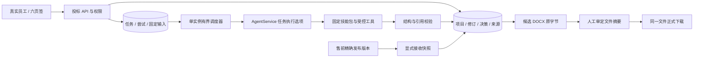

# 独立投标模块 Architecture Review and Implementation Plan

> **For agentic workers:** REQUIRED SUB-SKILL: Use superpowers:subagent-driven-development (recommended) or superpowers:executing-plans to implement this plan task-by-task. Steps use checkbox (`- [ ]`) syntax for tracking.

**Goal:** 在 MateClaw 内交付由数字员工执行、结果可回读、失败可重试的技术标编制流程。

**Architecture:** 同一应用内增加独立 bidding 业务模块，复用平台身份、工作空间和 AgentService。业务服务拥有确认与版本门禁；数据库任务/尝试驱动执行；技能只输出候选，不取得批准权。

**Tech Stack:** Java 21、现有 Spring Boot 3.5.16、MyBatis/JdbcTemplate、Flyway、Jackson、PDFBox 3.0.7、POI 5.5.1；Vue 3、Element Plus、TypeScript、Vitest。沿用现有数据库与依赖，不新增依赖。

## Global Constraints

- 本项目独立建设，与售前模块并列，复用 MateClaw 平台能力。
- bid-agent 仅提供业务拆分与规则设计参考，不成为代码、数据、接口、部署或运行依赖。
- 每项 Skill 返回结构化内容，校验并持久化至数据库。
- Word 输入限定 `.docx`；正式交付以可编辑 DOCX 为必验格式，PDF 输出后续扩展。
- 一个投标项目对应一个标段；自动重试最多两次；首版单应用实例调度。
- 禁止新增依赖，禁止修改已有售前/本体数据，禁止把计划、模拟通过或配置存在称为真实模型验收通过。
- 真实负责人选择真实成员；三个数字员工岗位另行绑定。审核员工必须不同于编写员工。
- 技能、输入、模板、正文均固定版本；正式文件必须与人工审定的候选原字节一致。
- enterprise UI；六个页签；简短中文、明确蓝色按钮、操作列对齐；不显示裸 ID、G1/G2、Fit-Gap。
- 每次实现任务遵循下列统一契约；禁止自行引入第二套同义字段或更换错误/状态命名。

---

## 审查结论

**设计可以进入实施。** 本次审核已把关键差异写回[设计规格](../specs/2026-09-23-independent-bidding-design.md)的 ADR-BID-05～07 和运行边界；下表事项是实施必须交付的补强，当前代码尚不具备。

审查以售前工作树 `codex/presales-v1` 的代码提交 `ff496645` 为基线；设计提交为 `b85cc91a`。本次仅修改设计与计划，未运行实现测试、迁移、模型或浏览器验收。

| 严重度 | 源码证据（仓库相对路径） | 结论与落实任务 |
| --- | --- | --- |
| 高 | `mateclaw-server/src/main/java/vip/mate/agent/AgentService.java:723,819`；`presales/PresalesToolPolicy.java:70`（同一 Java 根目录） | 隔离依赖售前会话前缀。P1-04 增加显式内部执行选项和逐次工具鉴权，保留旧接口兼容 |
| 高 | `mateclaw-server/src/main/java/vip/mate/skill/runtime/SkillRuntimeService.java:350`；`tool/builtin/SkillFileTool.java:104,161` | 当前读活动技能。P1-03 固定包原文，P1-04 从固定包加载并回执，不能只存版本号 |
| 高 | `mateclaw-server/src/main/java/vip/mate/agent/graph/NodeStreamingChatHelper.java:402,1496,2187`；`agent/graph/node/ReasoningNode.java:1229` | 内部重试和部分输出会破坏两次重试上限。P1-04 关闭任务模式内部重试/降级并保留类型化错误，P1-05 统一计数 |
| 高 | `mateclaw-server/src/main/java/vip/mate/tool/builtin/TikaExtractor.java` | 达文本上限可返回部分文本。P1-02 用页/区块读取与覆盖清单，超限明确失败；P1-06 分片分析 |
| 高 | `mateclaw-server/src/main/java/vip/mate/tool/document/MarkdownDocxRenderer.java:248` | 图片可取本地路径。P3-02 使用 POI 受控内容块渲染与授权图片字节，不直接消费模型 Markdown |
| 中 | `mateclaw-server/src/main/java/vip/mate/presales/PresalesService.java:695` | 当前 handoff 取最新发布及当前澄清。P2-01 增加精确历史版本导出，历史信息缺失时显式拒绝；不改投标独立创建路径 |
| 中 | `mateclaw-server/src/main/resources/db/migration/{h2,mysql,kingbase}/V211__presales_projects.sql` | 现有大 JSON 聚合不适合分章任务。P1-01 新建任务/尝试/修订表；P1-05 对目标版本而非整项目作并发判断 |
| 中 | `mateclaw-ui/src/features/presales/pages/PresalesWorkbench.vue`；`src/features/semantic/api/ontologyApi.ts`（同一 UI 根目录） | 复用成员选择、固定工作空间请求和脏数据拦截，不复制整个大页面。P1-07/P2-05/P3-04 分职责组件 |

取舍：保留模块化单体及单实例调度，减少部署成本；不建设通用流程编辑器/消息队列。固定技能包增加存储，换取可重试与可追溯。严格拒绝不可读/超限输入减少“表面成功”，长文件通过分片、复杂表格通过人工核对解决。模型语义质量与 DOCX 实际分页仍需人工样例验收，不能由 Schema 或 OOXML 检查代替。

## 结构与交付顺序



| 阶段 / 计划 | 任务 | 单独可验收的交付 |
| --- | --- | --- |
| [P1：项目到解析基线](2026-09-23-bidding-p1-analysis.md) | P1-01～08 | 上传可读招标文件，真实员工派发四类解析，失败重试，结果与证据入库，确认基线并刷新回读 |
| [P2：基线到技术标草稿](2026-09-23-bidding-p2-writing.md) | P2-01～05 | 可选接收售前精确版本，目录确认、分章/批量写作、修订采用、补遗影响，形成整本候选 |
| [P3：草稿到正式成果](2026-09-23-bidding-p3-review-export.md) | P3-01～05 | 独立审核、问题整改、候选 DOCX、人工审定与同字节下载、真实脱敏样例闭环 |

依赖：P1-01 → P1-02/03；P1-03 → P1-04；P1-01/04 → P1-05；P1-02/05 → P1-06；P1-06 → P1-07/08。P2 在 P1 验收后执行；P2-01 与 P2-02 可以独立开发，P2-03/04/05 依次集成。P3-01 与 P3-02可独立开发，随后 P3-03/04/05。最多两个独立实现子任务并行；共享 AgentService 或迁移编号时串行集成。不得同时修改同一核心服务。

## 统一类型与接口词典（P1-01 创建，后续按所属任务补方法实现）

Java 根目录 `mateclaw-server/src/main/java/vip/mate/bidding/`。以下 record 放在 `BiddingTypes.java` 中，嵌套类型均为 `public`；JSON 字段就是 record 字段的 camelCase 名称。API 中所有 ID 为字符串；数据库 workspace/actor/agent 列沿用 BIGINT，边界转换并验证正整数。

```java
public record Scope(String workspaceId, String actorId, String projectId) {}
public record Ref(String kind, String id, long version, String digest) {}
public record Command(String operationId, Ref expected, String action,
                      com.fasterxml.jackson.databind.node.ObjectNode payload) {}
public record NewProject(String operationId, String name, String lotName, String ownerId) {}
public record SkillPin(String skillId, String version, String digest,
                       java.util.Map<String, String> files) {}
public record Claim(Scope scope, String taskId, String attemptId, String token,
                    int attemptNo, int cycleAttempt, java.time.Instant deadlineAt, String agentId, SkillPin skill,
                    String modelConfigId, String configDigest, java.util.List<Ref> inputRefs,
                    com.fasterxml.jackson.databind.node.ObjectNode input) {}
public record Failure(String code, String category, Long retryAfterMs,
                      boolean resultUnknown, boolean partial, boolean stopped) {}
public record Execution(com.fasterxml.jackson.databind.node.ObjectNode payload,
                        Failure failure, String loadedSkillDigest,
                        String configDigest, String rejectedOutput) {}
public record ReadBlock(String id, Integer pdfPage, String locator, String text,
                        String kind, String quality) {}
public record Extraction(java.util.List<ReadBlock> blocks, boolean complete,
                         java.util.List<String> problems) {}
public record Page<T>(java.util.List<T> items, long total, int page, int pageSize) {}
```

`Execution` 必须恰有 payload / failure 之一；失败不可附有效 payload。`Ref` 不引用“latest”；版本从 1 开始。数据库 JSON 使用确定性属性排序、十进制文本与 UTC 时间；摘要 `SHA-256(canonical UTF-8)`。技能包摘要按排序后的相对路径与文件 UTF-8 字节计算，不能只摘要 SKILL.md。请求幂等摘要排除 operationId、包含 action/expected/payload。

### HTTP 边界

控制器根 `/api/v1/bidding`；所有请求含 JWT 与 `X-Workspace-Id`，复用现有 `R<T>` 响应，错误用本模块 `BiddingApiException` + `BiddingExceptionHandler`。同工作空间无对象与跨工作空间 ID 均返回 404；角色不足 403；未登录 401；缺 scope/格式 400；版本/幂等冲突 409；来源/输出不合格 422；超限 413。

| 方法与路径 | 请求 / 返回（均为 data 内容） | 所属 |
| --- | --- | --- |
| GET `/capabilities` | `{enabled, canWrite, canApprove}`；审批仍按项目重查 | P1-01 |
| GET/POST `/projects` | 查询 name/stage/ownerId/page/pageSize → `Page<ObjectNode>`；创建 `NewProject` → Project | P1-01 |
| GET `/projects/{id}` | Project，含 `ref`、岗位与当前选定修订 refs，不内嵌全部历史 | P1-01 |
| POST `/projects/{id}/commands` | `Command` → `{ref, result}`；result 为具体动作对象或任务组 | 各阶段 |
| GET `/employees` | 本工作空间可用员工及已授权技能/模型就绪状态；不返回密钥 | P1-03 |
| POST `/projects/{id}/sources` | multipart file、operationId、sourceKind、supersedesRef（可空）；返回 SourceRevision | P1-02 |
| GET `/projects/{id}/sources` | 来源与读取状态列表 | P1-02 |
| GET `/projects/{id}/sources/{sourceId}/versions/{version}/content` | 授权原字节，attachment + no-store | P1-02 |
| GET `/projects/{id}/evidence` | sourceId/version/blockId → 原文区块 | P1-02 |
| GET `/projects/{id}/tasks` 与 `/tasks/{taskId}` | 分页任务 / 固定输入、各次尝试、拒绝原因、有效结果 | P1-05 |
| GET `/projects/{id}/revisions/{revisionId}` | immutable ObjectNode，含 ref、inputRefs、payload、validation | P1-06 |
| GET `/dashboard` | 4 项统计，使用同一授权与筛选谓词 | P1-07 |
| GET `/handoff-options?presalesProjectId=...` | 有权接收的已发布版本；售前关闭返回 409 `PRESALES_UNAVAILABLE` | P2-01 |
| GET `/projects/{id}/materials` | 已接收售前/知识库材料与权限、有效性状态 | P2-01 |
| GET `/templates` | 可用模板 `{ref,name,format}` 列表；内容固定，只读 | P3-02 |
| GET `/projects/{id}/artifacts/{artifactId}` | metadata 与可下载状态 | P3-02 |
| GET `/projects/{id}/artifacts/{artifactId}/content?mode=candidate|formal` | 原字节；formal 须有效决定且输入仍有效 | P3-03 |

Project `{id,ref,workspaceId,name,lotName,ownerId,version,stage,bindings,selectedRefs}`；TaskGroup `{id,taskIds}`。任务状态统一 `QUEUED/RUNNING/WAITING_RETRY/SUCCEEDED/FAILED/CANCELLED/STALE`。业务修订状态 `CANDIDATE/CONFIRMED/NEEDS_RECONFIRMATION`，正式文件 `CANDIDATE/APPROVED/STALE`，不得混用。

Command.action 由对应阶段列举允许值，未知值 400；控制器不反射调用任意方法。Project 更新比较 project ref；章节更新比较 chapter ref；批准比较 artifact ref。跨对象命令在事务中锁相关选择指针并重查 inputRefs，不把整项目 version 作为所有章节的全局锁。

### 服务职责约束

- `BiddingAccess`：JWT/真实用户/当前成员/来源权限，后台显式传 actorId 重查；不依赖 semantic 功能开关。
- `BiddingRepository`：同范围的 SQL、CAS、事务内候选提交；不向前端暴露任意 SQL/表名。
- `BiddingSourceService`：原字节、提取、稳定定位、来源集合修订。
- `BiddingTaskService`：快照、幂等派发、取消、重试、提交门禁；结果业务校验通过 `BiddingResultHandler` 小接口交给对应领域服务；`BiddingScheduler` 只领取和调度。
- `BiddingEmployeeRuntime`：适配 AgentService 输出，不操作业务选定版本或人工决策。`BiddingReadTool` 只读取 Claim 白名单内来源/材料并保存读取回执；不开放通用文件访问。
- `BiddingAnalysisService/OutlineService/WritingService/ReviewService/ArtifactService`：各自的确定性校验、候选、采用及确认。
- `BiddingDependencies`：输入引用、当前授权、变更失效检查；不以所有来源均来自“旧项目版本”为由一刀切重跑。
- `BiddingCommandService`：显式 action switch 路由；事务在具体领域服务上。避免复制售前巨型服务。

## 数据库与默认容量

P1-01 使用 V212，P2-01 使用 V213，P3-02 使用 V214；执行前重新检查未占用，若冲突则三个方言同时改到下一个空号。现有 Postgres 配置复用 kingbase 目录，不新增 postgres 迁移目录。

基础表 `mate_bidding_project/source/revision/head/task/attempt/decision/operation/skill_package`；P2 加 `mate_bidding_handoff/material`；P3 加 `mate_bidding_artifact`。每个对象带 workspace_id/project_id，所有查询先约束 scope。原文、固定包、结果和候选文件均入数据库；二进制 H2 BLOB、MySQL LONGBLOB、kingbase BYTEA；长 JSON 分别 CLOB/LONGTEXT/TEXT。不复制售前的 base64 TEXT 存储方式，避免大文件膨胀和 MySQL TEXT 限额。

head 专存当前选择指针：`(workspace_id,project_id,kind,object_id,version,selected_ref_json)`，主键前四列；历史 revision payload 不更新。

唯一约束：operation `(workspace_id,actor_id,operation_id)`、attempt `(task_id,attempt_no)` 和 token、revision `(workspace_id,project_id,kind,object_id,version)`、来源 `(project_id,source_id,version)`。task 存 active_attempt_id；领取 CAS 只有一个赢家。索引 task `(status,next_run_at,workspace_id)`、revision `(workspace_id,project_id,kind,created_at)`。artifact 的 generator_attempt_id 唯一，防同次导出重复存档。

容量默认值逐字对应规格 §12：单文件 25 MiB、单项目生效来源合计 100 MiB、单 PDF 500 页、单来源提取文本 1,000,000 个 Unicode 码点、单分析分片 12,000 个码点、单次结构化输出 2 MiB；单实例最多 2 个活动尝试、每工作空间最多 1 个；扫描 2 秒、每次最多 20 项；尝试总时限 300 秒、工具/模型循环最多 12 轮。10 秒/30 秒自动重试间隔附 0～1 秒抖动，有 Retry-After 取更大值。不能把这些初始值称为已压测容量。

## 测试基座与执行命令

所有 Java 测试类在 `mateclaw-server/src/test/java/vip/mate/bidding/` 下以 `Bidding` 开头。P1-01 创建 `BiddingHttpFixture`，独立 Spring 测试配置借鉴现有 `semantic/support/SemanticHttpFixture.java` 的 JWT/真实数据库装配，**不继承其启用 semantic 的配置**。固定 H2 测试 profile `bidding-test`、semantic/presales disabled、bidding enabled、scheduler disabled；扫描 auth/workspace/agent/bidding mapper，导入现有 JWT、AuthService、WorkspaceService、安全过滤器与 Jackson。`tokens` 含 owner/member/viewer，另建 otherWorkspace；测试创建的用户/员工在当前测试库内。

共同测试辅助接口（仅测试）在 P1-01 定义：

```java
protected JsonNode api(String method, String path, String role, String workspace,
                       Object body, int expectedStatus) throws Exception;
protected JsonNode project() throws Exception; // POST /projects；真实 member 为默认负责人
protected JsonNode command(JsonNode project, BiddingTypes.Ref expected, String action,
                           Map<String, ?> payload, String role, int expectedStatus) throws Exception;
protected BiddingTypes.Ref ref(JsonNode object); // json.treeToValue(object.path("ref"), Ref.class)
```

`api` 使用 MockMvcRequestBuilders.request(HttpMethod.valueOf(method), `/api/v1/bidding` + path)，附 tokens.get(role)、workspace header、Jackson body，断言 HTTP status 后读取 `.data`；错误断言在响应原文中检查 code，不吞掉验证错误。`command` 自动生成 UUID operationId 并构造已定义 Command。集成测试不 mock 鉴权、数据库或任务状态；仅在独立执行适配边界控制模型/时间/故障。普通单元测试使用已有 JUnit/Mockito。

命令从工作树根执行：

```bash
JAVA_HOME=$(/usr/libexec/java_home -v 21) mvn -pl mateclaw-server -am -Dtest='Bidding*Test' -Dsurefire.failIfNoSpecifiedTests=false test
cd mateclaw-ui
pnpm test src/features/bidding/__tests__
pnpm test src/features/presales/__tests__
pnpm exec eslint src/features/bidding src/router/index.ts src/views/layout/MainLayout.vue
pnpm lint:precision
node --max-old-space-size=6144 ./node_modules/vue-tsc/bin/vue-tsc.js --noEmit
pnpm exec vite build --outDir /tmp/mateclaw-bidding-ui-build
```

Vite 默认构建会清空/重写服务端 static，验收用显式临时 outDir；不提交生成文件。Java 仓库当前未配置独立 Checkstyle/PMD 门禁，不虚报静态分析通过；编译、范围测试、diff 检查分别记录。没有 MySQL/Kingbase 实例时记录方言实跑 NOT_RUN，不用 H2 代替。

## 规格覆盖与验收证据

| 规格 / 标准 | 任务 | 最终证据 |
| --- | --- | --- |
| §1～4，A01/A05 | P1-01/04/06，P2-02，P3-05 | 关闭 bid-agent/售前/semantic 的独立路径；直接 API 越级拒绝 |
| §5，A03/A04 | P1-02/06/08 | 逐页区块、表格黄金样例、超限与混合扫描拒绝、人工基线 |
| §6，A02/A06 | P1-03/04/06，P2-02/03，P3-01/02 | 八包契约、实际固定技能加载回执、非法输出无业务修订 |
| §7～8，A07/A08/A09 | P1-01/05/08，P2-03 | 真实 DB 幂等/CAS、时钟故障注入、重启、取消及迟到结果 |
| §5/9，A10/A13/A14 | P1-01/04，P2-01/04，P3-03 | 精确交接、撤权、补遗依赖、跨 scope 和过期文件下载拒绝 |
| §4/6，A11/A12 | P3-01/02/03/05 | 独立审核、修订重审、Office 文件检查、数据库与下载 SHA-256 一致 |
| §10，A15 | P1-07/08，P2-05，P3-04/05 | 浏览器全流程、窄宽布局、409 草稿保留、切 Workspace/刷新回读 |
| §11～13，A16 | P1-08，P3-05 | 脱敏真实招标黄金标注、真实配置/任务/尝试与文件摘要、遗漏误判报告 |

验收报告路径 `docs/bidding/acceptance/<date>-<phase>.md`，逐项 `PASS/FAIL/NOT_RUN/NOT_APPLICABLE`，包含 commit、环境、数据目录标识（无密钥）、输入摘要、任务/attempt/revision/artifact IDs、命令结果、证据文件和限制。静态、集成、浏览器、真实模型、Office、方言迁移分别列状态。

## 本轮计划自检

已按规格逐项映射任务，统一 task/attempt、Ref、Command、Execution 与接口命名；计划中的代码是执行时要建立的契约和测试起点，不是当前现成功能。实现遇到已有依赖无法可靠读表格、固定模型不支持运行要求或缺真实脱敏样例时，保留失败证据并明确阻断对应验收；不可悄悄改成 OCR、假员工输出或虚构业务批准。
