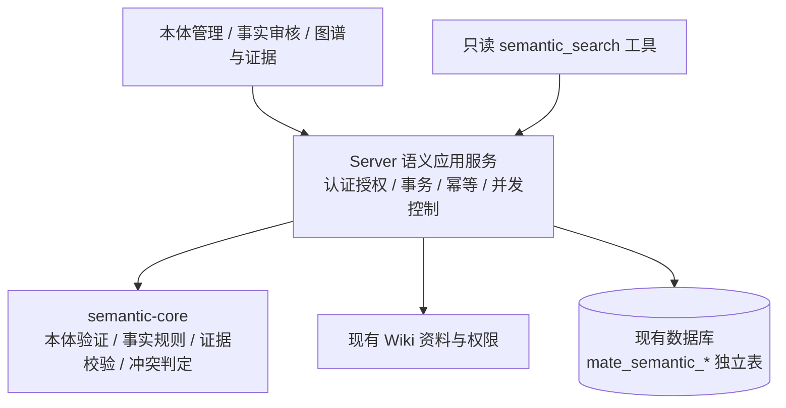

# MateClaw 企业语义核心与本体管理总体设计

日期：2026-09-05。状态：Proposed，待实施。代码基线：`codex/enterprise-ui@04dde691`。本文统一此前讨论；对象字段见[领域模型](../../architecture/2026-09-05-semantic-domain-model.md)，交互细节见[本体管理规格](../../architecture/2026-09-05-ontology-management-ui-spec.md)，执行顺序见[实施计划](../plans/2026-09-05-enterprise-semantic-core.md)。

## 1. 目标与范围

在当前 MateClaw 仓库增加一个小型、可独立测试的 Java 语义核心，结合现有 Server、数据库和企业 UI，完成“本体配置与发布 → 知识库绑定 → 固定来源 → 候选事实 → 审核与冲突处理 → 图谱和证据查询 → Agent 调用”的真实闭环。

首期必须可通过界面维护本体，不能用 Java 常量、数据库手工修改或只读演示代替。资料到候选首期采用人工结构化录入并引用真实资料；不承诺自动把任意文档转换成完整图谱。现有抽取可在后续作为候选生产者接入。

确定边界：

- 只在当前仓库实施，不继续建设或依赖外部 Semantica4j 工作区。
- 只新增 `mateclaw-semantic-core` 一个 Maven 模块；宿主集成在 `mateclaw-server`。
- 同进程、同数据源；不新增生产依赖、独立服务、Neo4j、向量库、消息中间件或前端框架。
- 一知识库最多一张图，一图固定一个已发布本体版本，同工作区可复用本体。
- 不做跨 KB 图合并、自动实体去重、OWL/RDF 推理、GraphRAG、非空图本体迁移。
- core 无 Spring、Spring AI、MyBatis、HTTP DTO 和宿主实体依赖；不复制原生 Wiki 图业务实现。
- UI theme profile 与功能启用、权限分开；继续支持现有 classic/enterprise 和浅深色。

## 2. 当前依据

| 当前事实 | 设计影响 |
|---|---|
| Java 21、Spring Boot 3.5.16、MyBatis、Flyway 已在根/Server POM | 使用当前工程依赖；不导入另一套 BOM |
| Wiki 已有资料、chunk、页面、实体和三元组 | 复用来源与导航，正式语义事实单独治理 |
| WorkspaceAccessInterceptor 只检查方法注解，缺失范围有历史默认逻辑 | 新应用服务必须自行拒绝缺失 Scope，检查实际资源归属 |
| ToolRegistry 对无数据库注册行的 Tool bean 默认启用 | 条件 Bean + 默认关闭的工具注册，两层限制 |
| 普通 AuditEventService.record 写失败可能仅记日志 | 发布/审核记录必须与领域状态同事务保存 |
| 前端 `api/index.ts` 导出 http，已处理认证、工作区和错误响应 | 语义 API 文件复用 http；HTTP 4xx 保留结构化错误详情 |
| Wiki 实体图已使用 ECharts，Vitest 使用 happy-dom | 新图视图复用现有 ECharts，不新增可视化依赖 |
| 当前构建脚本引用不存在的 check-snowflake-precision.sh | 使用显式验证命令，另记录基线缺口，不创建虚假替代门禁 |

本次未运行应用测试或启动服务，以上是代码事实，不是新功能运行验证。

## 3. 架构与所有权



core 按 identity、ontology、fact、evidence、conflict 分包，维护纯领域值与确定性函数。Server 按 ontology、graph、source、statement、query、security、web、tool 组织功能；数据库模型和 Mapper 留在各自功能包中，不形成通用 Repository 平台。UI 新代码集中在 `src/features/semantic/`。

所有权：MateClaw 管用户、工作区、知识库和原文；语义模块管本体、图、事实、修订、证据快照及审核记录。实体的展示名可维护，业务属性统一经 Statement 写入，不建立可写的 entity.propertyJson 第二权威。

## 4. 领域契约

### 4.1 对象与版本

| 对象 | 最小责任 |
|---|---|
| Ontology / OntologyRevision | 工作区内本体身份；不可变发布内容及维护中的草稿 |
| OntologyDefinition | 实体类型、属性定义、关系定义；稳定 key、中文 label、类型和 SINGLE/MULTI 约束 |
| SemanticGraph / GraphScope | 绑定 KB 和精确本体版本；mutationVersion 控制并发 |
| Entity | 图内稳定身份、单一类型、显示名称 |
| Statement / StatementRevision | 可寻址断言及不可变修订；字面值或实体对象二选一 |
| ChangeProposal | 既有事实的独立修改候选，包含 expectedRevision 和不可变拟定内容 |
| SourceSnapshot / Evidence | 固定文本和摘要；明确 code point 片段及原文 |
| Conflict / ConflictMember | 精确引用事实修订或 ChangeProposal，保存规则和处理结果 |

本体发布版号、草稿并发版本、来源采集版本、事实修订、图 mutationVersion 分开。已发布本体不可原地编辑；v2 发布不影响仍绑定 v1 的图。空图显式换绑；实体、候选、快照、导入任务或事实任一存在即不视为空图，首期拒绝换绑。

新事实以 PROPOSED 修订开始，确认生成 ACCEPTED 修订；拒绝及撤回产生 REJECTED/RETRACTED 修订。已有 ACCEPTED 的修改先存 ChangeProposal，批准前不移动当前修订指针。批准事务只允许匹配 expectedRevision 的一个候选生效，其他过期候选标记 STALE。

时间为 UTC Instant 的半开区间或显式 UNKNOWN。未提供有效时间不得自动当作永久有效。DECIMAL 以 BigDecimal 数值比较，固定单位一致才比较；不做单位换算。多值不同值不冲突；单值不同值在有效时间重叠时冲突，未知时间需处理后才能同时确认。

### 4.2 core 最小公共入口（待实现契约）

ID 值类型集中在 `identity/SemanticIds.java` 的嵌套 record，分别为 WorkspaceId、KnowledgeBaseId、GraphId、OntologyId、OntologyRevisionId、EntityId、StatementId、ProposalId、SnapshotId、EvidenceId、ConflictId，均保存非空正整数字符串；由宿主生成，core 不生成数据库 ID。序号用正整数并检查溢出。

```java
ValidationReport OntologyValidator.validate(OntologyDefinition definition);
ValidationReport StatementValidator.validate(
    GraphScope scope, OntologyRevision ontology, StatementContent candidate,
    Map<EntityId, Entity> referencedEntities);
ValidationReport EvidenceVerifier.verify(SourceSnapshot snapshot, Evidence evidence);
Optional<ConflictKind> ConflictDetector.compare(
    OntologyRevision ontology, StatementContent left, StatementContent right);
List<ConflictFinding> ConflictDetector.detect(
    OntologyRevision ontology, StatementContent candidate,
    List<StatementRevision> currentAcceptedStatements);
```

`ValidationReport` 为 `List<Violation>`，Violation 包含稳定 code、字段 path 与不含敏感原文的说明；`valid()` 等价于没有 error 级别条目。ConflictFinding 包含 kind、竞争 StatementRevisionRef 及原因，不生成可写全局 ID。上述服务不取数据库、Clock、当前用户或全局 ThreadLocal；输入明确，输出确定。

compare 是共享的两项内容判定，返回 SINGLE_VALUE_DISAGREEMENT/TEMPORAL_UNCERTAINTY 或 empty；前提是双方已通过定义与范围验证，跨 Scope 输入拒绝而非当作无冲突。detect 仅是对当前 ACCEPTED 事实调用 compare 的便捷方法。候选预检由应用服务使用同一 compare 检查 PROPOSED 修订/PENDING 变更，持久化引用双方真实身份的 OPEN Conflict；首次两项互斥候选在处理前均不进入正式图。

已有事实的ChangeProposal在检查最终状态时替换自己的目标当前版本，故对ACCEPTED集合比对时排除该目标的旧当前版本，并先验证expectedRevision；其他竞争Statement不能排除。针对相同目标的并行候选仍分别有身份，批准后通过CAS使旧基准候选过期。

StatementContent 包含 scope、ontologyRevisionId、subjectId、predicateRef、StatementValue、Validity、evidenceIds；StatementValue 为互斥 sealed 类型 TextValue、DecimalValue、BooleanValue、DateValue、InstantValue、EntityValue。ChangeProposal 共享该内容类型，不冒用未生成的事实修订号。

## 5. 存储与事务

采用既有 Flyway 目录，三个方言（h2/mysql/kingbase）同版本同语义追加脚本。当前最大版本 V190；实施当天重新扫描并分配下一个未占用整数版本，不永久预占 V191。不修改旧脚本，不向 schema/data seed 或 BootstrapRunner 增加临时建表。Flyway 启动 repair 行为不能代替旧迁移内容不变的审查。

| 表（均以 mate_semantic_ 开头） | 查询列与约束 |
|---|---|
| ontology | id、workspace_id、name、active_draft_id；一个本体最多一活动草稿，通过父行锁维护 |
| ontology_revision | ontology_id、revision_id、version、status、draft_version、base_revision_id、definition_json、publication_note；UNIQUE(ontology_id,version)，发布后正文不可更新 |
| graph | id、workspace_id、kb_id、ontology_revision_id、enabled、mutation_version；UNIQUE(workspace_id,kb_id) |
| entity | id、graph_id、type_key、display_name、status；索引(graph_id,type_key) |
| statement | id、graph_id、current_revision；当前指针需与修订写入同事务 |
| statement_revision | statement_id、revision、graph_id、subject_id、predicate_kind/key、review_status、validity、typed_value_json、content_json、actor/time/reason；UNIQUE(statement_id,revision)，按 graph/subject/predicate/status 查询 |
| change_proposal | id、graph_id、target_statement_id、expected_revision、payload_json、status、result_revision；候选正文不可覆盖 |
| source_governance | source_kind/source_id、workspace_id、kb_id、state；UNIQUE(workspace_id,kb_id,source_kind,source_id) |
| source_snapshot | id、graph_id、source identity、capture_version、text_digest、text_content；版本唯一，文本及摘要不可更新 |
| snapshot_exclusion | snapshot_id、actor、reason、created_at；对单次解析错误排除支持，不撤回所有来源版本 |
| evidence / revision_evidence | snapshot_id、codepoint start/end、exact_quote；UNIQUE(statement_id,revision,evidence_id) |
| conflict / conflict_member | 图、规则、状态、解决决定；成员类型为修订或候选并引用精确身份 |
| command_record | workspace_id、operation_id、kind、request_digest、result_ref；UNIQUE(workspace_id,operation_id)，保存原子结果供重试回读 |
| import_job | 图、操作标识、状态、租约、重试数、错误码、来源 ID；重启可恢复过期任务 |
| governance_record | 操作者、工作区、资源、动作、前置/结果版本、理由、traceId、时间；随发布/审核/撤回同事务提交 |

定义与事实 payload 作为有版本的 JSON 文档保存，关键检索/约束字段独立列；不为每个本体值对象建表。内容列使用各方言适配的文本类型，不使用只能某个数据库执行的 JSON 查询函数。相同数据库 ID 的跨 Scope 关系由应用验证和组合约束共同保护。

事务边界：

1. **发布**：锁 ontology → 验证唯一草稿与 expectedDraftVersion → 重验定义 → 写发布版本、command_record、governance_record → 清活动草稿指针 → 提交。
2. **确认/修订/解决冲突**：锁 graph → 重新读取当前事实/候选/来源状态与权限 → 校验最终状态 → 写新修订、证据关联、当前指针、冲突决定及治理记录 → 更新 mutationVersion → 提交。
3. **来源撤回/快照排除**：锁相同 graph → 写治理状态和原因 → 更新 mutationVersion → 提交。查询实时计算支持状态，不改历史修订。
4. **启用/换绑**：锁关联 KB/graph，并发安全检查图为空和版本可选 → 写绑定 → 提交。UNIQUE 防并发重复建图。

首期单图写锁换取正确性与小实现。后续有实际吞吐瓶颈再缩锁粒度。普通平台审计可另记一份摘要，但不承担唯一业务证据。

## 6. 来源、支持和访问

来源优先 WIKI_RAW，读取真实授权资料并将原文/解析文本固定到语义文本快照；MANUAL_RECORD 保存人工记录及操作者。引用片段采用 Unicode code point 的 `[start,end)`，截取必须与 exactQuote 相同。Wiki chunk 仅作导航辅助；核实旧偏移单位后转换。

来源级 WITHDRAWN 对 SourceRef 全部快照生效；特定快照排除只影响一次采集。新来源版本不覆盖旧快照。原 Wiki 引用禁止级联物理删除语义历史；原来源已删除/无法验证可访问时，普通查询拒绝披露内容，治理界面返回允许显示的状态，不能重新暴露已撤权文本。此判断不把某个用户的撤权误记成全局来源撤回。

默认可信查询条件是：当前修订 ACCEPTED、符合时间选择、至少一个当前有效且该用户可见的支持证据、资源授权通过。关系两端和所有返回邻居也需授权。SUPPORT_LOST 是派生状态；单值冲突检查仍包含所有当前 ACCEPTED，竞争新值确认前必须处理旧事实，不能靠失去证据跳过约束。

## 7. 权限与功能开关

新增 capabilities：view:ontology、manage:ontology、publish:ontology、view:semantic、propose:semantic、review:semantic、manage:semantic。viewer 获两项 view；member 增加 manage:ontology 和 propose:semantic；admin/owner 增加其余三项。图绑定和来源治理另需真实 KB 管理权限。全局管理员可授权执行，但不能将不一致的 KB/graph/workspace 拼接成合法资源。

Controller 每个入口使用当前方法级角色注解，应用服务统一 `SemanticAccessService` 再验。工具调用同一服务，不能依赖 HTTP 注解。首期只接受已认证 Web 用户的 ChatOrigin.requesterUserId；匿名、外部 IM、cron/system 和缺失 Scope 的工具请求拒绝，后续有明确服务账号再扩。

`mateclaw.semantic.enabled=false` 默认关闭模块 Web/Tool 入口；核心表可预先迁移。Tool bean 条件装配，另追加工具注册迁移，初始 enabled=false；只有开启模块、管理员启用工具并授予 Agent 后才可用。开放的只读工具为 `semantic_search`，写操作不经模型工具发布。

唯一常驻的语义入口为受认证保护的 `GET /semantic/status`，只返回当前模块 enabled。前端先读 enabled，再结合现有 `/workspaces/{id}/access` 的 capabilities 决定菜单/路由可用性；关闭时不因静态能力清单仍有新字段而展示失效入口。业务端点和工具关闭时拒绝调用，状态入口不暴露来源或配置秘密。

## 8. HTTP 与 UI 契约

统一前缀 `/api/v1/semantic`，认证复用现有过滤链；不添加 permitAll。请求使用明确 Workspace header，DTO 不接受模型提供的 actor。全部 ID 为字符串，DECIMAL value 为字符串；序号保持受界限校验的整数。成功复用 R<T>，错误用实际 HTTP 400/401/403/404/409/422，data 提供 code、fieldErrors、traceId；未知异常不返回堆栈。

| API | 行为/并发字段 |
|---|---|
| GET /status | 已认证用户读取 enabled；模块关闭时仍可用 |
| GET/POST /ontologies；GET /ontologies/{id} | 列表、新建、详情 |
| POST /ontologies/{id}/draft；GET/PUT/DELETE /ontologies/{id}/draft | 建草稿、读取、保存、放弃；baseRevisionId、expectedDraftVersion |
| POST /ontologies/{id}/draft/validate；POST /ontologies/{id}/draft/publish | 校验报告绑定 draftVersion；发布带 expectedDraftVersion、operationId、note |
| GET /ontologies/{id}/revisions；GET /ontologies/{id}/revisions/{revisionId} | 精确版本历史和详情 |
| GET /ontologies/{id}/diff?from=...&to=...；PATCH /ontologies/{id}/revisions/{revisionId}/availability | 按稳定 key 对比；停止/允许新绑定，正文不变 |
| GET /ontologies/{id}/bindings；GET/PUT /knowledge-bases/{kbId}/binding | 有权绑定列表；PUT 显式 revisionId、expectedGraphVersion（创建时 null） |
| GET/POST /graphs/{id}/entities | 图内实体列表/确认身份录入，不以名称自动合并 |
| POST /graphs/{id}/imports；GET /graphs/{id}/imports/{jobId}；POST .../{jobId}/retry | 固化来源任务，持久化状态与幂等重试 |
| GET /graphs/{id}/sources；GET /graphs/{id}/snapshots；GET /graphs/{id}/snapshots/{snapshotId}/text | 来源/快照列表与候选录入用的固定文本；文本需 propose:semantic 或 manage:semantic，且原来源访问权限通过 |
| POST /graphs/{id}/snapshots/{snapshotId}/evidence | 从固定文本建立证据；operationId、startCodePoint、endCodePoint、exactQuote；服务端回读校验，返回 evidenceId |
| POST /graphs/{id}/statements；POST /graphs/{id}/statements/{statementId}/changes | 建新增候选/已有事实变更候选 |
| GET /graphs/{id}/changes；GET /graphs/{id}/changes/{proposalId} | 按权限读取修改候选队列及具体内容 |
| POST /graphs/{id}/statements/{statementId}/review；POST /graphs/{id}/changes/{proposalId}/review | 确认/拒绝/撤回，expectedRevision、operationId、reason |
| GET /graphs/{id}/conflicts；POST /graphs/{id}/conflicts/{conflictId}/resolve | 读冲突、提交处理决定；重验成员版本和最终单值约束 |
| POST /graphs/{id}/sources/withdraw；POST /graphs/{id}/snapshots/{snapshotId}/exclude | 来源全版本撤回、特定快照排除，理由必填 |
| GET /graphs/{id}/statements；GET /graphs/{id}/statements/{statementId}/revisions | 默认可信当前事实；受权限保护的历史 |
| POST /graphs/{id}/search；GET /graphs/{id}/neighbors?entityId=... | 有界精确/文本匹配查询和一至两跳图 |
| GET /graphs/{id}/evidence/{evidenceId}；GET /operations/{operationId} | 经授权片段及操作结果回读，幂等 key 不代表查询授权 |

绑定 API 的启用开关、版本换绑是同一资源的不同命令意图，PUT 明确 `action=ENABLE|DISABLE|REBIND`；DISABLE 不删除数据，REBIND 仅空图。缺失 version/GraphVersion 的更新拒绝。

`GET statements` 默认为 `view=trusted`；候选/已拒绝/撤回/失支持管理列表使用 `view=review` 并要求 review:semantic，提交者查看自身待审候选用 `view=mine`。changes/conflicts/source 治理列表也按角色、提交者及资源授权过滤。分页参数与上限统一，不能为了填满一页先返回无权对象。事实变更后默认可信查询、审核列表与图视图使用同一当前修订规则。

快照text响应含snapshotId、textDigest、startCodePoint、endCodePoint、totalCodePoints和text；可请求指定区间，坐标始终相对整份固定快照。没有范围时返回受2 MiB上限约束的全文。证据创建要求提议能力和源权限，同operationId重试不得重复创建；用户选区若由浏览器UTF-16提供，前端需转code point后提交，后端必须独立核验。

新增候选提交也在图锁内与未决候选、当前事实比较并登记冲突。普通确认遇未决候选间冲突返回409；必须通过resolve明确选择成员及拒绝/修订其他成员后，验证最终状态再提交，不以“先点确认的人获胜”。

候选 payload 示例（字段格式版本 `semantic/v1`）：

```json
{"format":"semantic/v1","operationId":"op-1001","subjectId":"101","predicate":{"kind":"property","key":"ratedVoltage"},"value":{"kind":"decimal","value":"380","unit":"V"},"validTime":{"kind":"interval","from":null,"to":null},"evidenceIds":["501"]}
```

显式 interval 双空端点表示无界；字段缺失不是无界，时间不明用 `{"kind":"unknown"}`。没有 evidence 的候选可以保存，确认必须拒绝。发布/审批反馈以服务端结果回读为准，不以 toast 为证据。

UI 页面：OntologyList、OntologyEditor（类型/属性/关系）、OntologyVersions、KnowledgeBindingPanel；SemanticWorkbench（实体与可信图、候选/修改/冲突队列）、StatementReviewDrawer、EvidenceDrawer。编辑器通过草稿 version 防并发覆盖；切换工作区要处理脏表单并取消旧请求，异步返回校验 workspace + requestGeneration。非空图换绑明确禁用和说明原因。

复用 `http` 拦截器，但新 feature API 统一解包 R<T> 和保留 HTTP 错误详情；不增加第二个 Axios 实例。复用 ECharts 做独立只读语义图组件，不改绑定 Wiki API 的现有图组件。标签以 text 渲染，证据不通过未经清洗的 HTML 展示。

## 9. 资源与失败边界

以下为首期可配置保守上限，不是性能承诺：每份快照 UTF-8 文本 2 MiB；每本体 100 个类型、500 项属性/关系；每图 1,000 实体、10,000 当前陈述；一次最多 100 节点、200 边、深度 2；查询 deadline 默认 5 秒；导入最多重试 3 次并有租约；列表 pageSize ≤100。超限明确拒绝或返回标注 truncated 的查询结果，校验不得截断后假称无冲突。

测试时单库小样本验证正确性；真实容量和性能在试点数据上测量再调整。记录 operationId/traceId、任务状态、失败码、版本，不在日志打印完整来源、Token 或敏感候选。

故障处理：发布网络中断查询 operationId；CAS 过期保留用户输入，禁止覆盖；导入重启从过期租约恢复，不重复证据；查询到期返回明确失败，无随机/空成功替代；关闭模块后停接新任务和工具，运行中的事务结束或回滚，数据保留。

## 10. ADR 汇总与交付标准

沿用[领域边界 ADR](../../adr/0001-semantic-knowledge-ontology-fact-boundaries.md)和仓库内核心设计的 LOCAL-SEM-01～05。新增实施决策：既有数据库权威、单图事务锁、独立同事务治理记录、UI 必交付、默认关闭。取舍：少量表和行锁增加宿主代码，但避免独立服务/消息/投影复杂度；绑定旧本体限制升级便利，保护当前事实解释。

交付按三层验收：

1. 可独立测试的 core：本体/事实/证据/冲突真实规则，非空 ArchUnit 边界验证。
2. 持久化应用：空库和升级库、真实并发、幂等、事务回滚、重启回读和权限负测。
3. 可用产品：真实登录浏览器维护本体 v1/v2、绑定 KB、固化来源、录入/审核事实、冲突处理、图与证据查询，并完成一次真实模型经工具取证回答。

H2 与 MySQL 为首期交付验证目标；Kingbase/Postgres 保留方言迁移，不在无真实环境时宣称运行通过。缺少 MySQL 或真实模型条件时，只能标记对应验收未完成，不能以 H2/Mock 代替。发布、推送、生产部署不属于此次“写设计和计划”。

## 11. 上游同步与回滚

保留现有双远端和企业 UI 提交。在实施时基于当前企业基线建立 `codex/enterprise-semantic-core` 功能分支/隔离 worktree，先携带本轮未提交的规格与计划，不遗漏 CONTEXT/ADR；不 stash、覆盖或提交其他未跟踪目录。用户若明确要求当前 checkout 直接实施则按其要求执行。

根/Server POM、能力清单、导航/路由、双语资源、追加迁移为挂接点；core/server semantic/UI feature 为自有目录。每任务按 Lore 协议独立提交，先执行本任务测试再回归，不通过整段选择上游/本地来处理混合冲突。

回滚优先关闭 `mateclaw.semantic.enabled` 与工具启用状态，保留语义表、来源快照和修订；不运行破坏性 down migration。已成功发布的版本恢复通过新版本完成；功能回滚不能冒充图本体迁移。实现阶段补充 README 和运行证据，记录实际数据库、模型及未过的环境门禁。
