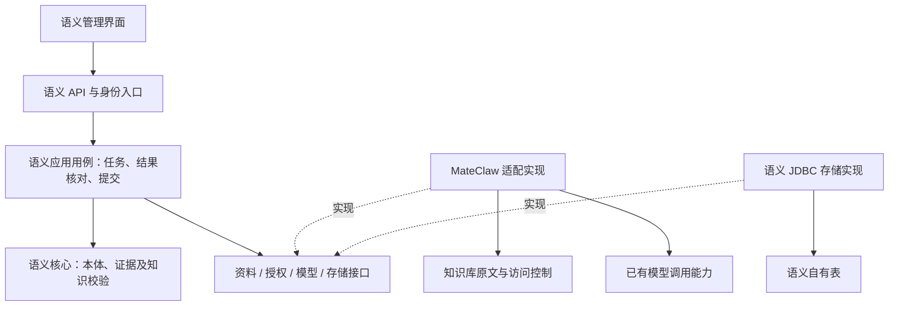

# M5 资料辅助构建知识设计

日期：2026-09-08。状态：详细设计已获用户确认，进入实施计划阶段。本文是设计，不代表功能已实现。

## 1. 目标与现状

让业务人员从一份质量调查报告出发，在本体约束下获得带原文依据的知识建议，修正后提交到现有审核流程。成功标准是减少重复填写，同时保留人工判断、原文证据、权限与历史记录。

当前基线：`34a5f7d2`，M1–M4 已有本体版本、知识库绑定、资料快照、证据、知识审核、分歧处理、工具查询和本体影响分析。当前工作区另有尚未提交的业务文案和本体关系图，不纳入本设计提交。

现有依据：
- `mateclaw-semantic-core/pom.xml`：生产核心无框架依赖。
- `mateclaw-server/src/main/java/vip/mate/semantic/source/SourceApplicationService.java`：当前来源仅支持 WIKI_RAW。
- `mateclaw-server/src/main/java/vip/mate/semantic/statement/StatementApplicationService.java`：已有知识及变更提交流程。
- `mateclaw-server/src/main/java/vip/mate/semantic/tool/SemanticTool.java`：已有只读知识检索工具。

## 2. 范围与停止线

M5 只打通：一个已绑定知识库 → 一份可访问资料的不可变快照 → 辅助识别 → 人工核对 → 现有知识审核 → 查询与证据回读。

包含：任务创建/状态/取消/有限重试、对象匹配建议、属性与关系建议、原文高亮、规则诊断、逐条编辑/忽略/提交、结果和提交记录恢复。

不包含：自动批准、自动修改既有知识、自动合并对象、跨知识库合并、任意格式文件解析、新向量库/图数据库、自动换绑本体、通用规则引擎、批量无人值守加工、独立服务部署。新文件沿用宿主已有解析入口，M5 消费已解析原文。

先完成单文档纵向闭环再扩展批量。模型配置不可用时明确提示，已有人工新增知识继续可用。

## 3. 架构与依赖方向

接口由消费它们的语义应用层定义，宿主实现接口；核心不依赖接口实现。首期同进程、同现有数据库部署，以本地调用和现有事务为主，不引入消息中间件。

新增轻量 `mateclaw-semantic-application` 模块，生产代码仅依赖 core/JDK。只承接 M5 用例及其接口，不搬迁全部 M1–M4 服务。模型调用、Spring 调度、JDBC、HTTP DTO 和宿主身份类型留在 server 的适配与装配层。

应用层不得直接引用 UserEntity、Wiki Entity、ToolContext、JdbcTemplate 或 Spring AI。核心与应用层测试使用内存替身即可运行；server 集成测试证明真实适配行为。架构检查禁止上述导入，并检查模块依赖方向。

## 4. 接口契约

| 接口 | 输入与输出 | 责任 |
|---|---|---|
| SourceContentPort | 授权上下文、图范围、资料引用 → 资料版本、原文、来源元数据 | 读取当前可访问资料，不替调用方扩大权限 |
| AccessPolicyPort | 操作者、工作区、图、资料、动作 → 允许或拒绝 | 执行实时权限检查，不缓存为永久授权 |
| ExtractionModelPort | 本体定义、分块原文、配置快照 → 有界结构化建议、用量、错误分类 | 封装模型协议；不提供数据库和写入工具 |
| ExtractionTaskRepository | 带版本任务、租约、尝试结果、条件更新 | 保证任务抢占、租约隔离、结果持久化 |
| KnowledgeSubmissionPort | 已核对建议、对象映射、稳定操作号 → 知识记录引用 | 适配现有知识提交入口，复用权限、校验、幂等与冲突规则 |

所有标识跨 JSON 使用字符串。接口类型使用语义自己的 ID、授权上下文和错误类型。租户/工作区来自服务端身份，不信任模型输出及客户端传入的操作者字段。

对象登记仍复用现有业务对象入口。用户先选择现有对象或显式登记新对象，提交建议时只接受已持久化且属于当前图的对象 ID；本期不做隐式创建对象与知识的一揽子事务。

## 5. 数据所有权与最小模型

MateClaw 拥有用户、Agent、知识库原始资料和资源权限；语义模块拥有本体、语义图、证据、知识、抽取任务和建议。新建议不是正式知识，不能进入现有可信查询。

新增语义自有持久化记录，具体迁移序号在实施前根据最新迁移链分配：

- ExtractionTask：工作区、图、发起人、operationId/requestHash、sourceSnapshotId/contentHash、ontologyRevisionId/definitionHash、promptVersion、配置摘要、状态、版本、取消标记、创建/更新时间。
- ExtractionAttempt：任务、尝试次数、租约持有者/代次/期限、模型名称及非敏感配置、输入输出用量、开始/结束时间、错误类别。禁止存 API key。
- ExtractionSuggestion：任务与尝试、稳定建议 ID、对象临时引用、属性/关系键、值/单位/适用时间、原文定位、诊断、编辑版本、处理状态。
- SubmissionReceipt：建议 ID、编辑版本、操作号、请求摘要、现有知识记录 ID、提交结果。唯一约束保证相同建议修订不会重复提交。

建议编辑保留版本及审计；不覆盖已提交内容。模型原始输出仅保存诊断必需内容，受同等资料权限保护，不写普通日志。默认不保留完整提示词副本；通过模板版本、资料快照和定义快照追溯。模型服务不保证相同输入逐字复现，追溯不等于确定性重放。

## 6. 任务、失败与并发

任务状态：QUEUED → RUNNING → SUCCEEDED / FAILED / CANCELLED；SUCCEEDED 表示建议生成并保存，不表示知识已审核。无可提取内容可以成功返回零建议并附说明。

建议状态：OPEN → SUBMITTED / IGNORED；编辑以版本条件更新，过期返回 409。诊断独立于状态，含错误的建议不能提交。

默认限制作为首期可配置运行参数：一次一份资料，原文最多 100,000 个 Unicode code point；每块最多 6,000、重叠 300，最多 20 块；每任务最多 200 条建议。输入超限在启动前拒绝；输出超限标记失败，不静默截断为完整结果。原文快照仍遵循现有字节上限，两项限制同时满足。

每工作区最多 2 个运行任务，全实例最多 4 个。单次模型调用 90 秒超时，任务执行预算 10 分钟。超时、限流、暂时不可用最多自动重试 2 次；鉴权、规则和格式错误不自动重试。模型调用不得占用数据库事务。

租约心跳与代次条件写入防止重启后旧执行者提交结果。取消为协作式：无法中断已发出的模型调用时丢弃后到结果，已经发生的调用费用无法撤销。重试保留旧尝试，不混入其部分输出；只有完整成功尝试成为可核对结果。

提交时实时检查图启用状态、资料访问与撤回状态、快照有效性、本体绑定、对象类型、证据及现有知识规则。本体发布新版本不改变该任务的绑定版本；如果图绑定发生变化，旧任务禁止提交，要求新建任务。

跨应用收据与现有命令提交采用稳定操作号恢复：命令已提交但收据写入失败时，以相同操作号重放并回读原结果，再补收据。禁止生成新操作号盲目重试。内容改动需新编辑版本和操作号。

## 7. 抽取、证据与对象匹配

1. 授权后固定现有 SourceSnapshot 与图绑定 OntologyRevision。
2. 确定性分块并记录每块在快照中的 Unicode code point 起点；相邻重复建议在任务内按规范化键归并，但保留多份原文引用。
3. 将资料作为不可信数据传给模型，指令与资料分隔；不执行资料中的提示指令，不向模型提供操作工具和密钥。
4. 模型返回类型键、对象名称、属性/关系键和值、原文引用和块内定位，不返回可直接执行的 SQL/工具命令。
5. 服务端验证结构、键、值域和单位，并把定位映射回完整快照。exactQuote 必须与 Unicode code point 区间一致；原文重复且定位不能唯一确认时，要求用户重选，不猜测证据。
6. 本体别名可帮助术语匹配，但不能将对象同名判为同一实体。只在当前图建议对象匹配；歧义时用户选择或登记。
7. 推测性内容、无法证实的根因、没有证据的值均显示诊断。模型置信度仅作辅助提示，不作为批准依据。
8. 用户编辑后重新校验并提交现有 PROPOSED 流程。现有管理员审核和分歧处理保持唯一权威入口。

日期不明确时保持 UNKNOWN，不用文档上传时间推断业务适用时间。数值单位不自动换算。首期只处理新知识建议；对已存在知识的修改引导用户进入现有变更申请。

## 8. 页面与 API 草案

工作台增加“从资料生成”入口，保留“新增知识”的手工入口。步骤为：选择资料 → 核对本体版本/模型及发送内容范围 → 生成进度 → 左侧原文、右侧建议核对 → 提交审核。

结果页展示对象匹配、属性/关系、值、单位、适用时间、原文高亮与错误原因。允许逐条忽略、编辑和提交，显示“已提交审核”及跳转；不把提交按钮命名为“确认事实”。首期不提供全选一键批准。

任务页可刷新恢复，离开页面不中断后台任务；局部编辑未保存时提醒。只显示当前操作者仍有权访问的任务及结果，撤权后不泄漏任务计数、摘要和原文。

拟定资源位于现有 semantic/graphs/{graphId} 下：
- POST extraction-tasks：启动，operationId 幂等，返回 202/任务 ID。
- GET extraction-tasks/{taskId}：状态、进度、错误及尝试摘要。
- POST extraction-tasks/{taskId}/cancel、/retry：取消或在同一输入快照下新建尝试。
- GET extraction-tasks/{taskId}/suggestions：分页查看成功结果。
- PATCH suggestions/{suggestionId}：expectedVersion 条件编辑、忽略。
- POST suggestions/{suggestionId}/submit：expectedVersion + operationId，返回知识记录引用。

模型配置变化、资料更新或本体绑定变化需新任务。任务只能显式选择宿主允许使用的模型，权限和模型数据发送策略由适配层核对；不可悄悄切换提供方。

## 9. 非功能、运行和回退

使用现有数据库、迁移、日志与指标能力；不新增技术基础设施。记录排队时间、运行时间、失败类型、建议数、提交数、模型用量，关联 traceId；不得记录原文和凭据到普通日志。

提交流程必须保证租户隔离、跨图拒绝、证据有效和幂等。首期性能验收记录机器与模型环境，分别测排队、模型和数据库耗时；不把模型响应时间写成固定 SLA。管理员可以关闭辅助生成入口，已有任务、收据与历史知识仍可读。

新增功能独立开关默认关闭，开启需适配与模型配置验证成功；关闭后禁止新增任务和新模型调用，已提交知识按原规则工作。停止运行任务按取消策略处理，不删除审计记录。

## 10. 质量根因端到端验收

使用合成且人工标注的质量资料：批次 LOT-QA-0908、设备 CNC-07、孔径超差、测量偏差 0.08 mm、调查结论刀具磨损。本体的测量值域必须允许真实异常值；合格标准与观测值分开表达，不能沿用演示中 ±0.05 的录入限制来接收 0.08。

验收逐项要求：
1. 资料 → 快照 → 任务 → 建议，每条能回读精确证据与绑定版本。
2. 人工选择对象、修正建议后提交，只出现 PROPOSED；模型与普通成员不能自行批准。
3. 管理员审核后，现有查询和 semantic_search 回读知识 ID、修订和证据。
4. 重复提交、响应丢失、执行者租约失效、服务重启不重复创建知识。
5. 引文伪造、重复引文、Unicode、越界值、非法单位、错类型、同名对象和未知时间均有针对性反例。
6. 来源撤回、资料撤权、跨工作区、跨图、模型超时、取消、输出超限均正确失败且无越权结果。
7. 本体 v2 发布后任务与旧图仍按 v1 工作；实际换绑后拒绝旧任务提交。
8. 成功零建议与失败清晰区分，原有人工构建及 M1–M4 核心回归通过。

用 10 份合成标注资料验证业务可用性，逐条记录漏提、误提、错误匹配和证据错误；不宣称统计性准确率保证。验收安全硬门槛为：所有可提交项通过证据和本体校验，所有审核前建议不得进入已确认知识查询。评测集与实际模型配置随验收报告保存。

## 11. 决策记录

### ADR-M5-01：同进程模块隔离
状态：已接受。
决定：新增 JDK-only 应用模块，只承接 M5；宿主适配留 server。
收益：边界可测、将来可替换宿主；保留本地事务和运维方式。
代价：新增一个构建模块，M1–M4 部分宿主耦合仍存在，不能声称全系统已经可独立部署。
备选：全放 server 会继续扩散耦合；立即独立服务引入网络授权与一致性成本。两者均不作为本期选择。

### ADR-M5-02：建议与正式知识分离
状态：已接受。
决定：模型结果存建议，通过原知识命令提交和审核，不新建第二套事实权威。
收益：沿用证据、冲突和权限保障。
代价：用户需要核对和审核，自动化程度受限。
备选：按置信度自动批准不满足可追溯且由业务负责的目标。

### ADR-M5-03：持久化任务与稳定命令恢复
状态：已接受。
决定：持久化队列、租约代次、有限重试；模型调用在事务外；跨提交收据使用幂等回读恢复。
收益：重启可恢复，不要求引入队列服务。
代价：需要任务领取、超时和恢复测试；外部模型调用无法实现严格恰好一次计费。
备选：请求内同步长事务易超时；先引入消息中间件增加本期运维成本。

## 12. 后续顺序及设计自检

本设计只覆盖 M5。M6 为业务问题与证据路径查询，M7 为资料更新后的复核任务，M8 为非空图受控升级；均需单独设计，不在 M5 顺带实施。

自检完成：建议与审核状态分开；本体版本固定；证据偏移与引文验证明确；对象创建与建议提交分开；重复提交恢复明确；权限撤回按实时授权处理；未承诺独立服务或自动图同步。用户已确认设计；任务级实施计划见 ../plans/2026-09-08-semantic-m5-assisted-knowledge.md。本设计更新不代表已开始编码。
