# MateClaw 本体与企业知识图谱用户手册

**适用版本：M1–M4（历史基线 34a5f7d2）及 M5 辅助生成操作补充｜更新：2026-09-08**

面向知识管理员、业务建模人员、质量工程师及 Agent 配置人员。本文说明当前已实现功能；配套[质量根因分析实操案例](quality-case.md)使用已经在系统中跑通的合成资料。截图来自 enterprise 界面；classic 的操作含义相同，颜色和布局略有不同。

> 本体负责定义“什么样的事实可以被表达”；知识库保管原始资料；语义图保存具体对象及带证据的事实。人工新增知识继续可用；启用 M5 后，也可先从资料生成建议，再人工核对原文、提交并审核。资料上传或本体绑定成功，不代表知识图谱已经构建完成。

## 1. 先理解四个对象

| 对象 | 管什么 | 质量场景中的例子 |
|---|---|---|
| 知识库 | 文件、原始文本、Wiki 内容，以及谁能访问资料 | “质量根因分析验收”知识库中的终检记录、调查报告 |
| 本体 | 对象类型、属性、关系、值类型、单值/多值及约束 | 批次、设备、质量问题；尺寸偏差是数值，单位 mm |
| 语义图 | 某知识库内的具体实体及事实，绑定精确本体版本 | LOT-QA-0908 在 CNC-07 加工，发现孔径超差 |
| 证据与事实修订 | 原文依据、审核结论、修改历史、有效时间 | “确认根因=刀具磨损”的 r2 修订及复核报告片段 |

**本体不是实体清单。** “设备”是类型，“CNC-07”才是实体。“尺寸偏差”是属性定义，“孔径超差的尺寸偏差为 0.08 mm”才是一条事实。

一个知识库最多对应一张企业语义图，一张图绑定一个已发布本体修订。多个知识库可以复用同一本体，具体实体、事实和资源权限仍各自隔离。

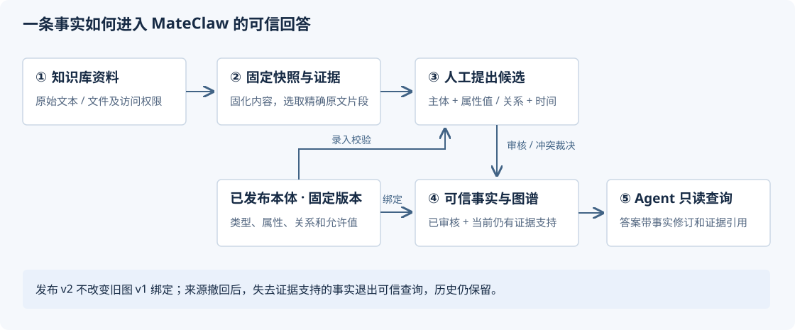

**与 MateClaw 原有 Wiki 图的关系：** 原有知识库的资料加工、Wiki 页面、关系图和检索继续工作。企业语义图增加了明确本体、事实审核、证据和版本治理，两者不是同一套事实存储。当前不会把原生 Wiki 图中的所有关系自动同步为已确认的企业事实。

## 2. 谁来操作，从哪里进入

当前沿用工作区角色，同时检查用户对底层知识库的访问权限。界面上没有按钮时，先核对工作区和角色。

| 角色 | 常见操作 |
|---|---|
| 查看者 viewer | 查看可访问的本体、版本、已确认知识和证据；查看允许的使用情况 |
| 成员 member | 在查看能力上，编辑本体草稿、导入模板、登记实体、固化快照、新增知识/修改 |
| 管理员 admin / owner | 发布本体、管理绑定、执行影响分析、审核/裁决、撤回来源或排除快照 |

全局管理员还有宿主管理能力；不能用界面主题判断授权。系统管理员需启用企业语义模块，普通用户无需修改部署配置。

- **本体入口：** 左侧“本体管理”。
- **绑定入口：** 左侧“知识库” → 目标知识库卡片的“管理知识库” → 页面下方“企业知识图谱绑定”。不要只停留在“查看 Wiki”模式。
- **构建入口：** 绑定卡片中的“打开知识工作台”。
- **Agent 工具入口：** “设置” → “工具目录”，以及“员工”中的 Agent 编辑页面。

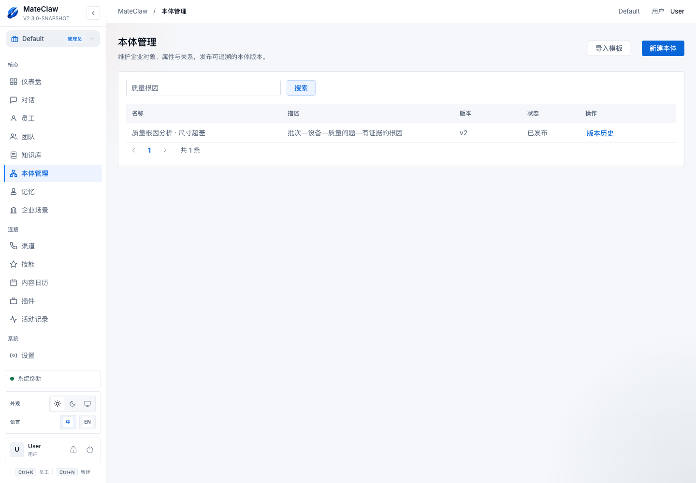

*图 1：可以新建本体、导入模板，或进入既有本体的版本历史。搜索框用于找本体名称。*

## 3. 建立和维护本体

### 3.1 新建、编辑、校验与发布

1. 点击“新建本体”，填写名称和描述。
2. 在“类型”中添加业务对象类型，例如 `QualityIssue` / 质量问题。
3. 在“属性”中定义该类型可记录的值，例如 `deviation` / 尺寸偏差。
4. 在“关系”中定义对象之间的连接，例如 `rootCause`：质量问题 → 根因。
5. 属性或关系编辑完成后点击“应用到草稿”，再点击页面“保存草稿”。前者只更新当前编辑内容，后者才保存到服务端。
6. 点击“校验草稿”。根据错误定位到字段并修正；警告是提示，不一定阻断发布。
7. 管理员点击“发布版本”，核对差异、填写发布说明并完成发布。

已有发布版本内容只读。需要调整时，在“版本历史”选择版本，再点“从所选版本建草稿”。如果已有活动草稿，先“打开草稿”。同一本体保留一个活动草稿，避免多人同时维护互相覆盖的版本。

### 3.2 字段怎样填写

| 字段 | 使用规则 |
|---|---|
| 标识 key | 稳定的业务标识，以英文字母开头，可含字母、数字、下划线。名称改了，不要随意改 key；同类定义内不能重复 |
| 显示名称 / 描述 | 给业务人员阅读的名称和说明，尽量表达具体业务含义 |
| 所属类型 | 属性属于哪一类对象；应先创建类型 |
| 值类型 | 文本 TEXT、数值 DECIMAL、布尔 BOOLEAN、日期 DATE、时刻 INSTANT |
| 单值 SINGLE | 同一主体、同一谓语在重叠业务时间内不能存在互相矛盾的取值；不会要求每个实体必须填写此属性 |
| 多值 MULTI | 允许多个值或多个目标，例如一个批次有多个质量问题 |
| 固定单位 | 仅用于数值属性；候选需使用该单位。当前不自动进行单位换算 |
| 起点 / 终点类型 | 关系允许连接哪两类对象；例如质量问题不能把“设备”误当作“根因”目标 |

**字段上限：** key 64 字符、名称 128、描述 1000、固定单位 32；每个本体最多 100 个类型，属性与关系合计最多 500 项。若类型被属性/关系引用，先处理这些引用再删除。

### 3.3 别名、弃用、枚举与范围

- **别名：** 在别名输入框中输入后按 Enter，可录入业务同义叫法，例如“尺寸偏差”的别名“测量偏差”。它帮助术语检索，不会把两个实体自动合并，也不改变规范名称。
- **标记为不推荐使用：** 表达术语弃用建议，保留历史引用；不等于删除字段或禁止所有旧事实。
- **TEXT 允许值：** 每行一个枚举值，例如“待复核”“已确认”。为空表示未限定枚举。系统按具体文本校验，注意空格和错别字。
- **DECIMAL 最小/最大值：** 支持只填一端或两端都填，边界包含在允许范围内。输入普通十进制数字，最小值不能大于最大值。空白表示该方向不限。
- 切换值类型会清理不适用的约束，应用前应核对；布尔、日期和时刻不提供当前版本的枚举/数值范围配置。

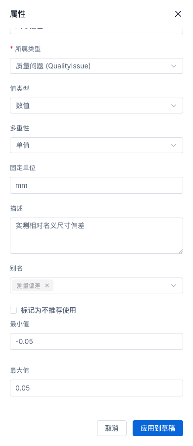

*图 2：属性抽屉中的固定单位、别名、弃用提示和数值上下界。该截图来自同日 M4 验收，演示值域 [-0.05, 0.05]。*

> **质量建模注意：** 值域约束决定“能否录入”。如果把合格公差 ±0.05 mm 填成原始测量值的允许范围，0.08 mm 的真实超差记录就会被拒绝。生产使用应允许记录超差观测，把合格标准与测量事实分开表达。当前没有跨字段自动判定合格/不合格的规则引擎。

### 3.4 查看对象关系图

在本体的版本历史中选择一个版本，可查看“对象关系图”。卡片表示对象类型，箭头表示关系方向；卡片列出前 3 个属性摘要。点击卡片或使用“查看对象类型”选择框，可查看全部属性、固定单位、允许值、上下界、别名和关联关系。图支持拖动、缩放和适应画布。

切换版本后，图与详情按所选版本重新展示。编辑草稿时可展开“对象关系图 · 草稿预览”，查看当前编辑内容；预览不等于保存。模型图中的“质量问题”是一类对象，知识工作台中的“孔径超差”才是具体业务对象。

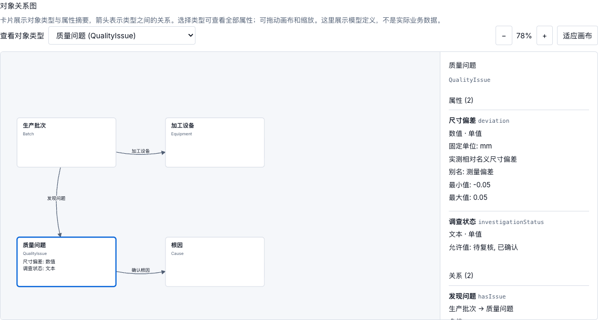

### 3.5 工作台入口名称

工作台现在使用“已确认知识、业务对象、资料与证据、新增知识、知识记录、变更申请、分歧处理”。其中“新增知识”只是提交待审核内容；通过审核且证据仍有效的内容才进入“已确认知识”。“知识记录”用于查看提交及其处理状态。

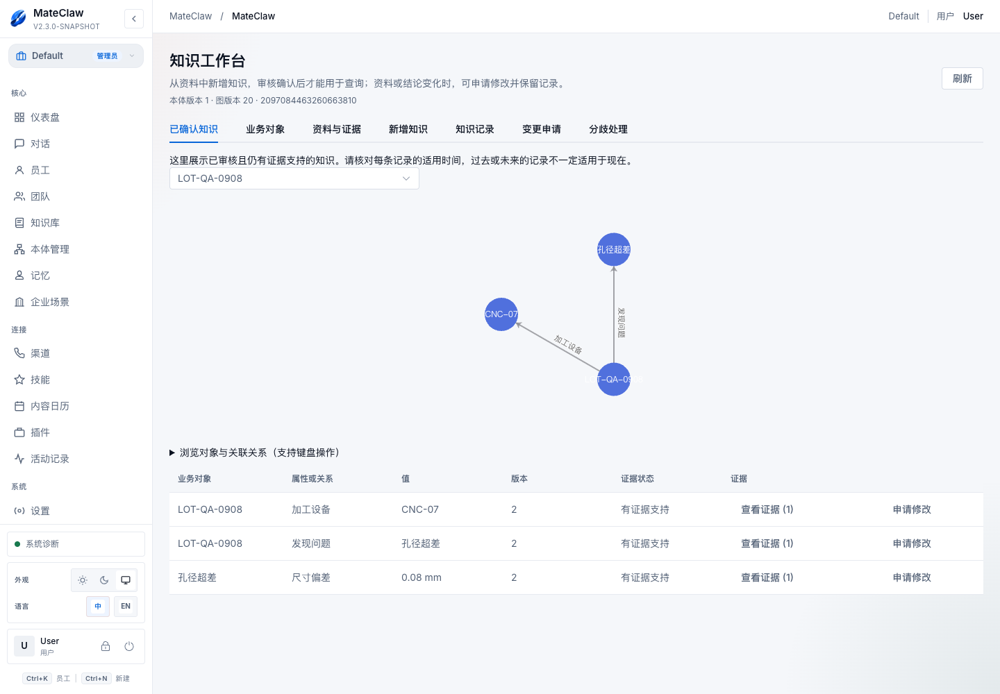

*本手册部分历史操作截图保留了早期“可信事实、提出候选、冲突审核”等名称，分别对应当前“已确认知识、新增知识、分歧处理”，业务流程相同。*

## 4. 把知识库连接到本体

1. 在知识库管理页上传资料，或用“添加文本”准备可读原文。文件需要已有可提取文本；只有文件名无法作为证据。
2. 在“企业知识图谱绑定”选择“本体名称 · 发布版本”。草稿不能绑定。
3. 首次绑定时执行页面绑定操作；之后会显示“已启用”“当前固定版本”。
4. 点击“打开知识工作台”，开始登记实体与建立事实。

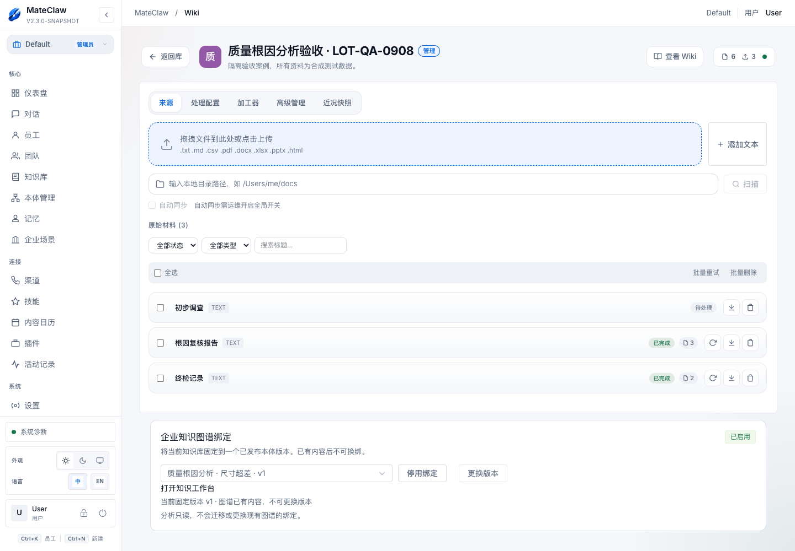

*图 3：上方仍是 MateClaw 原有资料管理；下方绑定卡片显示该知识库固定 v1。已有内容时“更换版本”不可用。*

- **发布新版本：** 为后续绑定提供新模型；不改变旧图。
- **停用绑定：** 停用企业语义图能力；不会自动删除原知识库资料。
- **更换版本：** 仅空图允许；登记实体等内容后不能直接更换。
- **禁止新绑定使用：** 在本体版本页控制该版本能否用于新的绑定；已有图仍按已绑定修订解释。

## 5. 从资料建立可审核事实

工作台有“已确认知识、业务对象、来源、新增知识、知识记录、变更申请、分歧处理”等入口，具体可见操作由角色决定。

### 5.1 登记实体

进入“业务对象”，选择本体中的类型，填写对象名称，点击“登记实体”。关系两端对象都应先登记。不要把不同批次的同名问题都当成一个实体，建议名称包含批次或事件编号；当前不做自动实体去重。

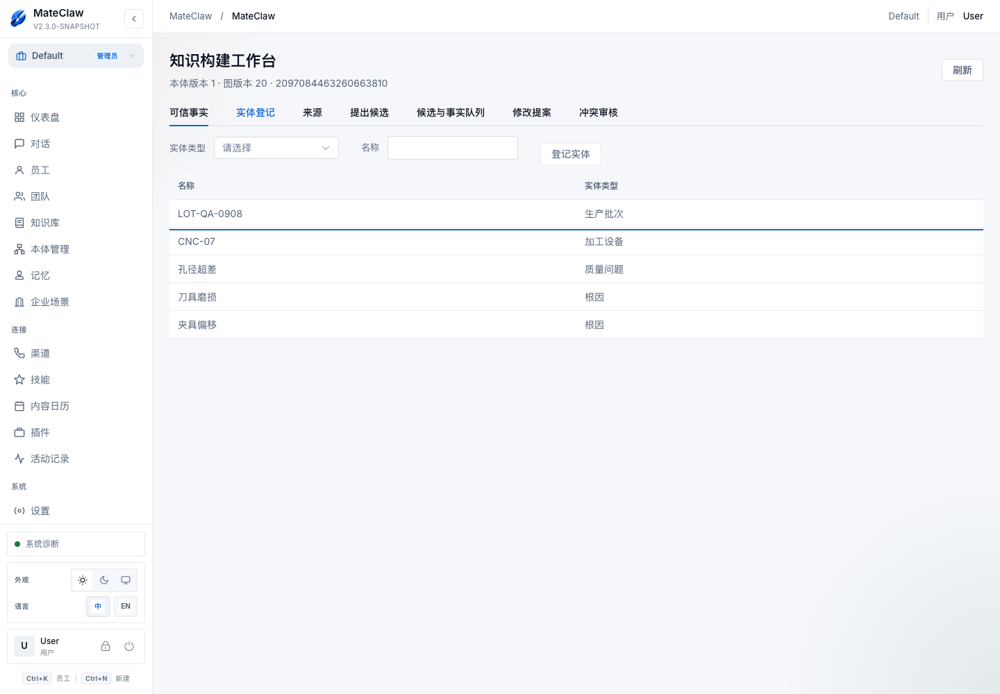

*图 4：本体定义了四类对象，案例登记了五个实体；两个根因候选属于同一“根因”类型。*

### 5.2 固化来源快照

进入“来源”，选择当前知识库资料，点击“固化快照”。等待任务返回快照；必要时“刷新”，失败时查看错误并“重试”。

固定快照保存当时的文本，后续原文变化不会改写该快照。新资料版本需要重新固化，再按新证据新增知识或修改。固化本身不会抽取实体、建立关系或确认事实。

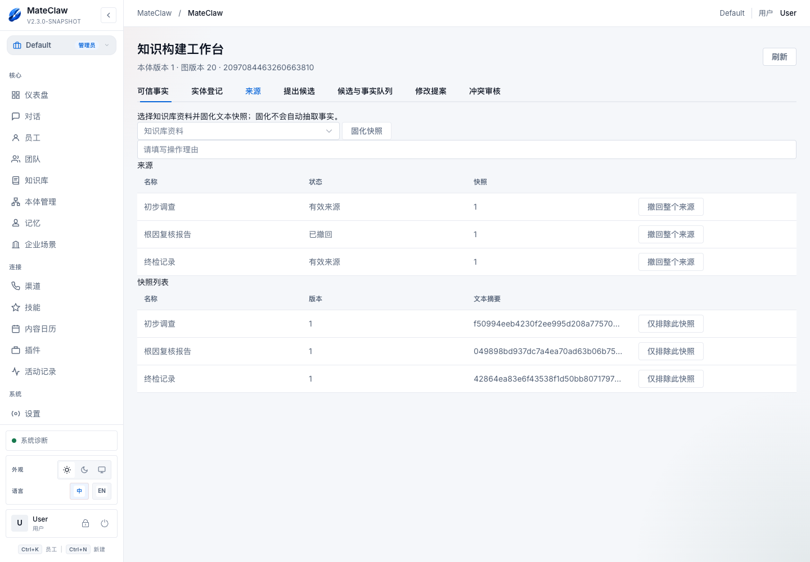

*图 5：同一来源可以有多个快照。示例环境已执行过来源撤回，因此会看到“已撤回”；它不是解析任务的成功/失败状态。*

### 5.3 新增知识

1. 打开“新增知识”，选择“主体实体”。
2. 选择“本体谓语”。可选项随主体类型变化。
3. 属性填写值；关系选择“目标实体”。候选要满足本体的值类型、单位、枚举和范围。
4. 填写“有效时间”。不知道时使用“时间未知”，不要凭资料上传时间猜测业务生效时间。
5. 选择“快照”，在“固定快照文本”中用鼠标选中能支持该事实的原文。
6. 确认页面显示选中片段，再点“新增知识”。没有精确证据时不能提交。

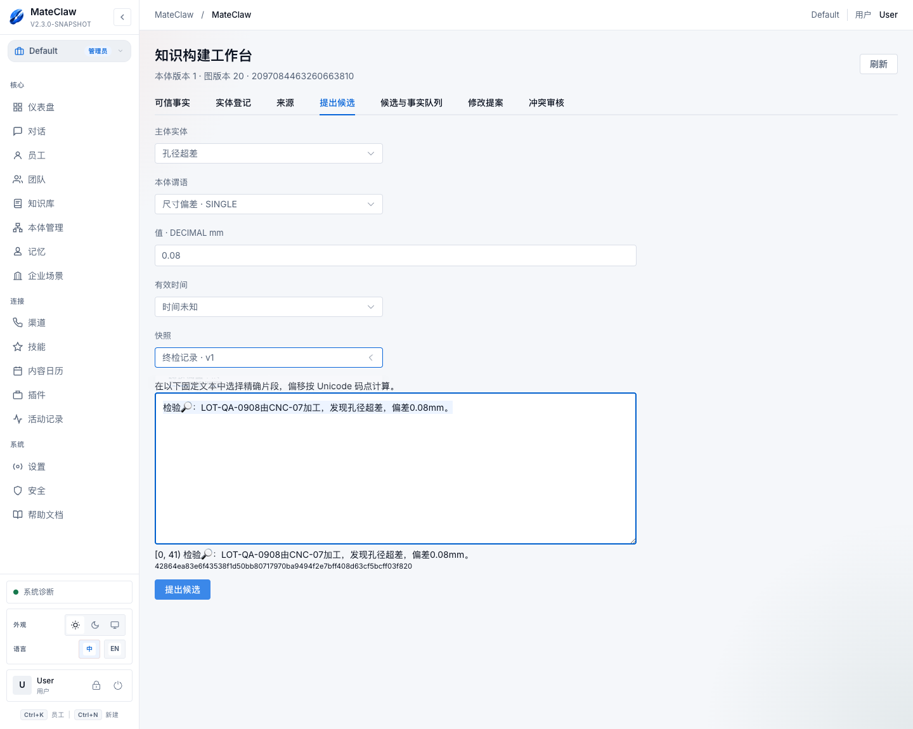

*图 6：本次为说明操作准备的真实表单截图，未再次提交。0.08 mm 在案例 v1 中合法；终检原文是该值的证据。编号和文本摘要由系统生成，无需手工计算。*

### 5.4 审核、冲突和修改

- **审核候选：** 在“知识记录”打开事实，查看证据和有效时间。管理员填写理由后“确认”或“拒绝”。
- **冲突裁决：** 若同一单值关系存在不同答案，不要反复点确认。进入“分歧处理”，比较所有成员的内容与证据，填写理由并保留有依据的事实或采纳变更申请。遇到有效时间不确定，先核实时间。
- **修改已确认事实：** 使用“提出修改”，选择新值/目标及证据。审核通过后形成新修订，旧修订保留；不直接覆盖历史记录。
- **并发过期：** 出现“版本已变化”时刷新并重新核对，不能把旧页面的选择当作当前状态重试。

### 5.5 查看可信图与追溯

“已确认知识”只展示当前已确认且仍受有效、可访问证据支持的修订。可选实体探索关系，点击“查看证据”查看事实和原文；属性值也在事实列表中展示，不一定表现为图上的一条边。

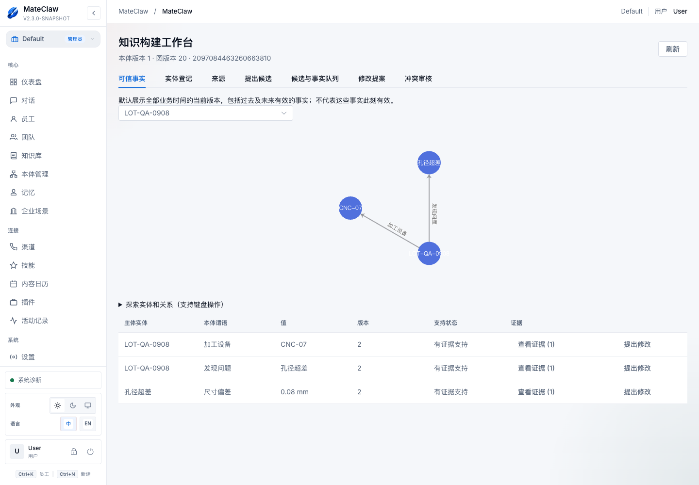

*图 7：该截图是来源撤回后的真实当前状态，保留三条检验事实，根因关系已退出可信结果。*

“可信”表示满足当前审核和证据条件，不表示系统证明了因果。默认查询跨全部业务时间的当前修订，包含过去、未来及时间未知记录；回答“现在是否有效”前必须检查有效时间。

## 6. 来源失效后如何处理

在“来源”中区分两类操作：

| 操作 | 使用场景 | 影响 |
|---|---|---|
| 撤回整个来源 | 报告整体失效、作废或被撤回 | 该来源全部快照不再提供有效支持 |
| 仅排除此快照 | 某次提取或快照内容错误，来源本身仍可能有效 | 只影响选定快照 |

操作需要管理员填写理由。事实还有其他有效且可访问证据时，可能继续可信；失去全部有效支持时会显示“证据支持已撤回”，退出可信查询。**审核状态可能仍为已确认，历史不会被删除。**

资料更新、来源撤回、快照排除和撤回事实是不同操作。更新资料并不自动修改旧事实；应核对新快照，再走变更申请和审核。

## 7. 发布 v2 前后怎样判断影响

1. 在“版本历史”创建草稿并调整定义，保存草稿后再分析；未保存输入不能作为分析目标。
2. 查看版本差异：标识删除、类型改变、单值/多值改变、范围收紧等会有不同变更分类。
3. 在“使用情况”选择具体知识库图，点击“分析影响”。已发布版本页也可分析。
4. 阅读报告的来源版本、目标、扫描时间及图版本。报告只针对当时扫描到的数据，后续有写入应重新分析。
5. 对违规项点击“定位”核对事实或提案，再决定如何建模和处理数据。

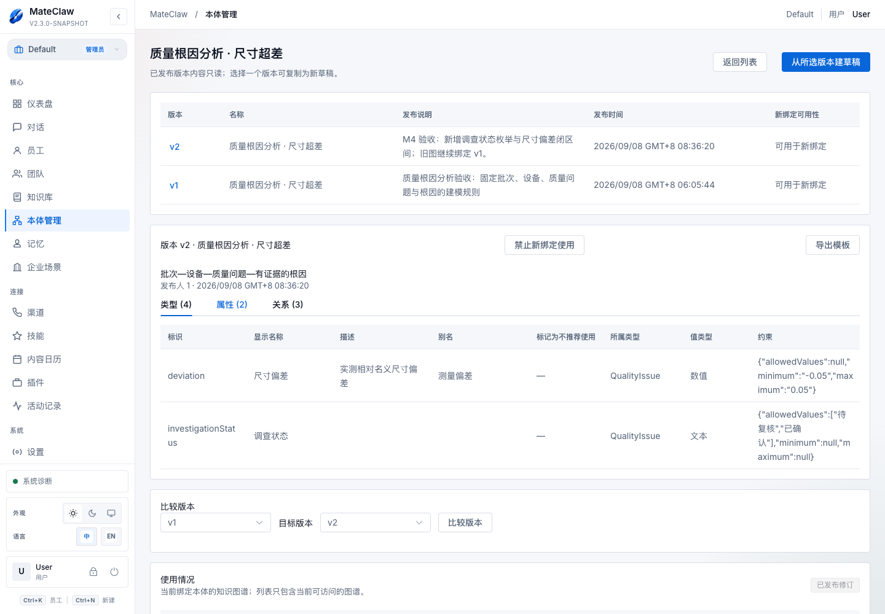

*图 8：v1、v2 同时存在。只读版本页可能以结构化文本展示约束；编辑仍通过表单完成。发布版本号与事实修订号 r1/r2 是两回事。*

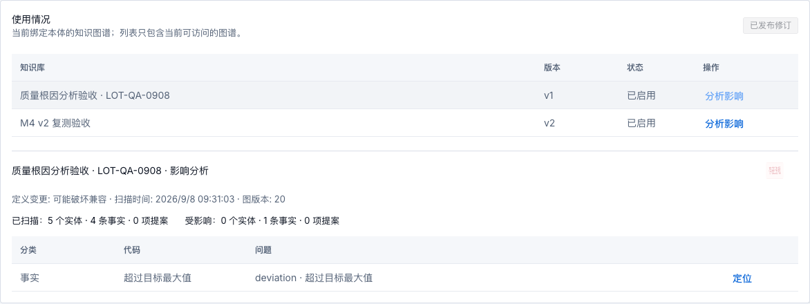

*图 9：旧图仍 v1，分析目标 v2 后发现 0.08 mm 超过新最大值。报告本身不修改数据，也不更换绑定。*

**报告怎样读：**

- 定义变更分类回答“模型改了什么”；数据符合性回答“当前扫描数据是否满足目标规则”，两者不能互相代替。
- 扫描包含实体、当前已确认事实（即使失去支持）、待审核候选及待审核变更申请，因此不一定等于可信图中可见事实数量。
- 最多显示 200 条诊断明细；明细截断不代表总数只统计了 200 条。
- 当前事实/提案分别以 10000 条为分析上限。超限、超时或版本变化时不能把失败当作“无违规”。
- 无违规也不代表自动迁移可行：历史修订转换、非空图升级尚未提供。

## 8. 模板复用：导出、预览、创建新本体

1. 打开已发布版本，点击“导出模板”，获得 JSON 文件。
2. 在目标工作区的本体列表点击“导入模板”，选取文件并“预览”。
3. 查看名称、类型/谓语数量及校验结果，填写新本体名称。
4. 点击“创建草稿”，进入新本体后核对、校验并发布。

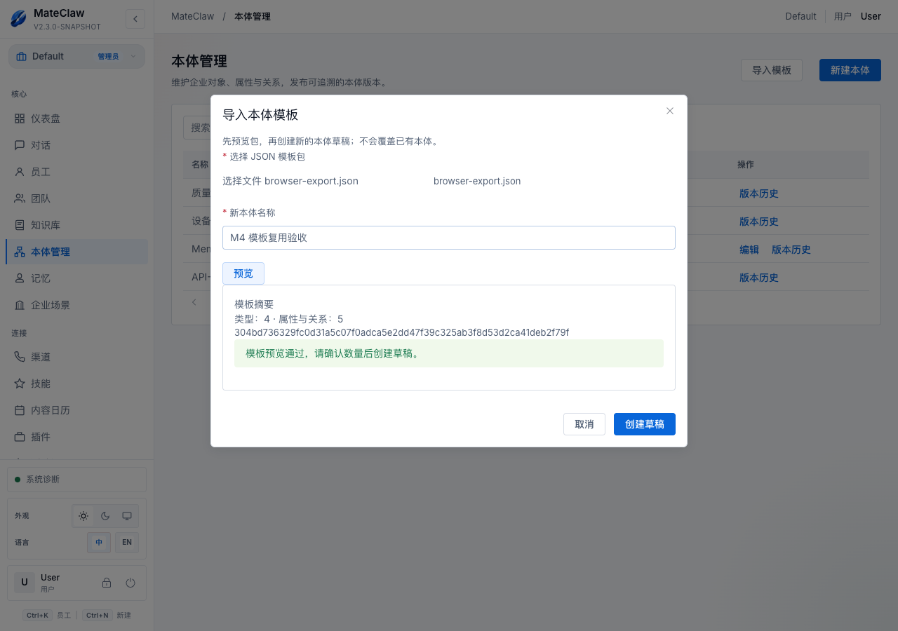

*图 10：同日 M4 实际导入验收截图。导入生成新本体草稿，不会覆盖原本体或复制业务数据。*

模板最大 1 MiB，仅支持规定格式。未知字段、重复 JSON 字段、格式错误会被拒绝。模板中的来源摘要用于追踪复制来源，不是数字签名，也不意味着以后会自动同步原模板。

网络中断而无法确认结果时，优先使用页面“恢复导入”回读原操作，避免重新创建重复本体。新建本体尚未绑定知识库时，“使用情况”为空是正常现象。

## 9. 让 Agent 使用企业事实

### 9.1 配置顺序

1. 管理员确认企业语义模块已启用，并且知识库图已启用绑定。
2. 在“设置 → 工具目录”找到 **semantic_search**（SemanticTool），根据实际需要启用全局工具。
3. 在“员工”中编辑目标 Agent：绑定允许访问的知识库，在“工具”页允许 `semantic_search`；不要处于“禁用所有工具”状态。宿主已有 Skill 授权也可能贡献工具，但不能代替知识库访问范围。
4. 在 Agent 指令中写明目标图谱 ID及引用规则。可从知识工作台标题/地址取得图 ID；它不是知识库 ID。
5. 在新的对话中询问事实，检查是否实际调用工具、返回事实修订和证据。工具调用不成功时，不能把模型自行生成的回答当作已验证结论。

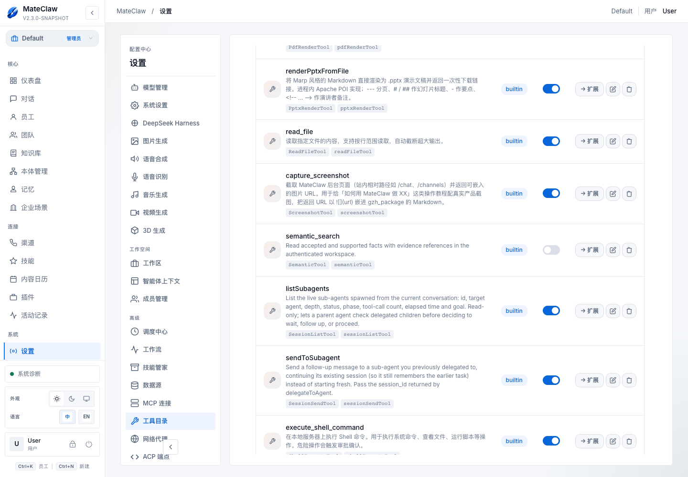

*图 11：本次截图时工具全局开关为关闭状态，保持了验收环境的既有配置。为了写手册没有擅自启用工具或改变 Agent；启用步骤由实际管理员按需执行。*

可使用以下 Agent 指令模板：

```text
你是质量事实查询助手。回答企业质量事实时，先调用 semantic_search。
只查询获授权的图谱 <填写知识工作台中的图谱ID>。
回答应包含事实 ID、修订号和证据 ID，并说明业务有效时间。
未检索到已确认知识时说明“当前无法确认”，不要把背景知识或猜测当作已确认根因。
对多个时间段或不同范围的记录分别说明，不自动归并为“当前结论”。
```

### 9.2 Agent 能做什么，不能做什么

工具读取同一套已确认知识规则，受当前用户、工作区、Agent 知识库范围及资料可见性约束。它可返回事实、规范名称、修订、证据和追踪 ID。

当前 `semantic_search` 是只读检索，不负责创建实体、提交候选、审核事实、发布本体或升级图谱；也不是自动多跳因果推理。知道图 ID 不等于有权访问。已撤回支持的事实不会因模型“记得旧答案”而恢复可信，业务结论应以本次查询为准。

## 10. 常见问题与处理

| 现象 | 优先检查 |
|---|---|
| 看不到本体入口/访问被拒绝 | 模块是否启用、当前工作区、成员角色与资源权限；登录过期时重新登录 |
| 绑定列表找不到模型 | 是否已发布，是否允许新绑定，是否在同一工作区；草稿不能绑定 |
| 发布了 v2，旧图仍显示 v1 | 正常行为；它绑定的是精确修订，新版本不会自动覆盖 |
| 上传资料、固化成功，但图仍为空 | 是否登记实体、选证据、提交候选并审核；这些步骤不会自动完成 |
| 新增知识按钮不可用 | 是否选主体/谓语、填写值或目标、选中固定原文片段 |
| 0.08 或某状态不能录入 | 当前绑定版本的数值范围、枚举、单位和类型是否匹配；勿为通过校验篡改观测值 |
| 事实确认失败或存在冲突 | 检查单值约束、其他当前事实、待审核提案与时间；管理员进入分歧处理 |
| 可信图看不到已确认事实 | 是否失去有效证据支持、当前资源是否可见、图是否启用；检查来源状态 |
| 别名检索不等于“自动找出同一设备” | 别名针对本体术语，当前不做实体消歧或合并 |
| 影响分析报版本变化/超时 | 刷新并重新分析；不能复用旧报告的无违规结论 |
| 模板导入是否带走知识库内容 | 不会；仅模型及来源描述。实例和权限需在新工作区独立建立 |
| Agent 有回答但没有事实/证据引用 | 核对工具调用与授权，不把自由生成文本当作系统事实 |

## 11. 当前边界与配套材料

已提供：本体建模与版本、KB 精确绑定、人工证据候选、事实审核/冲突/修改、来源治理、可信查询、模板复用和只读影响分析。

尚未提供：文档到候选的全自动抽取、复杂规则/本体推理、自动因果证明、实体自动合并、非空图本体升级迁移。当前单图最多 1000 个实体、10000 个事实身份；生产容量应另行评估。

- [实操案例：尺寸超差的根因治理与本体演进](quality-case.md)
- [可导入的质量本体 JSON 模板](../../examples/semantic/quality-ontology-package.json)
- [M4 验收记录](../../validation/ontology-m4/acceptance.md)
- [截图来源与状态说明](screenshot-sources.json)

本手册基于当前实现和本地实际界面，不把未来设计当作已上线功能。案例历史阶段与当前状态见实操案例说明；生产 Kingbase 等环境是否可用，应以对应部署验收为准。


## 12. M5：从资料生成知识建议

本节说明当前工作区的辅助生成操作。功能开关 `mateclaw.semantic.extraction.enabled` 默认关闭；本次仅在本地测试服务开启，不代表生产环境已经启用或完成验收。关闭时页面提示“辅助生成尚未启用，仍可手工新增知识或查看已有任务”。真实模型、浏览器与持久化验收状态以 M5 验收记录为准。

### 12.1 选择资料与模型

1. 打开已绑定本体的知识库工作台，进入“从资料生成”。先确认“业务对象”中已登记所需对象。
2. 在“选择资料”中选一份当前有权访问的已解析资料，在“使用模型”中选择可用模型。没有模型时联系管理员配置。
3. 核对页面显示的“本体修订”及发送提示：所选资料原文和本体定义将发送给所选模型。
4. 点击“生成知识建议”。“生成完成，待核对”只表示建议已保存，不表示知识已经确认。

首期每次处理一份 WIKI_RAW 已解析原文，不提供任意文件解析入口。原文最多 100,000 个 Unicode 字符（code point），还须满足原有快照字节限制；每任务最多 200 条建议。超限会明确报错，不会把截断内容当作完整结果。

### 12.2 核对对象、数值与原文

从“知识建议”列表逐条选择。左侧显示原文依据，高亮内容必须支持右侧建议的完整含义。

- 为识别出的名称选择已登记的业务对象；同名不代表同一对象。关系建议还须选择目标对象。没有对应对象时使用“没有对应对象？先去‘业务对象’登记”，登记后返回任务选择。
- 核对类型、属性或关系、值、固定单位和适用时间。单位由本体定义决定；日期不明时保持“未知”，不能用上传日期代替。
- 原文不匹配或依据不充分时，点击“重新选择原文”，在出现的原文文本框中手动选中准确片段。系统会重新校验引文与位置。
- 点击“保存核对结果”，等待诊断刷新。所有修改都须先保存；仍有诊断、缺少对象或缺少有效引文时不能提交。无价值的建议可“忽略这条建议”。

### 12.3 提交到现有审核流程

点击“提交审核”，再通过“查看已提交的知识记录”进入既有知识记录。此时只是待审核知识（PROPOSED）；有权审核的管理员继续按第 5.4 节核对证据并批准。批准后再到“已确认知识”及已有查询入口验证结果和证据。

辅助生成不会自动批准、合并对象或覆盖已有知识。对既有知识的修改仍走原有变更申请；模型建议不能绕过审核进入可信查询。

### 12.4 离开、失败与运行边界

离开页面不会停止后台生成，可从“已有任务”或保留任务参数的页面地址恢复。未保存的编辑会提示确认离开。“停止生成”为协作式取消，已发生的模型调用费用不能撤销；“重试本次任务”受次数限制。模型配置、本体绑定变化时应新建任务；资料撤回或撤权后不能继续读取或提交相关内容。成功但零建议会明确提示“处理完成，未识别到可提取的知识”，与“生成失败”分开显示。

企业知识能力仍在 MateClaw 同进程内运行：语义核心负责本体与证据规则，独立的 `mateclaw-semantic-application` 模块承接辅助生成用例，server 适配现有资料、权限、模型与数据库。它复用宿主能力，不是独立部署的企业知识服务。M5 不包含自动因果证明、实体自动合并、非空图升级或后续 M6–M8 能力。

### M5 手机核对界面

手机上原文与核对表单上下排列；提交记录保持只读，查看已提交知识可返回原审核流程。

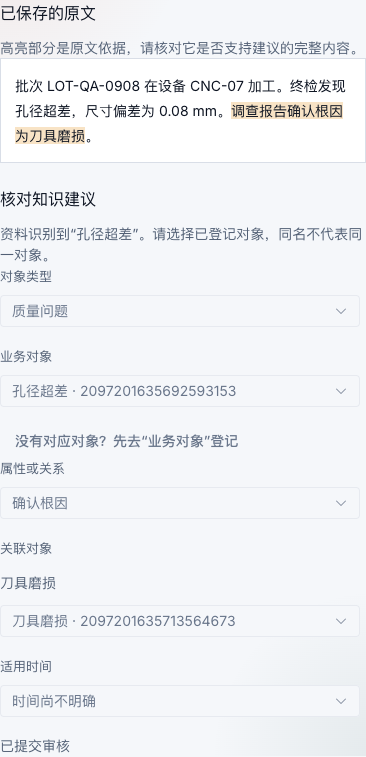

本地质量主线的实际操作与验证结果见 [质量案例 M5 补充演练](quality-case.md)。
