# MateClaw 本体业务模型使用手册

**适用：当前业务模型与知识工作台｜更新：2026-09-13**

本手册面向业务建模人员、知识管理员和使用知识问答的同事。先了解本体的作用，再用一个设备案例走完“建模、确认、发布、应用、知识审核、问答和维护”。页面操作受工作区权限影响。

## 1. 本体是什么，能解决什么问题？

本体是一份可以被系统理解和检查的业务定义：有哪些对象，它们有什么属性，彼此如何关联。例如，“泵是一种设备”“设备有设备编号”“点检记录关联被点检的设备”。统一这些定义后，资料整理人员和问答智能体才能用一致的业务含义处理信息。

使用时分清以下三层：

| 层次 | 回答的问题 | 设备案例 |
|---|---|---|
| 业务模型 | 我们如何定义这类业务？ | 泵属于设备；设备编号是文本；温度是数字 |
| 业务实体与知识记录 | 具体是哪一个对象，关于它知道什么？ | P-101 是具体设备；“P-101 是一台泵”是一条知识记录 |
| 证据 | 为什么相信这条记录？ | 保存的 equipment-v1 原文中明确写着“P-101是一台泵” |

模型里的“泵”不是某一台设备；资料里出现 P-101，也不等于系统已批准关于它的知识。建模时识别出的具体对象先作为样例保留，之后需要匹配业务对象、引用原文并审核。

## 2. 系统功能与完整流程

| 你要做什么 | 进入哪里 | 完成后得到什么 |
|---|---|---|
| 从业务描述或已有资料建立模型 | 本体管理 → 从资料生成 | 建模任务和待确认建议 |
| 核对类型、属性、关系及规则 | 模型工作区 → 建模建议、业务模型、业务规则 | 人工确认后的模型草稿 |
| 核查依据并发布 | 参考资料 → 检查发布 | 固定的发布版本 |
| 让知识库使用业务定义 | 发布版本 → 应用到知识库 | 知识库与指定版本的绑定 |
| 登记对象、核对原文和知识 | 知识工作台 | 有证据、可审核的知识记录 |
| 使用已经确认的知识 | 已确认知识、已配置的知识查询智能体 | 能追溯原文的查询结果 |
| 更新资料和模型 | 来源变化复核、参考资料、版本迁移 | 经复核的新知识或新版本应用 |

**完整流程：描述需求 → 核对建议 → 保存草稿 → 检查并发布 → 应用到知识库 → 匹配实体与证据 → 审核 → 问答 → 更新维护。**

知识库应用的是一个**固定发布版本**，不是自动订阅最新模型。发布 v2 后，使用 v1 的知识库仍使用 v1。已有知识库内容需要先检查版本差异，再按迁移流程升级。

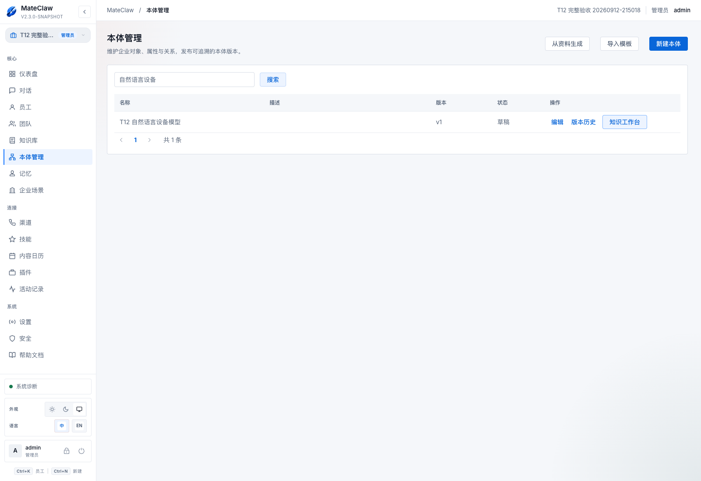

## 3. 贯穿案例：设备 P-101

本手册使用当前环境已保存的 **“T12 自然语言设备模型”**、**“T12 固定领域资料”知识库**和 **equipment-v1** 资料。它们是操作演示用的验收示例数据，不是生产设备台账。阅读已有示例时直接打开对应记录；自行练习时使用独立名称和知识库，避免重复添加 P-101。

| 模型内容 | 本例定义 |
|---|---|
| 对象类型 | 设备、泵、点检记录 |
| 上下位关系 | 泵是一种设备 |
| 文本属性 | 设备的设备编号 |
| 数字属性 | 点检记录的温度 |
| 对象关系 | 点检记录通过“点检设备”关联设备 |
| 具体样例 | P-101、XJ-001；它们不应成为新的对象类型 |

资料里的关键原文为：

> P-101是一台泵，设备编号为P-101。点检记录XJ-001的点检设备是P-101，温度为65。

资料没有给出温度报警阈值。因此，不能把 65 推断为异常，也不能自动增加“超过 60 就报警”的规则。下面重点核对其中一条结论：**P-101 是一台泵**。温度等其他内容仍需分别核对和审核，不能随这一条结论自动生效。

## 4. 开始建模：把业务说清楚

1. 进入当前工作区的“本体管理”，点击“从资料生成”（随后可选择自然语言或资料方式）。阅读现有案例时，直接打开“T12 自然语言设备模型”。
2. 在“开始业务建模”窗口填写模型名称。自行练习可填写“设备运维练习模型”。
3. 建模方式选择“描述业务需求”，在“希望建立什么业务模型？”粘贴下面的内容。
4. 点击“创建任务”，进入建模任务；通过“继续对话”补充说明，等待建议产生。

```text
建立设备运维模型，包含设备、泵和点检记录；泵是一种设备。
设备有文本类型的设备编号；点检记录有数值类型的温度，
并通过“点检设备”关联设备。
P-101是一台泵，设备编号为P-101。
点检记录XJ-001的点检设备是P-101，温度为65。
P-101与XJ-001仅作为具体样例，不要建立为新的业务类型。
资料没有给出温度报警阈值，不要自行添加阈值或其他未说明的限制。
```

也可下载[设备建模需求示例](equipment-brief.txt)复制使用。重新生成的建议可能有差异，需要按下一节核对。

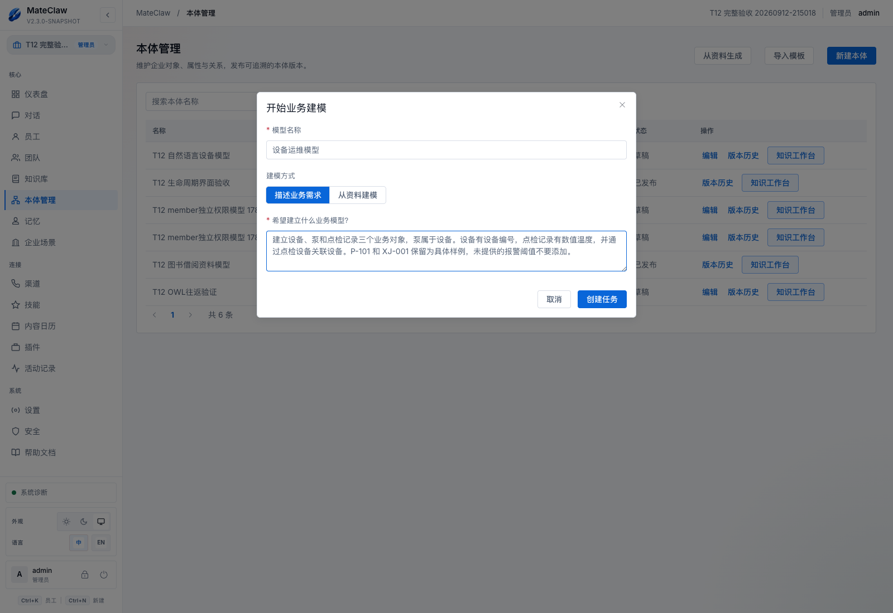

如果要从文件开始，在同一窗口选择“从资料建模”，选择知识库并勾选可读取资料，再填写建模目标。没有资料时，使用“在知识库上传资料（新窗口）”先上传，解析后点击“刷新解析状态”。选择参考资料不会自动将模型应用到该知识库。

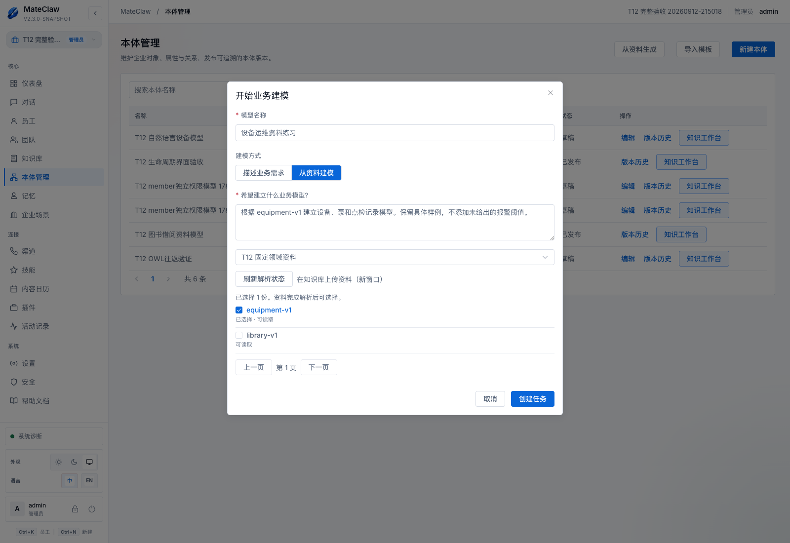

## 5. 核对建议，形成模型草稿

1. 进入模型工作区的“建模建议”，选择原建模任务并点击“刷新建议”。
2. 对照第 3 节检查类型、属性和关系。尤其检查“设备编号”为文本、“温度”为数字、“点检设备”从点检记录指向设备。
3. 点击“查看依据”，确认建议来自自己的描述或所选资料。检查 P-101、XJ-001 是否保留为样例，而不是对象类型或所有设备必须满足的限制。
4. 如果有误，点击“继续对话”，说明需要修改的内容，例如“P-101 是具体样例，不要建为类型”。对于没有依据的阈值，要求保留为未决问题。
5. 正确时点击“确认本批建议”；不采用时选择“拒绝本批建议”。确认后进入“业务模型”，核对草稿中的业务定义和图。

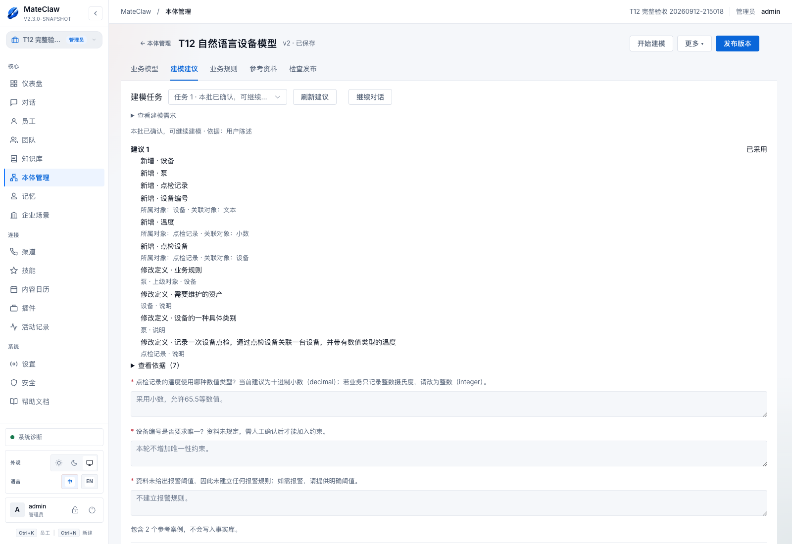

图中建议已经采用；首次处理时才会出现确认、拒绝操作。编辑区截图使用从 v1 建立的临时 v2 草稿展示当前界面，内容与 v1 相同，没有发布新版本。

在“业务模型”可继续维护对象类型、属性、关系及支持的限制，在“业务规则”维护业务检查要求。完成修改后保存。**确认建议只写入草稿，不发布模型，也不批准样例中的事实。**

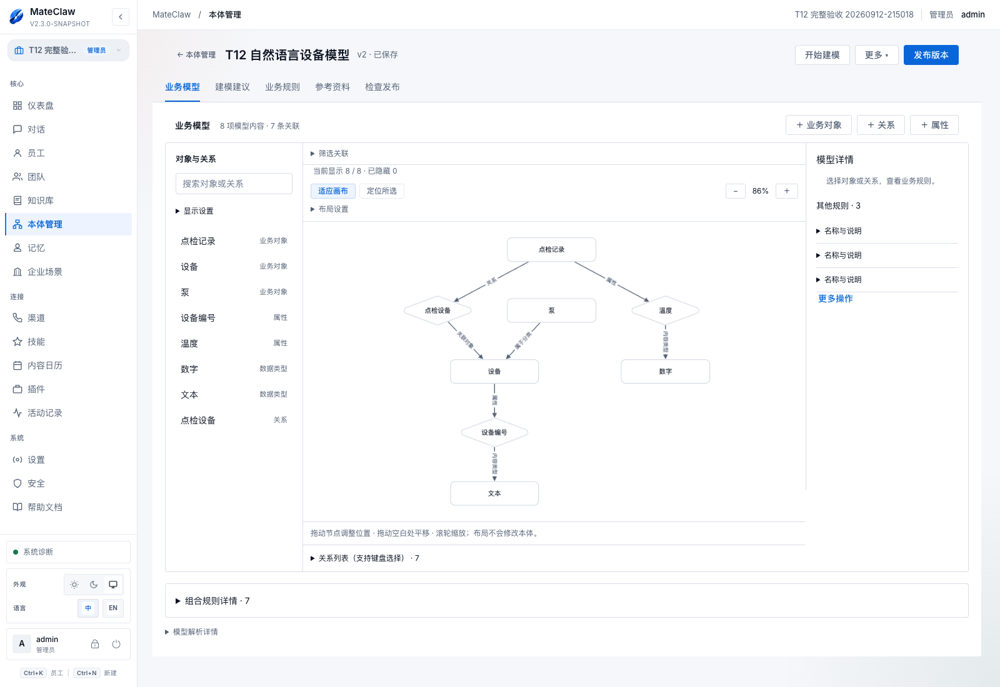

业务图覆盖常用定义。若复杂表达式显示“部分展示”或“未展示”，应由模型维护人员检查高级文档，不能据图中未显示就认为定义已被删除。

## 6. 核查参考资料，检查并发布

1. 进入“参考资料”，查看定义依据与未决项。资料发生变化或需要确认时，打开原文与当前资料对照，填写处理理由并完成对应处理。
2. 保存模型和业务规则，进入“检查发布”，点击“运行检查”。
3. 按报告处理结构、逻辑、业务及来源问题。修改模型或资料后，重新运行检查。
4. 检查满足发布要求后，由有权限的人员填写发布说明并发布，例如“建立设备、泵和点检记录基础定义”。
5. 打开版本历史，确认新发布的版本及其内容。

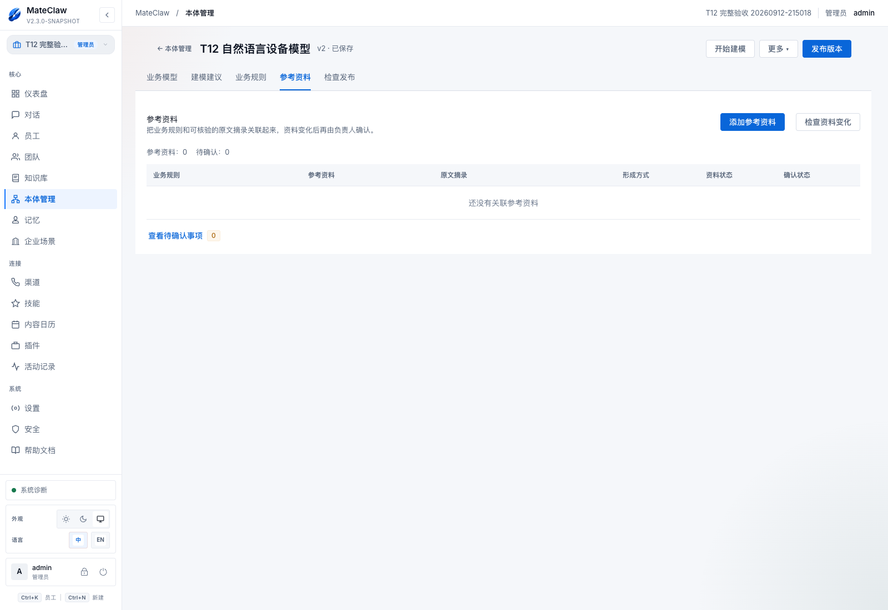

本例最初由自然语言建立，因此该页没有资料绑定；需求依据与问题回答保留在“建模建议”中。后续引用 equipment-v1 核对具体知识，是另一项操作。

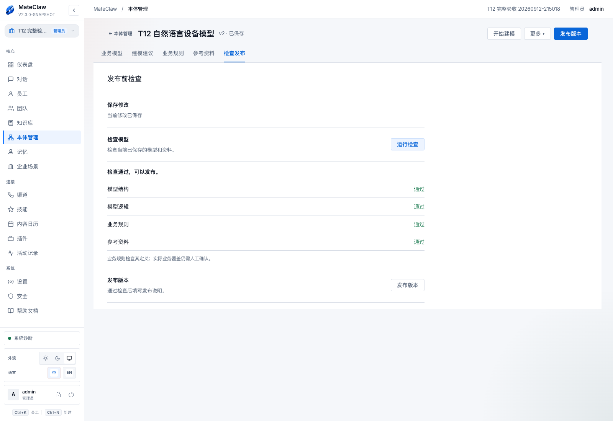

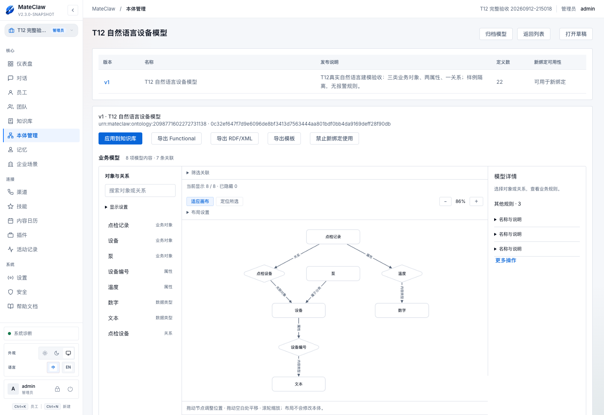

检查尚未执行、失败或超时均不表示通过。发布保存的是当时的模型版本，P-101 等样例不会因此自动变成已确认知识。

## 7. 把发布版本应用到知识库

1. 打开要使用的发布版本，点击“应用到知识库”。
2. 选择目标知识库。本例为“T12 固定领域资料”；新练习请选择自己的知识库。
3. 确认应用。已有绑定时先核对当前模型与版本；不要覆盖使用另一模型的知识库。
4. 刷新绑定状态，确认知识库使用的固定版本，点击“打开知识工作台”。

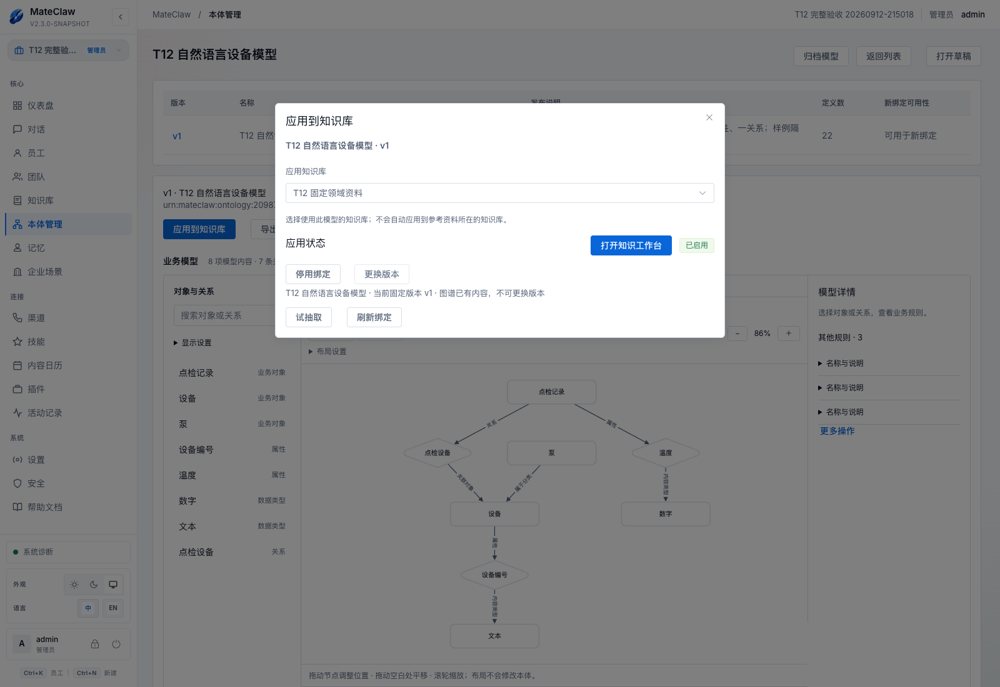

已使用本版本时，可以直接打开工作台；已有内容且使用同一模型旧版本时，先“查看版本差异”，再“前往版本迁移”。停止新应用的版本不能用于新的绑定。

## 8. 把 P-101 样例变成可追溯知识

### 8.1 登记业务对象

1. 在“知识工作台”进入“业务对象”，先查看是否已有 P-101。本例已有对象，直接使用即可。
2. 在独立练习知识库新增时，名称填写 `P-101`，IRI 填写 `urn:t12:equipment:P-101`，点击“添加对象”。IRI 是对象的唯一标识，本例可直接复制；日常使用应遵循本单位的对象编号规则。
3. 本例登记时不指定直接类型，把“它是一台泵”的结论留到样例核对和审核阶段。添加后刷新，确认列表中出现 P-101。

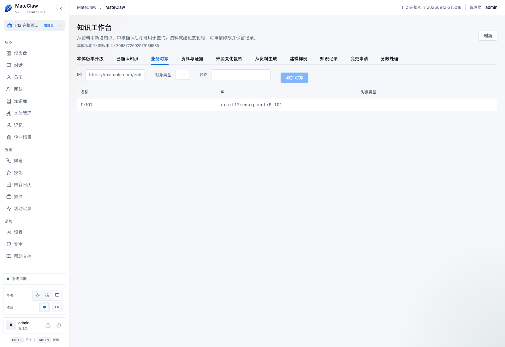

### 8.2 保存原文版本

1. 进入“资料与证据”，选择 `equipment-v1`。
2. 点击“保存原文版本”，等待任务完成；必要时点击“刷新”。如果已有可用原文版本，直接核对并使用。
3. 确认保存的文本包含“P-101是一台泵”。这个原文版本固定了当时的资料，供后续引用；保存原文不会自动生成或批准知识。

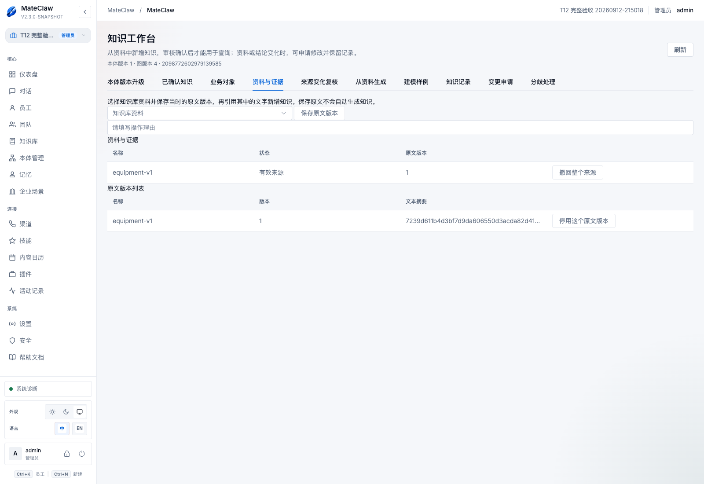

### 8.3 匹配实体并引用精确原文

1. 进入“建模样例”，在“建模样例核对”选择关于 P-101 的样例。
2. “业务对象”明确选择刚核对过的 P-101；不要因为名字相似就选另一个对象。
3. “核对内容”选择“对象类型”，“类型”选择“泵”。
4. “来源快照”选择 equipment-v1 对应的原文版本。
5. 在“支持这条结论的原文”填写 **`P-101是一台泵`**。必须与原文一致；若同一句出现多次，补充前后文以定位具体出处。
6. 点击“提交审核”，进入“知识记录”查看待确认记录。

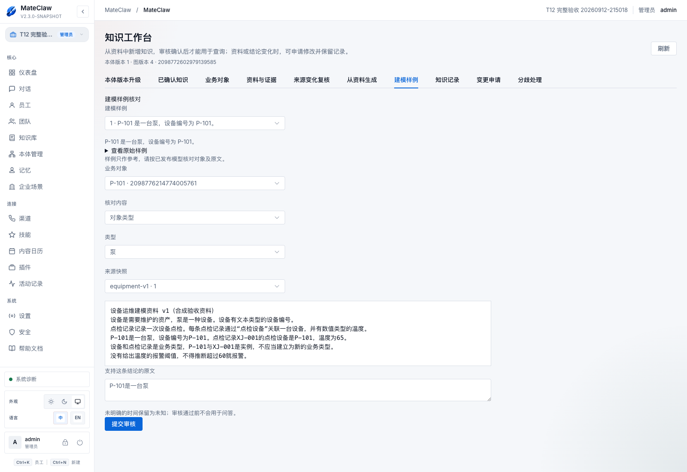

截图为已存在样例的填写演示，没有再次提交；本例已确认记录见下一节。

此时仍未进入已确认知识。资料没有明确适用时间，就保留“时间尚不明确”。当前样例属性入口是“文本属性”，不要用它把数值温度当成文本录入。

### 8.4 审核并查看证据

1. 进入“知识记录”，点击 P-101 的待确认记录，打开“知识审核”。
2. 核对对象是 P-101、类型为“泵”，点击证据查看引用原文及来源。
3. 有审核权限的人员填写理由，例如“原文明确说明 P-101 是一台泵，对象编号一致”，点击“确认”；依据不足时点击“拒绝”。
4. 回到“已确认知识”，刷新并找到这条记录，核对内容和证据状态。
5. 点击“查看证据”，检查原文仍为“P-101是一台泵”，来源为对应的 equipment-v1 原文版本。

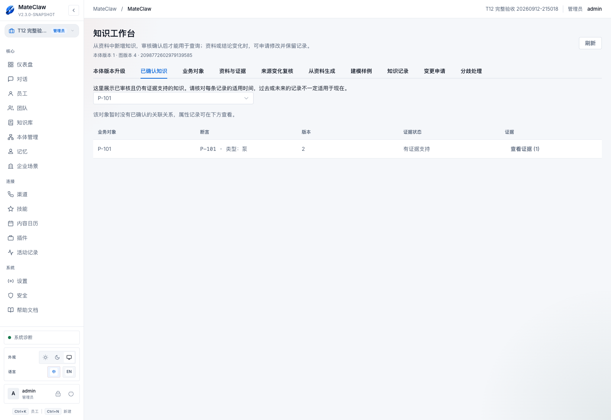

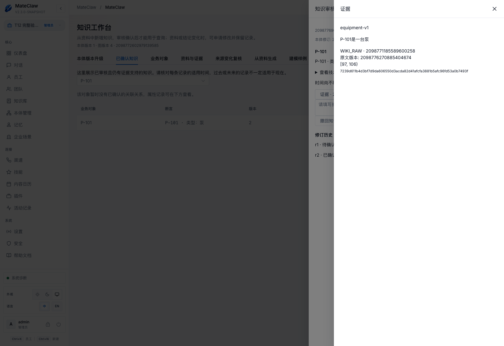

知识被确认后，也需要继续拥有有效、可访问的证据支持。审核历史会保留；来源撤回或支持失效会影响它是否出现在可信查询中。

### 8.5 从其他资料生成知识

对于更多资料，可以进入“从资料生成”，选择资料和可用模型生成建议，再逐条匹配业务对象、核对原文、保存并提交审核。**此功能依赖环境开启抽取能力及有效的模型配置**；看到入口不代表当前环境一定可执行。

生成完成只表示有建议，仍需人工核对与审核。长资料受处理长度和分块上限限制，应检查实际处理范围。不同资料中的同名对象不会自动成为同一对象。

## 9. 在问答中使用已确认知识

由管理员完成末尾的查询智能体配置后，打开有权访问本例知识库的知识查询智能体，新建对话并输入：

> P-101 是什么类型的设备？请查询已确认知识，并提供支持结论的原文依据；如果适用时间不明确，请说明。

检查回答是否说明 P-101 是“泵”，是否提供对应的知识记录和原文“P-101是一台泵”。打开引用或工具结果核对来源。若回答没有调用知识查询工具，只给出自由生成的文字，不能据此认为查询已完成。

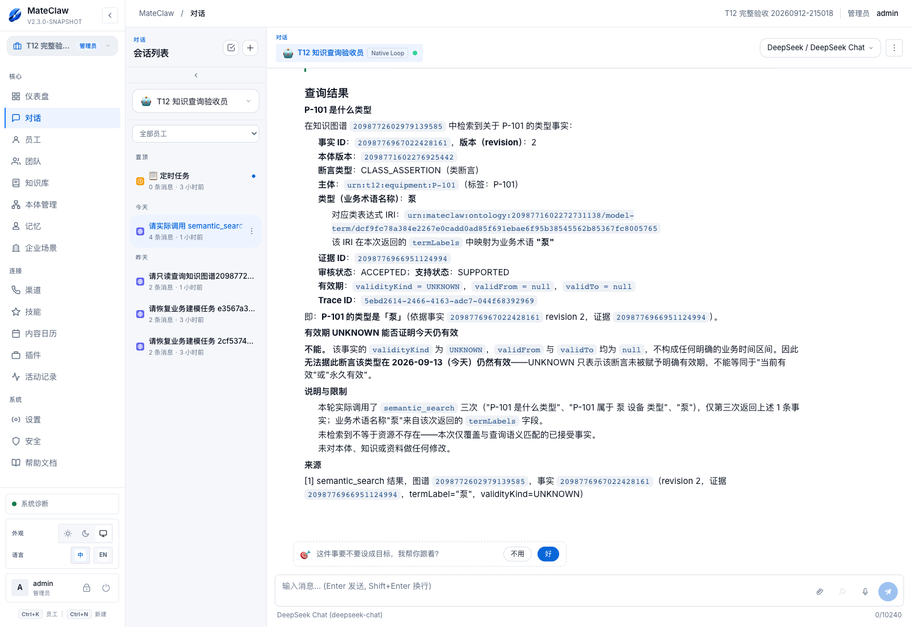

本例的适用时间尚不明确，因此可以说明记录内容，但不能据此证明“今天仍然有效”。当前检索按文本匹配，复杂提问没有命中时，可以用 `P-101` 等明确对象名称缩小检索；调用失败与没有符合条件的知识是两种不同情况。

## 10. 后续维护：资料变化与版本升级

### 10.1 原始资料发生变化

模型依据变化时，进入模型的“参考资料”，点击“检查资料变化”，核对原始依据和新资料。需要更新模型时继续建模、确认建议、重新检查并发布；旧发布版本保持固定。

具体知识的资料变化，在知识工作台进入“来源变化复核”，点击“扫描来源变化”，查看受影响记录，再按实际情况处理。复核决定不会自动改写知识；需要修正结论时，基于新的原文版本提出变更，并审核“变更申请”。存在不同说法时，在“分歧处理”对照证据后决定采用哪一条。

“撤回整个来源”会停止使用该来源作为有效支持；“停用这个原文版本”只针对所选版本。删除知识库原文、撤回来源和保留历史的含义不同。保留历史用于追溯，不会自动恢复证据或重新批准知识。

### 10.2 将知识库升级到新模型版本

1. 新模型版本发布后，先在应用面板查看版本差异，再进入知识工作台的“本体版本升级”。
2. 选择目标发布版本，点击“生成升级计划”，完成“准备并检查影响”，查看受影响对象、知识和阻断提示。
3. 仅修改业务名称且标识未变时无需填写映射；标识变化时由维护人员核对旧、新标识映射。
4. 没有阻断且影响已确认后，由负责人点击“批准此计划”，再点击“执行已批准的切换”。
5. 执行后刷新知识库绑定，核对当前版本和已有知识。只有页面允许且满足安全条件时才点击“恢复原版本解释”回滚；迁移后知识库发生变化可能使回滚不可用。

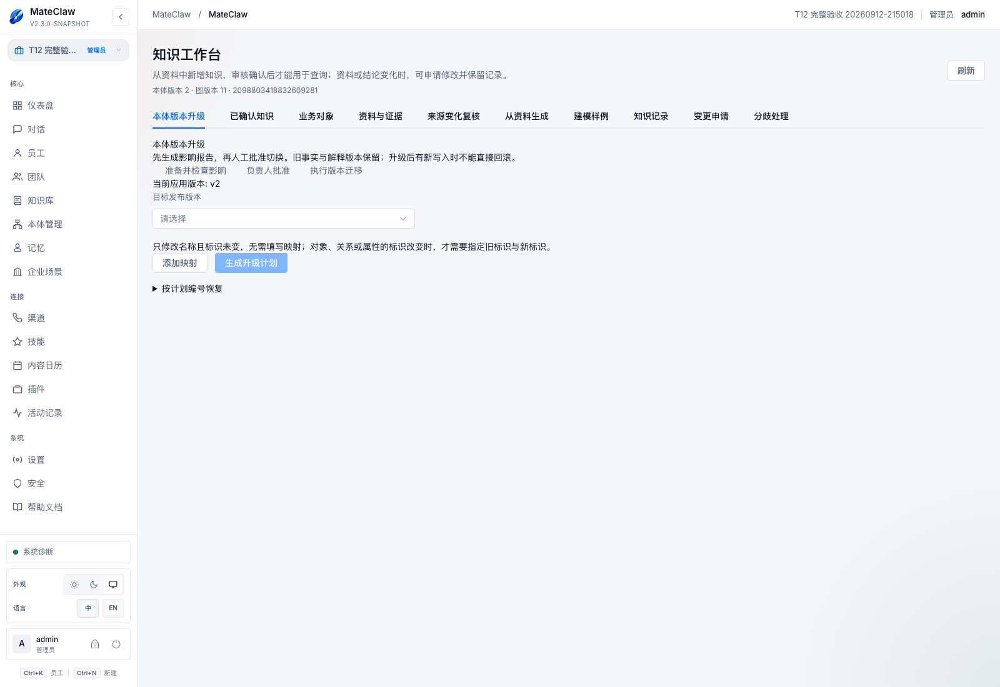

此图使用另一个已保存的“生命周期界面验收”演示知识库，展示多版本维护入口；P-101 主案例仍固定在 v1。

### 10.3 停止使用与归档

在版本管理中点击“禁止新绑定使用”，只限制后续新绑定，不会自动移除已有知识库的绑定。本体归档后编辑器只读；恢复本体后，还要单独核对版本是否允许新应用。归档模型、停用绑定、撤回来源和撤回知识应根据各自业务目的分别处理。

## 11. 常见问题

| 遇到的情况 | 如何处理 |
|---|---|
| 找不到资料或无法选择 | 核对工作区、知识库访问权限和解析状态，刷新资料列表 |
| 有建议，模型却没变化 | 检查是否点击“确认本批建议”；旧建议过期时刷新并重新核对 |
| 不能发布 | 保存修改，处理检查报告中的问题，再运行检查；核对发布权限 |
| 样例无法提交审核 | 检查业务对象、核对内容、来源快照和精确原文是否完整且一致 |
| 模型发布了，问答仍没有事实 | 检查知识库绑定版本、样例是否提交并审核、证据是否有效 |
| 确认过的知识不再出现 | 查看来源是否撤回、证据访问权限和适用时间范围 |
| 发布 v2 后知识库仍使用 v1 | 这是固定版本应用的预期行为，按迁移流程升级 |
| 请求失败，不确定是否保存 | 先刷新原任务或原记录确认结果，再决定是否重试，避免重复创建 |

## 12. 管理员与专家配置

建模与知识查询使用不同工具。建模智能体通过 `OntologyAuthoringTool` 维护模型草稿；知识查询智能体通过 `SemanticTool` 中的 `semantic_search` 查询已经确认且仍有证据支持的知识。不要把知识图谱标识当作本体标识交给建模工具。

配置查询智能体时：在工具目录确认 `SemanticTool` 已启用；为目标智能体绑定查询工具并保存；授予目标知识库访问范围；开启新对话，检查实际工具调用和返回的证据。工具停用、绑定失败或缺少知识库权限时，应先解决配置问题。

资料建模也需要可用的建模助手、模型配置和资料访问权限，按页面提示进入员工设置或智能体管理处理。资料辅助抽取另外受环境开关控制。

专家可使用高级 OWL 文档入口维护受支持的 Functional Syntax 或 RDF/XML，导入后保存并检查；发布版本可导出对应文档。模型导入导出不包括知识库实体、证据和权限，也不意味着任意复杂表达式均可用业务图完整编辑。

当前操作证据、截图范围和剩余验证事项见[验证与截图说明](verification.md)。离线版 `index.html` 内嵌截图，可放大图片、使用目录导航及打印。
