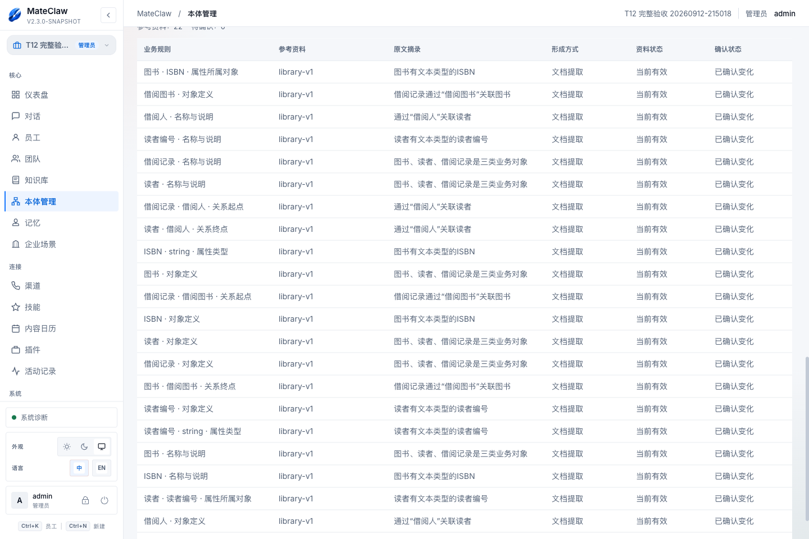
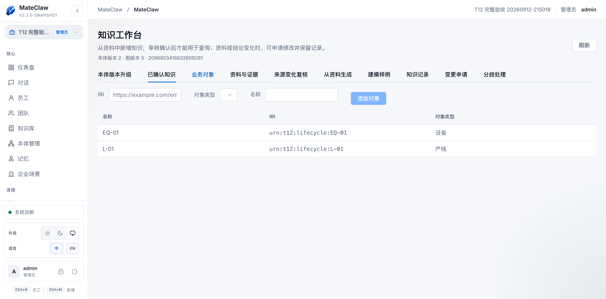
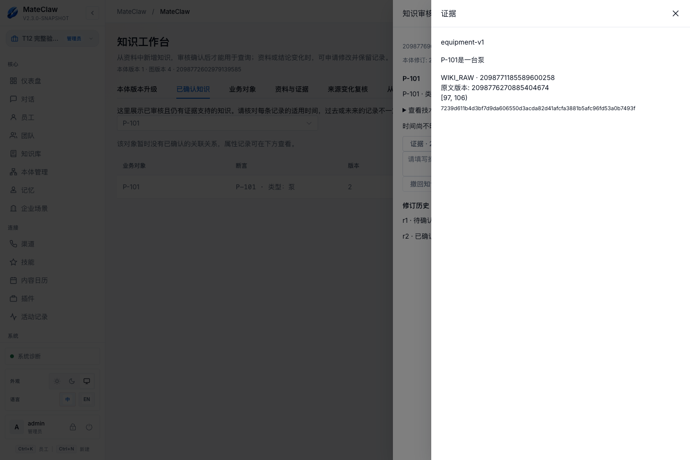
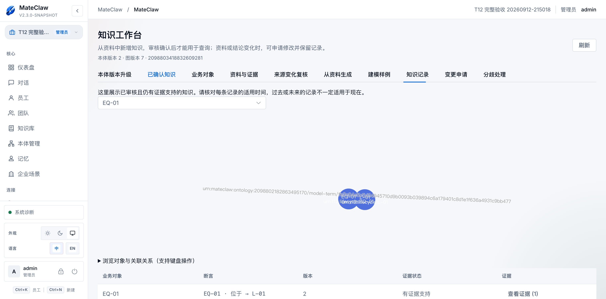

# MateClaw 本体业务模型使用手册

**适用范围：semantic-m1 当前业务模型界面｜更新：2026-09-13**

面向业务建模人员、知识管理员和智能体配置人员。推荐按“描述需求或选择资料 → 建模建议 → 人工确认 → 核对来源并检查发布 → 应用到知识库 → 实体与证据审核 → 问答 → 更新维护”操作。普通建模不需要编写 OWL、IRI、摘要或字符位置。

> 功能说明依据当前界面源码；本轮实际验收和未验收范围单独记录在[验证与截图说明](verification.md)。T12 尚未完成整体验收，不能把本手册当作生产可用承诺。历史质量案例及 M1–M5 截图保留在附录，不作为当前界面示意。

## 1. 先分清模型、对象和证据

| 对象 | 用途 | 设备场景示例 |
|---|---|---|
| 本体 / 业务模型 | 定义对象类型、属性、关系和规则 | 设备、泵、产线；设备编号；设备位于产线 |
| 发布版本 | 一次检查后发布的固定模型 | 设备运维模型 v1 |
| 知识库 | 保存可授权访问的原始资料 | 设备台账、运维规范 |
| 业务实体 | 某知识库内的具体对象 | 设备 EQ-001、产线 LINE-A |
| 实体记录 / 事实 | 对具体对象的类型、属性或关系陈述 | EQ-001 位于 LINE-A |
| 参考资料 / 证据 | 支持模型定义或具体事实的原文 | 台账中的对应记录及固定快照 |

“泵属于设备”是模型定义；“PUMP-01 是一台泵”是具体事实。建模过程中发现的设备编号和图书实例先保留为样例，不会随模型发布自动成为正式知识。

## 2. 准备权限、智能体和资料

进入正确工作区，确认可以访问本体管理和目标知识库。页面可见操作由权限决定；发布、审核、来源治理和迁移须由有相应权限的人员执行。

从资料建模前，先在原知识库上传文件或添加文本，等待解析。界面提供“在知识库上传资料（新窗口）”和“刷新解析状态”。选中已有资料只是作为建模参考，不会自动把模型绑定到资料所在知识库。无法解析、空内容或不可访问的资料，不能视作已读取成功。

智能建模依赖可用的建模智能体和模型配置；按页面提示进入智能体管理或员工设置。实际调用会使用所选资料，请只选择本次需要且获授权的内容。

## 3. 发起自然语言或资料建模

1. 在本体管理发起业务建模；“开始业务建模”窗口填写模型名称。
2. 在“建模方式”选择“描述业务需求”或“从资料建模”。已有本体可以继续建立建模任务。
3. 填写“希望建立什么业务模型？”，说明对象、需要回答的问题和不确定事项；资料模式再选择知识库及可用资料。
4. 点击“创建任务”，进入建模任务与对话。失败时按页面“重试创建任务”恢复，先回读原任务，避免重复新建同名模型。

可直接使用这段[设备建模需求示例](equipment-brief.txt)：

```text
建立设备运维模型，包含设备、泵和产线；泵属于设备。
设备有设备编号和名称，设备可以位于产线。
把资料中的 EQ-001 和 PUMP-01 保留为具体样例。
没有依据的报警阈值、数量限制保持待确认，不要自行添加。
```

自然语言建模可以没有文档；此时应如实保留用户提供的依据，不得伪造资料引用。长资料应检查读取覆盖与未决问题，不把模型回复“已完成”直接当作完整阅读证明。

## 4. 核对建议并人工确认

打开模型工作区的“建模建议”，选择原任务并“刷新建议”。需要补充时点击“继续对话”，例如“把机器统一称为设备”或“这是具体设备样例，不要作为所有设备的限制”。

逐批检查：

- 对象类型及上下位关系是否正确；属性归属、内容类型、关系方向是否符合业务。
- “查看依据”里的原文是否支持该定义；同名对象不能仅凭名字自动合并。
- 未决问题是否有明确回答；缺失阈值、基数或日期不可自行补全。
- 样例是否与模型定义分离，具体编号不能变成所有对象必须满足的规则。

选择“确认本批建议”或“拒绝本批建议”。确认将变更写入草稿；这一步不发布模型，也不批准事实。对旧草稿提出的建议若已过期，刷新并重新核对，不把旧对话当作当前状态。

## 5. 用业务界面完善模型

模型工作区包含“业务模型、建模建议、业务规则、参考资料、检查发布”。在“业务模型”中查看图和业务定义，编辑对象类型、属性、关系及支持的限制。普通用户使用业务名称和选择控件，不沿用历史手册中的 schema key 命名约束作为前置要求。

“业务规则”与逻辑限制要分开理解：“每台设备必须填写编号”属于完整记录检查，不能仅用关系数量限制代替。测量值也应与合格标准分开，避免为了设置公差而禁止录入真实超差数据。

业务图不是完整 OWL 编辑器。复杂表达式显示“部分展示”或“未展示”时，不代表内容被删除。需要复杂语义时交给专家检查原文及支持范围；不可把近似展示当作完整语义证明。

## 6. 核对来源、检查并发布

1. 在“参考资料”检查模型定义对应的依据和未决项，查看资料是否当前有效、已变化、不可访问或尚未检查。
2. 确认并保存当前模型和业务规则。未保存修改不能参与发布检查。
3. 在“检查发布”点击“运行检查”，逐项处理结构、逻辑、业务及来源问题。未执行、超时、失败或不适用不能等同于通过。
4. 模型或资料变化后重新检查；遇到“模型或资料已变化”不要复用旧报告。
5. 满足当前门禁后，由有发布权限的人员填写发布说明并发布。回到版本历史确认新版本。



这张截图来自已存在的 T12 本地验收材料，展示已发布版本的来源信息；不是本次手册编辑重新执行发布的证明。

发布版本保持固定。发布 v2 不会自动改写使用 v1 的知识库；发布成功也不表示资料中的实体已经审核入库。

## 7. 应用到知识库

在发布版本点击“应用到知识库”，选择真正需要使用此模型的知识库并确认应用状态。也可从知识库管理的语义绑定面板查看固定版本、打开知识工作台。

| 当前状态 | 操作 |
|---|---|
| 尚未绑定 | 选择允许新应用的发布版本并绑定 |
| 已使用本版本 | 刷新绑定，打开工作台；可使用“试抽取” |
| 同一模型旧版本且已有内容 | 先“查看版本差异”，再“前往版本迁移” |
| 已使用另一模型 | 选择其他知识库，不直接覆盖既有模型 |
| 版本停止新应用 | 选择其他可用版本 |

参考资料所在的知识库和应用知识库可以不同；权限与应用范围都必须单独核对。绑定完成后刷新页面确认版本，不能只看操作提示。

## 8. 从样例到已确认知识

### 8.1 准备具体对象与来源

在知识工作台登记或核对“业务对象”，使用编号、名称和业务背景区分对象，不按同名自动归并。在资料与来源相关页面选择资料，固化可读取的文本快照。快照保留当时文本；上传文件或固化成功不会自动产生已确认事实。



本轮在界面保存 EQ-01（设备）与 L-01（产线），并回读实体类型；名称显示修复不改变内部模型标识。

### 8.2 核对建模样例

打开“建模样例核对”，选择已接受建议中的样例。样例只作参考，必须按已发布模型重新核对：

1. 显式选择对应“业务对象”。
2. 在“核对内容”选择对象类型、对象关系、文本属性、是同一对象或是不同对象，再选择类型、关系/属性或另一对象。
3. 选择来源快照，复制支持这条结论的准确原文。原文出现多次时补充前后文，直到能定位具体出处。
4. 提交进入审核。未明确时间保留为未知；样例核对的属性入口目前是文本属性，不应当作所有数值/日期类型的统一录入入口。



本轮既有证据显示一个样例经对象匹配、精确原文和审核进入可信结果；不代表所有样例类型、角色和视口组合均已验收。

### 8.3 资料辅助抽取与人工新增

已有绑定模型的知识库也可进入“从资料生成”，选择资料及模型生成知识建议，逐条匹配业务对象、核对原文、保存后提交审核。此能力是否启用取决于环境开关。生成完成不等于审核通过；失败、取消、零建议和待核对是不同状态。当前抽取有长度和分块上限，不能承诺任意长文档完整处理。

人工“新增知识”仍须选择对象、声明内容及支持原文。变更既有记录走变更申请，保留旧修订。

### 8.4 审核和回读

在“知识记录”打开待审核记录，检查完整含义、证据和有效时间，再由有权限者确认或拒绝。存在互斥内容时进入“分歧处理”，比较各自依据后裁决。

通过后到“已确认知识”查看结果和“查看证据”，刷新后再次核对。已确认且仍受有效可访问证据支持的记录才进入可信结果；同一性声明也必须有证据，不是自动合并对象的授权。



这条关系候选由合成验收 API 准备，随后在真实界面核对证据并确认；不把 API 准备计作界面提交候选通过。

## 9. 在问答和智能体中使用

先区分两类智能体：建模智能体使用 `OntologyAuthoringTool` 创建或完善本体草稿；知识查询智能体使用 `SemanticTool` 提供的 `semantic_search` 查询知识库图谱。仅绑定建模工具的智能体不能代替知识查询智能体，不要把知识图谱 ID 当成本体 ID 交给建模工具。

配置查询智能体时按以下顺序操作：

1. 管理员在工具目录找到 `SemanticTool` / `semantic_search`，先确认全局工具已启用。目录里能看到工具不代表它已经启用；停用状态可能导致绑定被拒。
2. 给专用知识查询智能体绑定该工具，保存并回读工具绑定；同时配置允许访问的知识库，核对没有禁用所有工具。
3. 开启新对话，使用正确知识图谱范围提出问题，检查实际调用了知识查询工具及其返回结果。

工具授权和知识库访问范围都要成立；知道图谱标识不代表有权限。工具未启用、绑定被拒、误用建模工具或调用失败，均属于配置或调用问题，不能据此判定“知识不存在”。只有查询成功后仍无符合条件的结果，才能说明该查询范围内当前没有可确认的知识。

- `semantic_search`：检索已确认且仍受支持的事实，核对版本、证据和追踪信息。
- 语义上下文工具：在固定版本、时间和长度预算内提供上下文；存在续页时不能把第一页当作全量。
- 语义推理工具：按明确范围运行逻辑检查或支持的推理；默认模型语义与显式加入业务事实不同。未运行、不支持、超时不能解释为结论为假。

建议先提出具体问题：“EQ-001 位于哪条产线？请提供事实修订、原文依据及有效时间；没有已确认依据时说明无法确认。”检查实际工具调用与返回证据，不把模型自由生成文本当作已验证事实。未知业务时间不能默认永久有效，逻辑推理也不能证明物理根因。

本轮真实问答已修复并重测业务名称返回：P-101 的类型为“泵”，关联事实 `2098776967022428161` 的 r2 与证据 `2098776966951124994` 可追溯。有效时间为 UNKNOWN，不能据此证明“今天有效”。此例证明指定查询链路，不代表所有问答准确率达标；汇总证据见 `output/ui-acceptance/2026-09-12-t12-e2e/REPORT.md`。

## 10. 资料变化、迁移和归档

### 10.1 资料更新

在参考资料点击“检查资料变化”。对受影响规则查看原始依据与新资料，进入增量建模任务时仍逐批人工确认；确认前不改变已发布版本。处理完来源与模型修改后，重新检查并发布。

事实侧的资料变化需在来源变更审核中处理。撤回整个来源或仅排除快照会影响有效证据支持；事实历史不因此被删除。更新原文不能自动覆盖旧事实，应按新快照提出并审核修改。

“撤回来源”是治理决定，停止把该来源当作有效支持；“删除原文”是知识库资料本身消失，需要扫描变化并核对受影响记录。两者不是同一操作。“保留历史”保留审计信息，不自动恢复证据支持，也不自动把事实重新纳入可信结果。

本轮撤回来源后可信数量从 1 降至 0。另一次合成原文由 API 删除后，界面扫描发现 1 条受影响记录；“保留历史”首次遇到版本字段格式导致的 400；修复后已通过真实界面重新扫描和保存，刷新及数据库回读确认决定为保留历史，可信数量仍为 0。

### 10.2 知识库版本迁移

迁移按“准备并检查影响 → 负责人批准 → 执行版本迁移”进行。选择目标发布版本，检查阻断项和事实变化。只改名称且标识未变通常无需映射；标识变更才由维护人员核对旧新映射。存在阻断、截断或过期报告时不能直接宣布可迁移。

本轮对含 2 个实体、1 条事实的独立知识库执行 v2 → v3 → 回滚 v2，并回读绑定与事实。此合成例不代表任意生产迁移可用。

执行后回读绑定版本和事实；页面提供回滚时，先核对计划状态与限制再操作。可用计划编号恢复原计划，不重复执行不确定结果。本手册不承诺任意复杂变更均可自动迁移，也不把有迁移入口当作生产数据库演练通过。

### 10.3 停止新应用与归档

版本的“停止新应用”只控制后续绑定；已有知识库仍须单独管理。版本历史提供本体归档和恢复，归档后的编辑器只读；恢复本体不会自动重新开放版本的新绑定，须单独核对版本可用性。本轮已在界面完成独立模型 v1/v2/v3 发布、中文版本差异及归档恢复。归档、停用绑定、撤回来源与撤回事实含义不同，不应相互替代。

## 11. 专家导入导出及能力边界

专家可通过高级 OWL 文档入口维护 Functional Syntax 或 RDF/XML 文档，导入后保存并检查。发布版本可导出相应格式；导入不会自动复制知识库实体、证据或权限。旧质量 JSON 附件只保留历史参考，不应直接当作当前格式的导入保证。

当前业务表单覆盖常用对象、关系、属性和部分限制，不等于完整 OWL 可视化编辑。保存、图形展示和推理的覆盖面不同；解析、规范、推理器或资源限制都可能拒绝处理。系统不提供自动因果证明、通用 ETL、自动实体归并或任意规则执行。

两个合成建模案例不能证明行业准确率、生产容量或成本目标达标。MySQL/Kingbase 原生迁移、故障恢复和供应商限流等未完成门槛见验证附件。

## 12. 常见问题与附件

| 现象 | 处理 |
|---|---|
| 找不到资料 | 检查工作区、资料权限、解析状态及分页；不可访问不等于资料不存在 |
| 有建议但模型未变化 | 检查是否确认本批建议、草稿是否过期 |
| 发布按钮不可用 | 保存修改，处理来源/规则问题并重跑完整检查，核对发布权限 |
| 已发布但问答没有事实 | 检查应用知识库、对象匹配、精确证据和审核状态 |
| 已确认事实消失 | 检查证据是否撤回、权限、绑定状态及查询时间范围 |
| v2 发布后仍用 v1 | 固定版本的预期行为；已有数据应走迁移流程 |
| 图中没有复杂定义 | 查看投影覆盖提示和专家文档，不假定定义已丢失 |
| 请求结果不确定 | 刷新原任务/计划和持久化状态，不直接重复创建或执行 |

- [验证与截图说明](verification.md)
- [设备建模需求示例](equipment-brief.txt)
- [历史质量根因案例（M1–M5）](quality-case.md)
- [历史 M1–M5 操作手册](historical-m1-m5.md)

`index.html` 内嵌图片和附件，可直接离线打开、放大截图、使用目录及打印。历史附录中的外部验收链接仍可能需要仓库或网络访问。
