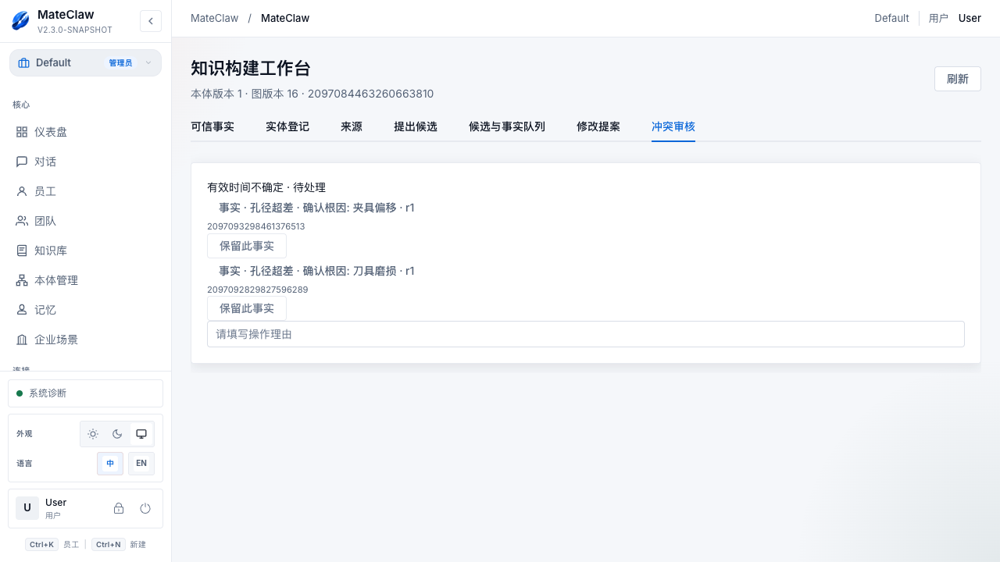
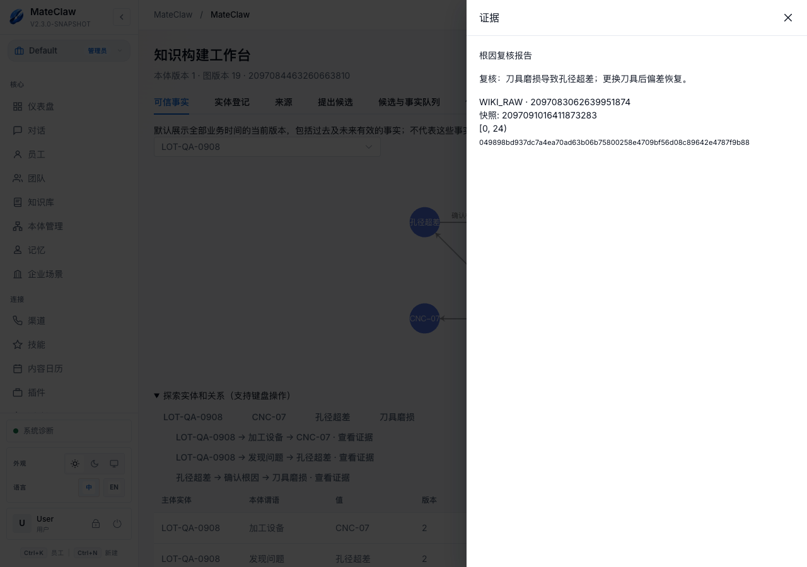
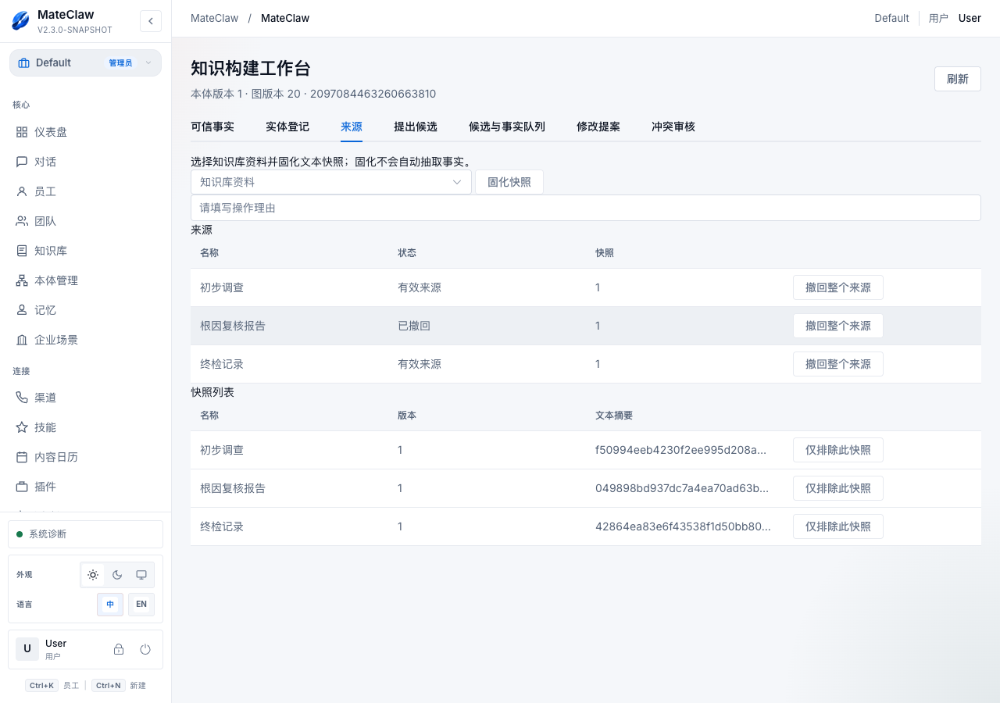
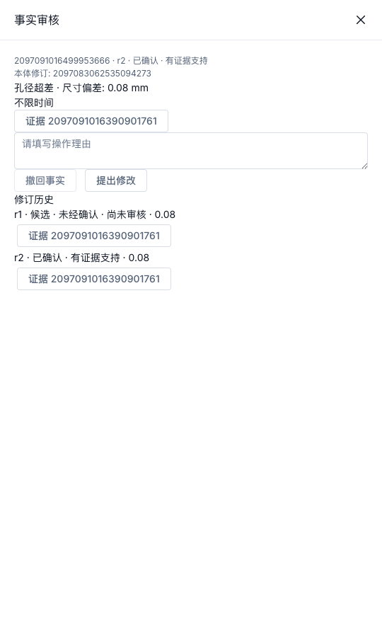
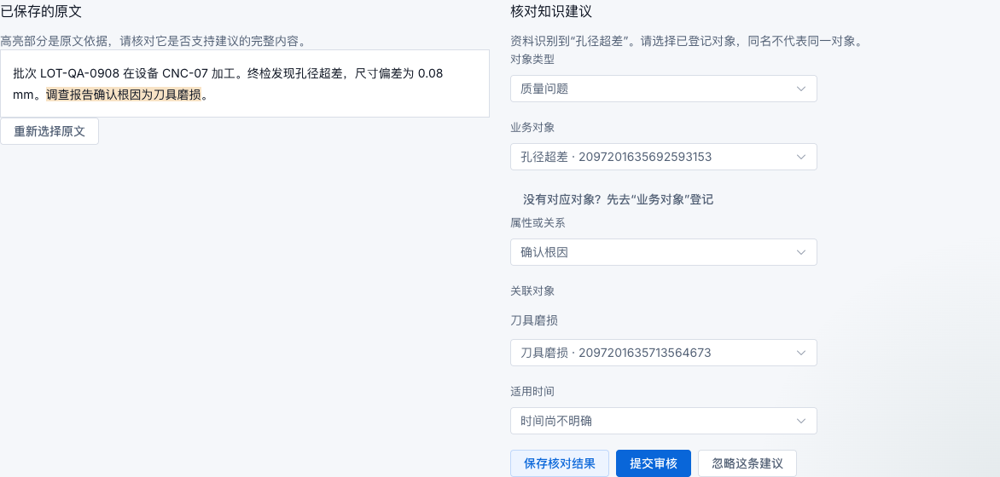
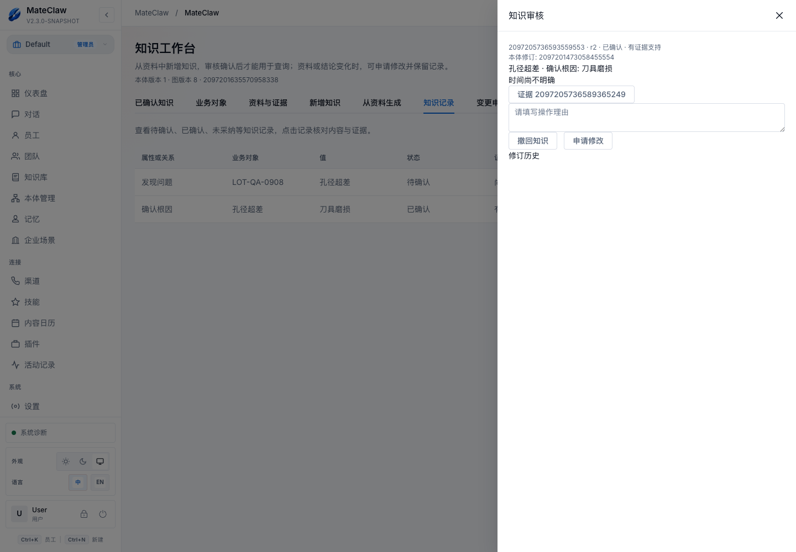
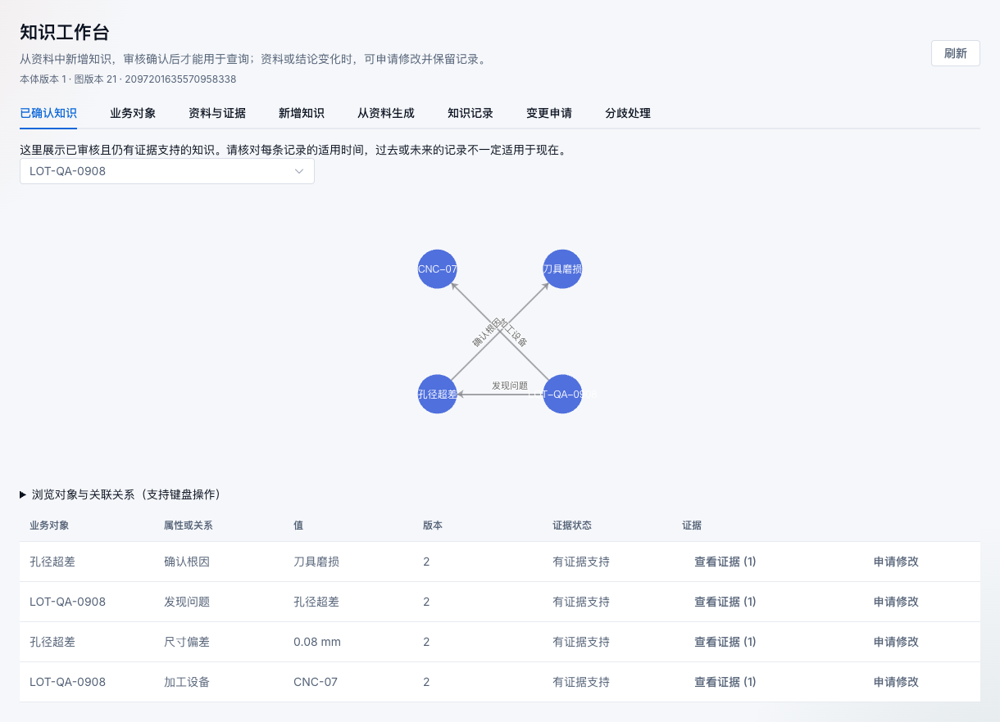

# 实操案例：尺寸超差的根因治理与本体演进

**案例类型：已经跑通的本地业务演示，全部工厂资料为合成数据。**

场景：批次 LOT-QA-0908 在 CNC-07 加工后出现孔径超差，测得偏差 0.08 mm。初步调查认为夹具偏移，复核认为刀具磨损。质量人员需要管理相互冲突的调查结论，并在报告失效后阻止 Agent 继续引用旧结论。

目标是形成可复核的业务事实链，不是让系统自动证明根因。手册当前基线为 M4 / 34a5f7d2。

> **先看演示状态：** 现有环境已经完成“确认刀具磨损 → 撤回复核报告”。所以现在打开旧图，可信根因应为空，仍保留三条检验事实。本文中的冲突处理和原文证据截图来自同日先前验收阶段，均为真实界面截图；不能把它们当作当前仍有效的结论。

## 1. 准备模型、人员与资料

建议由一名工作区成员负责资料和候选，一名管理员负责发布、审核与来源治理。首次练习请建独立测试知识库，不要重复操作现有验收图。

可以在本体列表导入[案例 v1 模板](quality-ontology-v1.json)，填写新名称并发布。该模板来自实际 v1 发布版本，已通过当前服务端预览；只复制定义，不带实体、事实或证据。

### 模型与实际对象

| 本体类型 | 登记的实体 |
|---|---|
| Batch / 生产批次 | LOT-QA-0908 |
| Equipment / 加工设备 | CNC-07 |
| QualityIssue / 质量问题 | 孔径超差（生产中建议加批次号或事件编号） |
| Cause / 根因 | 刀具磨损、夹具偏移 |

| 定义 | 起点/所属类型 | 值或终点 | 规则 |
|---|---|---|---|
| producedOn / 加工设备 | Batch | Equipment | SINGLE |
| hasIssue / 发现问题 | Batch | QualityIssue | MULTI |
| deviation / 尺寸偏差 | QualityIssue | DECIMAL，mm | SINGLE；v1 不限制合格公差 |
| rootCause / 确认根因 | QualityIssue | Cause | SINGLE |

本案例把“确认根因”定义为一个主要根因。如果实际业务允许多个同时成立的根因，应讨论后定义为 MULTI；不能先设 SINGLE，再把所有多因情况都当成数据错误。

### 可复现的合成资料

在新知识库“管理知识库 → 来源 → 添加文本”分别创建以下文本。它们用于复现业务情节，重新创建会得到不同的资料/图谱 ID。

**终检记录**

```text
检验记录：LOT-QA-0908 由 CNC-07 加工，发现孔径超差，尺寸偏差 0.08 mm。
```

**初步调查**

```text
初步调查记录：针对 LOT-QA-0908 的孔径超差，调查人员提出夹具偏移为疑似根因，结论待复核。
```

**根因复核报告**

```text
复核报告：复核人员认为 LOT-QA-0908 的孔径超差主要由刀具磨损导致，并否定初步调查中的夹具偏移结论。
```

这里的“待复核”与“认为”不能省略。初步报告只能支持一个待审核候选，不能凭它把疑似原因自动提升为已确认事实。

## 2. 发布 v1，绑定知识库

1. 导入 v1 模板或按上表手工建模。
2. 保存、校验；管理员发布 v1。
3. 打开新知识库的管理页，下方选择这个本体的 v1，完成绑定。
4. 点击“打开知识工作台”，确认标题显示“本体版本 1”。


**检查点：** 知识库现在有了一套明确事实规则，图里还不应自动出现任何新事实。上传报告、绑定本体和审核事实是不同步骤。

## 3. 登记五个实体，固化三份快照

进入“业务对象”，按第 1 节登记批次、设备、问题及两个根因实体。

进入“来源”，依次选择三份资料并“固化快照”，确认快照列表有相应名称与版本。若资料没有可提取文本，先处理来源再重试。


**检查点：** 本体有 4 个类型，图中有 5 个实体。登记实体不等于已经建立了这些实体之间的可信关系。

## 4. 建立三条基础检验事实

进入“新增知识”，每次选取终检记录中支持该事实的精确片段，再提交以下候选：

| 主体 | 谓语 | 值/目标 | 证据 |
|---|---|---|---|
| LOT-QA-0908 | 加工设备 | CNC-07 | 终检记录中的加工描述 |
| LOT-QA-0908 | 发现问题 | 孔径超差 | 终检记录中的问题描述 |
| 孔径超差 | 尺寸偏差 | 0.08 mm | 终检记录中的测量值 |

若原文没有业务生效区间，选择“时间未知”，不要把上传时间当成业务时间。管理员进入“知识记录”逐条看证据、填理由并确认。


**检查点：** “已确认知识”出现 3 条事实。关系图可以展示批次→设备、批次→问题；0.08 mm 是问题的属性事实，仍可从表格和证据入口查看。

## 5. 提出两个根因候选并裁决

1. 以“孔径超差”为主体、“确认根因”为谓语，选择“夹具偏移”为目标，引用初步调查原文，提交候选。
2. 再建立同一主体/谓语的“刀具磨损”候选，引用复核报告原文。
3. 两个不同目标在同一 SINGLE 关系下可能冲突；时间 UNKNOWN 也不能假定二者不重叠。
4. 管理员进入“分歧处理”，逐一查看候选及证据。填写如“复核报告否定初判，保留经复核的主要根因”这样的真实裁决理由，保留刀具磨损。



*历史阶段截图：来自同日已执行的冲突裁决验收，并非当前待处理队列。*



*历史阶段截图：展示当时有效的复核证据。该来源随后已经撤回。*

**实际验收结果：** “刀具磨损”成为 r2、已确认；另一候选被拒绝。已确认知识由 3 条增加到 4 条。图的业务链可以表述为：

```text
LOT-QA-0908 ─加工设备→ CNC-07
      └────发现问题→ 孔径超差 ─确认根因→ 刀具磨损
                            └─尺寸偏差：0.08 mm
```

这里确认的是“经过人工裁决、由指定报告支持的调查结论”。图上的根因边不代表系统运行了因果推理或排除了所有其他可能性。

## 6. 用 Agent 查询并检查引用

按用户手册第 9 节启用 `semantic_search`，给测试 Agent 绑定该知识库并允许此工具。手册编写时既有全局工具开关保持关闭，没有为了截图修改配置。

测试问题可写为：

```text
请用 semantic_search 查询图谱 <你的图谱ID>：
孔径超差的确认根因是什么？给出事实 ID、修订号和证据 ID，说明有效时间。
```

**已执行验收中的结果：** 模型实际调用该工具后回答“刀具磨损”，引用事实 `2097092829827596289`、修订 r2、证据 `2097092829777264641`，并说明业务有效时间 UNKNOWN。以上编号属于保留的验收环境，重新复现应使用自己的返回值。

检查的不只是模型最后一句话，还包括：

- 是否真实调用了 `semantic_search`；
- 是否返回当前已确认、仍有支持的事实；
- 引用能否在工作台找到；
- 是否把 UNKNOWN 错说成“现在有效”；
- Agent 是否只访问了绑定且允许的知识库。

这条工具是只读入口，不能要求 Agent 用它直接修改根因或替你审核候选。

## 7. 撤回复核报告，观察可信结论变化

假设复核报告随后被作废。在“来源”中找到“根因复核报告”，管理员填写撤回原因，点击“撤回整个来源”。不要通过删除事实来隐藏历史。



*历史过程截图：演示实际撤回操作。当前环境已处于撤回完成状态。*

**实际结果：**

| 观察点 | 撤回前 | 撤回后 |
|---|---|---|
| 已确认知识总数 | 4 | 3 |
| rootCause 可信查询 | 刀具磨损 | 无可信结果 |
| 根因历史 r2 | 已确认、有证据支持 | 历史保留、证据支持已撤回 |
| 新会话 Agent 回答 | 刀具磨损并附引用 | 当前无法确认根因 |
| 终检记录支持的三条基础事实 | 可查询 | 仍可查询 |


这说明“证据支持状态”与“审核状态”是两个维度。报告作废后，系统阻止继续把旧结论当作当前已确认知识，同时保留谁曾确认、基于哪份证据的历史。若一条事实还有其他有效证据，结果应按剩余支持重新计算，不能假设任何来源撤回都必然删除该事实。

## 8. 演示 v2 规则收紧与影响分析

这一部分沿用已经执行的 M4 技术演示：在 v2 为尺寸偏差增加范围 [-0.05, 0.05]，增加别名“测量偏差”和调查状态枚举“待复核/已确认”。

> **不要直接把这条收紧规则用于全部原始质量测量。** 0.08 mm 可以是真实而重要的不合格记录。这里用收紧演示“系统能否拦截非法值并指出旧数据影响”；实际业务应先明确模型是在接收全部观测，还是只接收指定复测结果。

操作：

1. 在本体“版本历史”从 v1 创建草稿。
2. 修改“尺寸偏差”，配置两端范围并添加别名；新增调查状态 TEXT 枚举。
3. 应用到草稿、保存、校验。
4. 在“使用情况”分析旧图；核对范围收紧分类及受影响事实。
5. 发布 v2 后重新看旧知识库绑定：仍为 v1。


**实际结果：** 扫描 5 个实体、4 条当前已确认事实、0 个提案，发现 1 条越界事实。可信图只有 3 条而这里扫描 4 条，是因为已经失去支持的根因事实仍属于当前已确认修订，影响分析必须考虑它。

点击“定位”可以找到 0.08 mm 的当前事实及本体修订。



**版本绑定的作用在这里很明确：** v2 发布不会让旧图的 0.08 mm 被悄悄删除、篡改或重解释；影响分析只是告诉管理员“如果使用这套新规则，哪些当前记录不符合”。当前没有非空图自动升级功能。

## 9. 新图验证新规则，模板复用模型

另建“复测验收”知识库，将一个新图绑定 v2，准备包含 0.08 mm 与 0.03 mm 的合成复测记录，并按工作台步骤建立候选。

| 输入 | 已验证结果 | 对业务人员的含义 |
|---|---|---|
| 尺寸偏差 0.08 mm | 422 / VALUE_ABOVE_MAXIMUM | 当前 v2 定义不允许录入此值，应核对模型用途，不要改假数据 |
| 尺寸偏差 0.03 mm | 录入并审核成功 | 满足数值约束，还需证据及人工审核 |
| 调查状态“未知” | 422 / VALUE_NOT_ALLOWED | 不属于所设枚举；“时间未知”与“调查状态未知”不是同一字段 |
| 搜索“测量偏差” | 返回尺寸偏差的可信结果，规范名仍为“尺寸偏差” | 别名帮助术语查找，不创建另一条事实 |

上述值域边界由真实认证 API 执行并回读；不是伪造的界面错误截图。建模、发布、模板导入和诊断定位已通过真实页面操作。

最后在 v2 点击“导出模板”，从本体列表“导入模板 → 预览 → 创建草稿”，得到一个新本体。完成校验/发布后，新本体“使用情况”为 0：复制的是模型，不是前面五个实体、证据或四条事实。


## 10. 一次成功的演示应该留下什么

- 一套有发布版本的本体及可解释的类型、属性、关系。
- 一个固定绑定版本的知识库图，实体与证据来源清晰。
- 根因冲突有明确裁决，而不是保留两条互相矛盾的单值结论。
- 可信回答能回到事实修订和原文；证据失效后，新查询不再给出旧的确认根因。
- v2 发布不影响旧 v1；影响分析能定位不兼容记录。
- 模板可以在另一授权工作区复用，但业务数据和权限不会随模板自动复制。

### 保留环境的核对入口

| 内容 | 本地验收标识 |
|---|---|
| 本体 | 2097083062522511362 |
| 原知识库 | 2097083062568648706 |
| 旧 v1 图 | 2097084463260663810 |
| v2 新图 | 2097122581024112642 |
| v2 发布修订 | 2097119581715070978 |

这些 ID 仅适用于当前本地验收环境。部署到其他环境应从实际页面获取，不要复制到生产 Agent 指令。

**证据来源：** [M1–M3 根因裁决与来源撤回记录](../../validation/semantic-core/quality-root-cause-review.md)、[M4 运行回读](../../validation/ontology-m4/runtime-readback.json)、[M4 验收记录](../../validation/ontology-m4/acceptance.md)。

[返回用户手册](README.md)


## 11. M5 补充演练：质量报告辅助生成

这一节使用新的合成质量资料，与前文已经执行的 M1–M4 演示分开。当前仅本地测试环境启用辅助生成。2026-09-08 已使用 DeepSeek Chat 执行本节主线：生成 4 条建议，逐项核对、提交并审核后，已确认查询回读 4 条知识。测试使用合成资料，不代表生产验收。

| 资料内容 | 人工核对重点 |
|---|---|
| 批次 LOT-QA-0908 | 选择已登记的对应批次，不能只凭名称认定对象 |
| 设备 CNC-07 | 关系建议的目标对象须显式选择 |
| 孔径超差，测量偏差 0.08 mm | 保存真实观测值与固定单位，不能改成合格阈值 |
| 调查结论：刀具磨损 | 原文必须支持该结论；模型推测不能代替调查证据 |

开始前检查绑定本体允许录入 `0.08 mm`。前文 v2 的 `[-0.05, 0.05]` 是值域收紧演示，不能直接用来录入本次异常观测；合格标准与观测值需要分开表达。

1. 在“从资料生成”中选择这份已解析质量报告与可用模型，核对本体修订，点击“生成知识建议”。
2. 生成完成后逐条选择批次、设备、质量问题及原因等已有业务对象；这些对象先经“业务对象”登记，生成不会隐式创建。
3. 核对属性和关系，必要时修改建议；点击“重新选择原文”，手动选取能够支持该条知识的完整引文。
4. 点击“保存核对结果”。确认无诊断且对象和引文完整后，“提交审核”。记录返回的知识记录编号。
5. 在原有审核入口由有权管理员批准，再从已确认知识和查询工具回读同一记录与证据。审核前结果不得出现在已确认查询中。

演练应保留资料快照、本体修订、任务、建议、提交收据、知识及证据之间的关联。截图只证明页面展示；任务成功、保存提示和审核按钮均不能代替数据库/API 回读。10 份合成资料的自动评测、真实模型表现和权限故障验收由独立 M5 验收记录说明。

### 本次实际界面

核对根因的原文依据，并选择已登记的质量问题和原因对象：



提交后沿用现有知识审核；必须填写理由，由有权限的人确认：



4 条知识通过审核后可查询，包括偏差 0.08 mm、加工设备与确认根因：



本次独立图谱编号 `2097201635570958338`，本体修订 `2097201473058455554`，成功任务 `9445e9aa-691a-4fce-a09b-5e07f60568c2`。这些编号仅供当前本地演示。

10 份资料的真实模型结果并非全部正确：重复引文与 Unicode 输入需人工修正证据，一份未知时间资料两次返回格式错误；系统阻止这些建议直接入库。完整结果见 [M5 验收记录](../../validation/semantic-m5/acceptance.md)。
